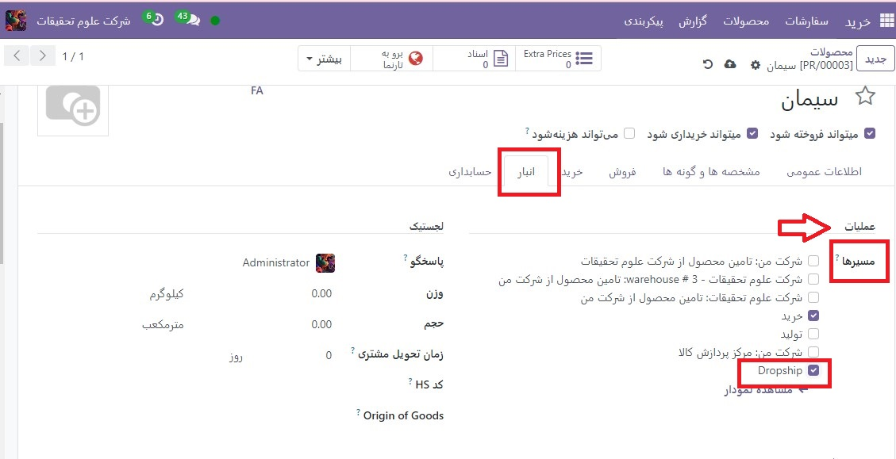
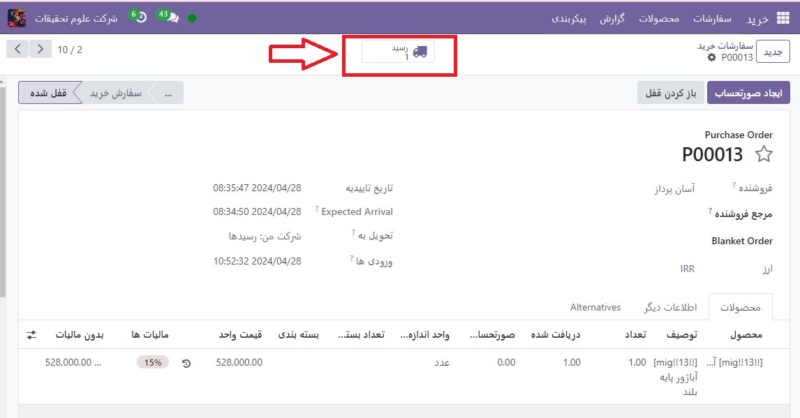

:nosearch:
:show-content:
:hide-page-toc:
:show-toc:

===================================================================================
از dropshipping برای ارسال مستقیم از تامین کنندگان به مشتریان استفاده کنید
===================================================================================

**Dropshipping** یک استراتژی انجام سفارش است که به فروشندگان اجازه می دهد اقلام را مستقیماً از تامین کنندگان به مشتریان ارسال کنند. به طور معمول، یک فروشنده محصولی را از یک تامین کننده خریداری می کند، آن را در موجودی خود ذخیره می کند و پس از ثبت سفارش، آن را برای مشتری نهایی ارسال می کند. با dropshipping، تامین کننده مسئول نگهداری و ارسال کالا است. این امر با کاهش هزینه های موجودی کالا از جمله قیمت انبارهای عملیاتی به نفع فروشنده است.

محصولات را برای dropshipped پیکربندی کنید
----------------------------------------------------------
برای استفاده از **dropshipping** به عنوان یک استراتژی تحقق، به برنامه خرید بروید و **پیکربندی ‣ تنظیمات** را انتخاب کنید. در زیر عنوان لجستیک، روی کادر بررسی **Dropshipping** کلیک کنید و برای پایان ذخیره، را **ذخیره** کنید.

بعد، به برنامه فروش بروید، روی **محصولات ‣ محصولات** کلیک کنید و یک محصول موجود را انتخاب کنید یا برای پیکربندی یک محصول جدید، ایجاد را انتخاب کنید. در صفحه محصول، مطمئن شوید که چک باکس های می تواند فروخته شود و می توان خرید کرد فعال باشد.

روی تب خرید کلیک کنید و فروشنده و قیمتی که محصول را به آن می فروشد را مشخص کنید. می‌توان چند فروشنده اضافه کرد، اما فروشنده‌ای که در بالای فهرست قرار دارد، فروشنده‌ای است که به‌طور خودکار برای سفارش‌های خرید انتخاب می‌شود.

در نهایت تب انباررا انتخاب کرده و چک باکس Dropship را در قسمت مسیرها فعال کنید.

سفارشات را با استفاده از **dropshipping** انجام دهید
--------------------------------------------------------------------------
هنگامی که یک مشتری یک خرید آنلاین را برای یک محصول **dropshipped** کامل می کند، یک سفارش فروش به طور خودکار با یک درخواست مرتبط برای قیمت  :abbr:`RFQ (Requested for Quotation)`  برای تامین کننده ایجاد می شود. با انتخاب **سفارشات ‣ سفارشات** می‌توانید سفارش‌های فروش را در برنامه فروش مشاهده کنید. برای مشاهده RFQ مربوطه، روی دکمه هوشمند **خرید** در سمت راست بالای سفارش فروش کلیک کنید.

.. tip::
    سفارشات فروش Dropship را نیز می توان به صورت دستی از طریق برنامه فروش با انتخاب  :menuselection:`سفارشات --> سفارشات --> ایجاد` و افزودن یک محصول پیکربندی شده برای dropshipping ایجاد کرد.

پس از تأیید :abbr:`RFQ (Requested for Quotation)` ، به یک سفارش خرید تبدیل می‌شود و رسید **dropship** ایجاد و به آن پیوند داده می‌شود. با کلیک روی دکمه هوشمند **رسید** در گوشه سمت راست بالای فرم سفارش خرید می توانید رسید را مشاهده کنید.

رسید dropship، تامین کننده را در بخش **دریافت از** و مشتری را در قسمت **مکان مقصد** فهرست می کند. پس از تحویل محصول به مشتری، روی دکمه تاییداعتبار در سمت چپ بالای رسید **dropship** کلیک کنید تا تعداد تحویل شده را تایید کنید.

.. image:: ./img/advancedoperations/a16.jpg
    :align: center
    :alt: انبار
