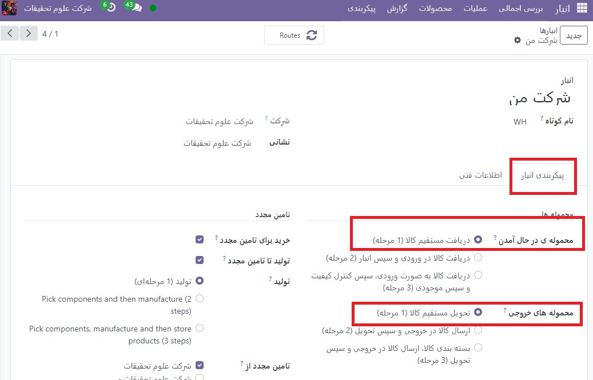
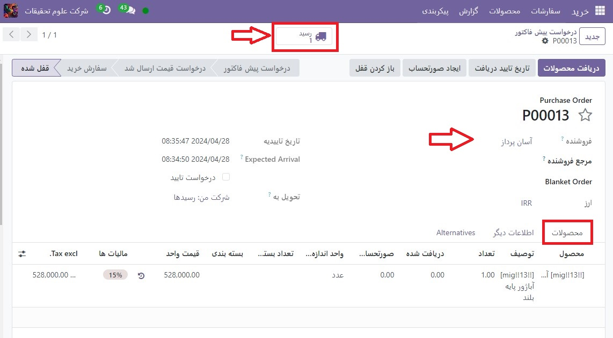

:nosearch:
:show-content:
:hide-page-toc:
:show-toc:

==============================================
دریافت و تحویل را در یک مرحله پردازش کنید
==============================================

به‌طور پیش‌فرض، محموله‌های ورودی به گونه‌ای پیکربندی شده‌اند که مستقیماً در انبار دریافت شوند، و محموله‌های خروجی به‌گونه‌ای پیکربندی شده‌اند که مستقیماً از انبار به مشتری تحویل داده شوند. تنظیمات پیش‌فرض برای انبارها در Odoo دریافت و تحویل یک مرحله‌ای است.

.. note::
    محموله های ورودی و خروجی نیازی به پیکربندی با مراحل یکسان ندارند. به عنوان مثال، محصولات را می توان در یک مرحله دریافت کرد، اما در سه مرحله ارسال کرد.

در مثال زیر از یک مرحله هم برای دریافت و هم برای تحویل استفاده می شود.

انبار را پیکربندی کنید
---------------------------------------------

اگر پیکربندی دریافت یا حمل دیگری در انبار تنظیم شده باشد، به راحتی می توان آنها را به تنظیمات یک مرحله ای بازگرداند.
با رفتن به  :menuselection:`انبار --> Reporting --> Dashboard`  شروع کنید و برای ویرایش بر روی انبار مورد نظر کلیک کنید. سپس، در برگه پیکربندی انبار، در بخش محموله‌ها، دریافت مستقیم کالا (1 مرحله) برای محموله‌های ورودی و/یا تحویل مستقیم کالا (1 مرحله) برای محموله‌های خروجی را انتخاب کنید.

دریافت مستقیم کالا (1 مرحله)
-----------------------------------------------------------------------
یک سفارش خرید ایجاد کنید
در داشبورد برنامه خرید اصلی، با ایجاد یک پیش فاکتور جدید با کلیک روی جدید شروع کنید. سپس، یک فروشنده را از فیلد کشویی انتخاب کنید (یا ایجاد کنید)، یک محصول قابل ذخیره را به خطوط سفارش اضافه کنید و روی تأیید سفارش کلیک کنید تا قیمت به عنوان یک سفارش خرید جدید نهایی شود.

یک دکمه هوشمند **رسید** در گوشه سمت راست بالای فرم PO ظاهر می شود - روی آن کلیک کنید تا رسید مربوط به سفارش خرید نشان داده شود.

.. tip::
    رسیدهای سفارش خرید را نیز می توانید در برنامه انبار پیدا کنید. در داشبورد نمای کلی، روی دکمه هوشمند  برای پردازش در کارت کانبان رسیدها کلیک کنید.

    .. image:: ./img/dailyoperations/d3.jpg
        :align: center
        :alt: انبار
