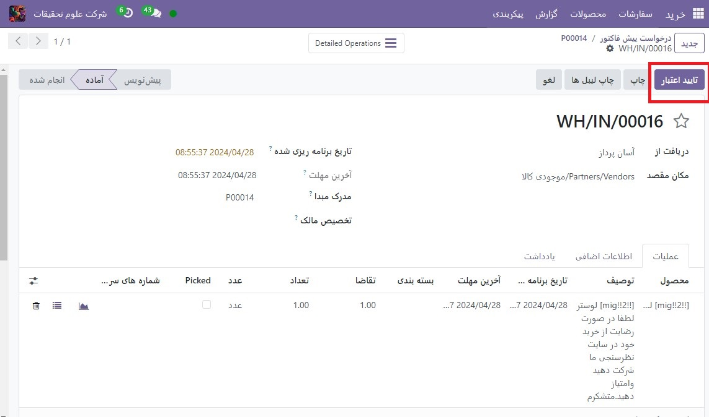
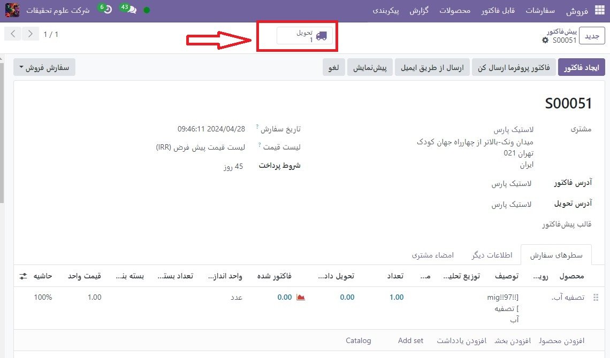
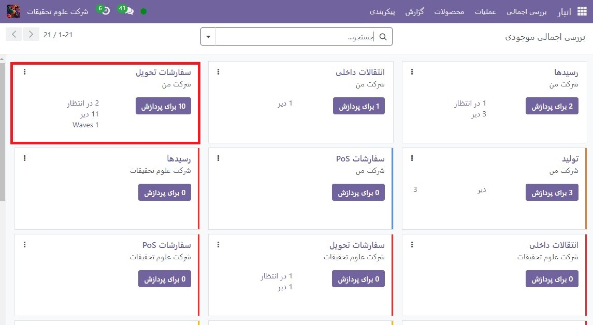

:nosearch:
:show-content:
:hide-page-toc:
:show-toc:

==============================================
دریافت و تحویل را در یک مرحله پردازش کنید
==============================================

به‌طور پیش‌فرض، محموله‌های ورودی به گونه‌ای پیکربندی شده‌اند که مستقیماً در انبار دریافت شوند، و محموله‌های خروجی به‌گونه‌ای پیکربندی شده‌اند که مستقیماً از انبار به مشتری تحویل داده شوند. تنظیمات پیش‌فرض برای انبارها در Odoo دریافت و تحویل یک مرحله‌ای است.

.. note::
    محموله های ورودی و خروجی نیازی به پیکربندی با مراحل یکسان ندارند. به عنوان مثال، محصولات را می توان در یک مرحله دریافت کرد، اما در سه مرحله ارسال کرد.

در مثال زیر از یک مرحله هم برای دریافت و هم برای تحویل استفاده می شود.

انبار را پیکربندی کنید
---------------------------------------------

اگر پیکربندی دریافت یا حمل دیگری در انبار تنظیم شده باشد، به راحتی می توان آنها را به تنظیمات یک مرحله ای بازگرداند.
با رفتن به  :menuselection:`انبار --> Reporting --> Dashboard`  شروع کنید و برای ویرایش بر روی انبار مورد نظر کلیک کنید. سپس، در برگه پیکربندی انبار، در بخش محموله‌ها، دریافت مستقیم کالا (1 مرحله) برای محموله‌های ورودی و/یا تحویل مستقیم کالا (1 مرحله) برای محموله‌های خروجی را انتخاب کنید.

.. image:: ./img/dailyoperations/d1.jpg
    :align: center
    :alt: انبار

دریافت مستقیم کالا (1 مرحله)
-----------------------------------------------------------------------
یک سفارش خرید ایجاد کنید
در داشبورد برنامه خرید اصلی، با ایجاد یک پیش فاکتور جدید با کلیک روی جدید شروع کنید. سپس، یک فروشنده را از فیلد کشویی انتخاب کنید (یا ایجاد کنید)، یک محصول قابل ذخیره را به خطوط سفارش اضافه کنید و روی تأیید سفارش کلیک کنید تا قیمت به عنوان یک سفارش خرید جدید نهایی شود.

یک دکمه هوشمند **رسید** در گوشه سمت راست بالای فرم PO ظاهر می شود - روی آن کلیک کنید تا رسید مربوط به سفارش خرید نشان داده شود.

.. image:: ./img/dailyoperations/d2.jpg
    :align: center
    :alt: انبار

.. tip::
    رسیدهای سفارش خرید را نیز می توانید در برنامه انبار پیدا کنید. در داشبورد نمای کلی، روی دکمه هوشمند  برای پردازش در کارت کانبان رسیدها کلیک کنید.

    .. image:: ./img/dailyoperations/d3.jpg
        :align: center
        :alt: انبار

رسید را پردازش کنید
----------------------------------------------
هنگام مشاهده رسید (مرتبط با سفارش خرید)، روی تأیید اعتبار کلیک کنید تا رسید تکمیل شود.

.. note::
    اگر مکان‌های ذخیره‌سازی فعال شده‌اند، با کلیک بر روی نماد جزئیات ≣ (فهرست گلوله) در کنار نماد حذف 🗑️ (سطل زباله) صفحه عملیات تفصیلی را فعال می‌کند. این اجازه می دهد تا مکان(ها) برای محصول(های) دریافتی مشخص شود.
    
    .. image:: ./img/dailyoperations/d5.jpg
        :align: center
        :alt: انبار

پس از تایید رسید، محصول از محل تامین کننده خارج شده و وارد مکان WH2 می شود. پس از رسیدن به اینجا، برای ساخت، فروش و غیره در دسترس خواهد بود. سپس وضعیت سند به تقاضا تغییر می کند و بدین ترتیب فرآیند دریافت در یک مرحله تکمیل می شود.

تحویل مستقیم کالا (1 مرحله)
---------------------------------------------------

یک سفارش فروش ایجاد کنید

رفتن به داشبورد اصلی برنامه فروش را شروع کنید و با کلیک کردن روی جدید یک قیمت جدید ایجاد کنید. سپس یک مشتری را از فیلد کشویی انتخاب کنید (یا ایجاد کنید)، یک محصول قابل ذخیره که در انبار موجود است را به خطوط سفارش اضافه کنید، و برای نهایی کردن قیمت به عنوان سفارش فروش، روی **تأیید** کلیک کنید.

یک دکمه هوشمند رسید در گوشه سمت راست بالای فرم **PO(سفارش خرید)** ظاهر می شود - روی آن کلیک کنید تا رسید مربوط به سفارش خرید نشان داده شود.

یک دکمه هوشمند تحویل در گوشه سمت راست بالای فرم **(سفارش فروش)SO** ظاهر می شود - روی آن کلیک کنید تا سفارش تحویل مربوط به سفارش فروش نشان داده شود.

.. tip::
    سفارشات تحویل را نیز می توانید در برنامه انبار پیدا کنید. در داشبورد نمای کلی، روی دکمه هوشمند  برای پردازش در کارت کانبان تحویل سفارش‌ها کلیک کنید.

    .. image:: ./img/dailyoperations/d7.jpg
        :align: center
        :alt: انبار

تحویل را پردازش کنید
--------------------------------------------------
هنگام مشاهده سفارش تحویل(مرتبط با سفارش فروش )، روی **تأیید اعتبار** کلیک کنید تا تحویل کامل شود.

هنگامی که سفارش انتخاب تأیید شد، محصول مکان WH2را ترک می‌کند و به مکان شرکا/مشتریان منتقل می‌شود. سپس وضعیت سند به Done تغییر می کند و در نتیجه تحویل در یک مرحله تکمیل می شود.
