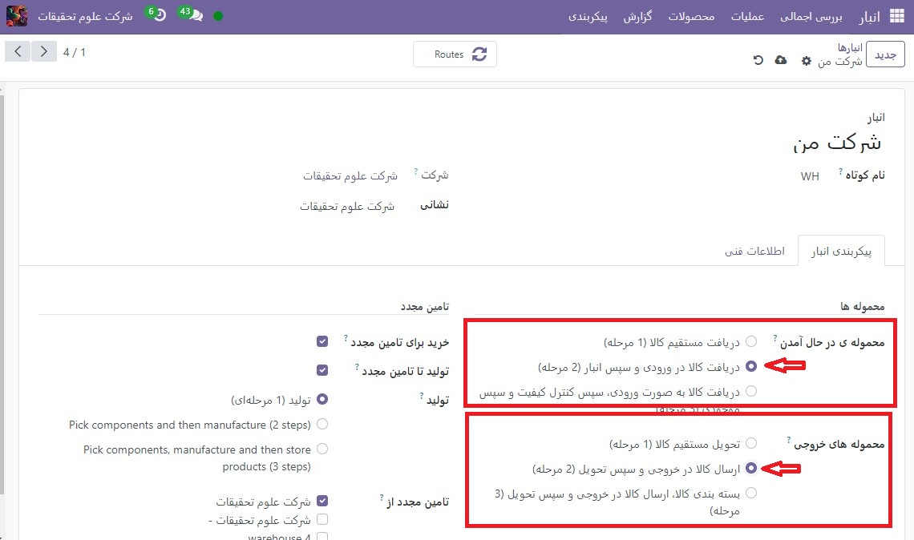
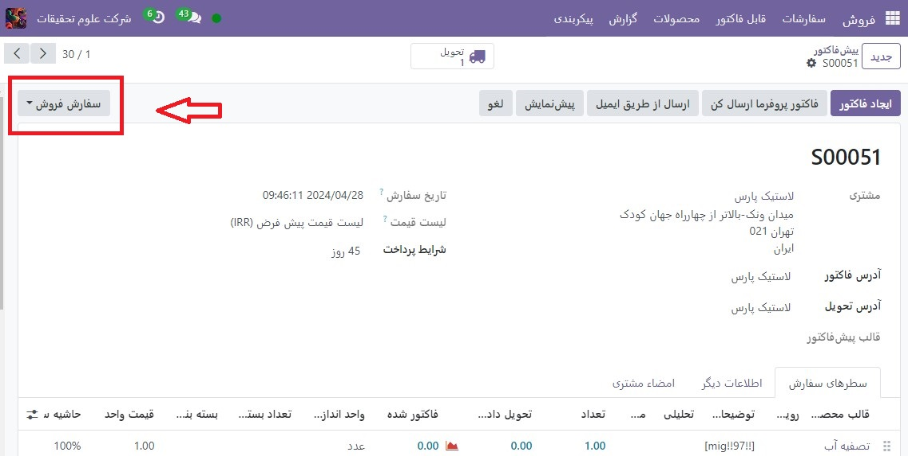
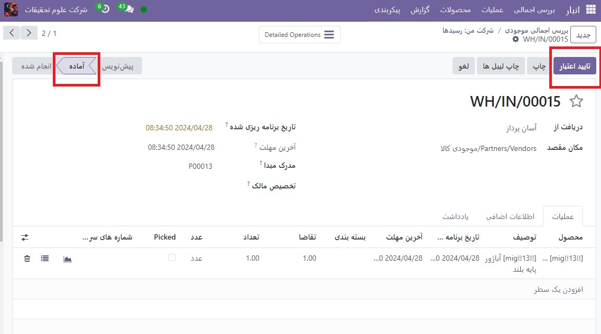
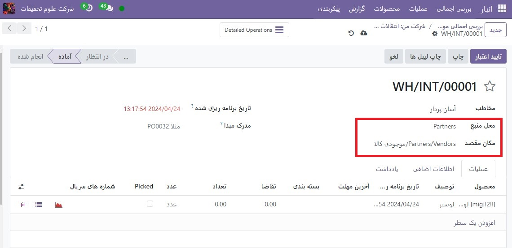
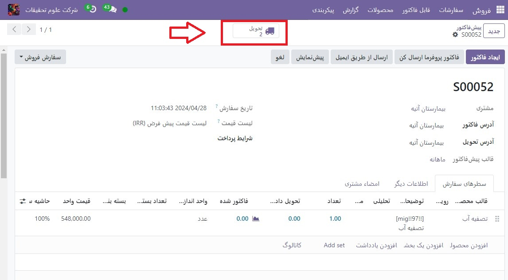

:nosearch:
:show-content:
:hide-page-toc:
:show-toc:

================================================
دریافت و تحویل را در دو مرحله پردازش کنید
================================================

بسته به فرآیندهای تجاری یک شرکت، ممکن است چندین مرحله قبل از دریافت یا ارسال محصولات مورد نیاز باشد. در فرآیند دریافت دو مرحله ای، محصولات در یک ناحیه ورودی دریافت می شوند، سپس به انبار منتقل می شوند. رسیدهای دو مرحله ای زمانی که از مکان های مختلف ذخیره سازی استفاده می شود، مانند مکان های قفل شده یا ایمن، فریزرها و یخچال ها یا قفسه های مختلف، بهترین کار را دارند.

محصولات را می توان بر اساس جایی که قرار است ذخیره شود مرتب کرد و کارمندان می توانند تمام محصولاتی که به یک مکان خاص می روند را ذخیره کنند. محصولات تا زمانی که به انبار منتقل نشوند برای پردازش بیشتر در دسترس نیستند.

در فرآیند تحویل دو مرحله‌ای، محصولاتی که بخشی از یک سفارش تحویل هستند، طبق استراتژی حذف از انبار برداشت می‌شوند و قبل از ارسال به محل خروجی آورده می‌شوند.

یکی از موقعیت‌هایی که این کار مفید است، زمانی است که از استراتژی حذف  :abbr:`FIFO (First In First Oute)` ،  :abbr:`FEFO (First Expired First Oute)` یا  :abbr:`LIFO (Last In First Oute)` استفاده می‌کنید، جایی که محصولاتی که انتخاب می‌شوند باید بر اساس تاریخ دریافت یا تاریخ انقضا انتخاب شوند

Odoo به طور پیش‌فرض برای دریافت و تحویل کالا در یک مرحله پیکربندی شده است، بنابراین تنظیمات باید تغییر کنند تا بتوان از دریافت‌ها و تحویل دو مرحله‌ای استفاده کرد. محموله های ورودی و خروجی نیازی به تنظیم مراحل یکسان ندارند. به عنوان مثال، محصولات را می توان در دو مرحله دریافت کرد، اما در یک مرحله ارسال کرد. در مثال زیر از دو مرحله هم برای دریافت و هم برای تحویل استفاده می شود.

مسیرهای چند مرحله ای را پیکربندی کنید
---------------------------------------------------------
ابتدا مطمئن شوید که گزینه مسیرهای چندمرحله ای در  :menuselection:`انبار --> پیکربندی --> مسیرهای چندمرحله ای` در زیر عنوان انبار فعال باشد. پس از فعال کردن تنظیمات، تغییرات را ذخیره کنید.

.. note::
    با فعال کردن تنظیمات مسیرهای چند مرحله‌ای، ویژگی مکان‌های ذخیره‌سازی نیز فعال می‌شود.

    .. image:: ./img/dailyoperations/d9.jpg
        :align: center
        :alt: انبار

در مرحله بعد، انبار باید برای دریافت و تحویل دو مرحله ای پیکربندی شود. به  :menuselection:`انبار --> پیکربندی --> انبارها` رفته و روی انبار کلیک کنید تا تنظیمات انبار را تغییر دهید.

سپس، دریافت کالا در ورودی و سپس انبار (2 مرحله) را برای محموله های ورودی و ارسال کالا در خروجی و سپس تحویل (2 مرحله) را برای محموله های خروجی انتخاب کنید.

.. tip::
    فعال‌سازی دریافت‌ها و تحویل‌های دو مرحله‌ای، مکان‌های ورودی و خروجی جدیدی ایجاد می‌کند که به‌طور پیش‌فرض، در داشبورد مکان ها به ترتیب WH/Input و WH/Output برچسب‌گذاری شده‌اند. برای تغییر نام این مکان‌ها، به **پیکربندی ‣ مکان ها** بروید و مکان را برای تغییر انتخاب کنید. در فرم موقعیت مکانی، نام موقعیت مکانی را به روز کنید و هر گونه تغییر دیگری (در صورت لزوم) انجام دهید.

پردازش رسید در دو مرحله (ورودی + موجودی)
----------------------------------------------------------
یک سفارش خرید ایجاد کنید

در داشبورد برنامه خرید اصلی، با ایجاد یک پیش فاکتور جدید با کلیک روی جدید شروع کنید. سپس، یک فروشنده را از فیلد کشویی انتخاب کنید (یا ایجاد کنید)، یک محصول قابل ذخیره را به خطوط سفارش اضافه کنید و روی **تأیید سفارش** کلیک کنید تا قیمت به عنوان یک سفارش خرید جدید نهایی شود.

.. important::
    برای کسب‌وکارهایی با انبارهای متعدد که پیکربندی‌های مرحله‌ای متفاوتی دارند، فیلد تحویل به در فرم **PO(سفارش خرید)** ممکن است لازم باشد به عنوان محل ورودی صحیح متصل به انبار دو مرحله‌ای مشخص شود، که می‌تواند با انتخاب انبار از فهرست کشویی انجام شود. انتخابی که شامل برچسب رسیدها در انتهای نام است.

پس از تایید  :abbr:`PO (Purchase Order)`، یک دکمه هوشمند پذیرفتن در بالای فرم  :abbr:`PO (Purchase Order)` ظاهر می شود. روی آن کلیک کنید تا عملیات رسید جدید (WH/IN) نشان داده شود.

رسید را پردازش کنید
------------------------------------------------------
پس از تایید سفارش خرید، رسید تولید و آماده پردازش است.

به برنامه انبار بروید و کارت وظیفه رسیدها را در داشبورد مشاهده انبار(بررسی اجمالی) پیدا کنید. این فهرستی از تمام رسیدهای مورد پردازش را نشان می دهد.

بر روی رسید مرتبط با **سفارش خرید** کلیک کنید، سپس برای تکمیل رسید و انتقال محصول به Partners، روی **تایید اعتبار** کلیک کنید.

انتقال داخلی را پردازش کنید
---------------------------------------------------
پس از تایید رسید، یک انتقال داخلی ایجاد شده و آماده پردازش است.

به نمای کلی انبار برگردید و کارت انتقال‌های داخلی را پیدا کنید.

روی دکمه  برای پردازش کلیک کنید تا فهرستی از تمام انتقال‌های داخلی برای پردازش نمایش داده شود و انتقال مرتبط با رسید تأیید شده قبلی را انتخاب کنید.

برای تکمیل انتقال و انتقال محصول از Partners به Partners/Vendors/موجودی کالا روی  تایید اعتبارکلیک کنید.

پس از تأیید اعتبار، محصول وارد موجودی می شود و برای تحویل مشتری یا سفارشات ساخت در دسترس است.

پردازش سفارش تحویل در دو مرحله (انتخاب + ارسال)
------------------------------------------------------------
یک سفارش فروش ایجاد کنید
در برنامه فروش، با کلیک بر روی جدید، یک پیش فاکتور جدید ایجاد کنید. یک مشتری را انتخاب کنید (یا ایجاد کنید)، یک محصول قابل ذخیره را به خطوط سفارش اضافه کنید و سپس روی تأیید کلیک کنید.

پس از تأیید  :abbr:`SO (Sales Order)`، یک دکمه هوشمند تحویل در بالا، بالای فرم  :abbr:`SO (Sales Order)` ظاهر می شود. روی دکمه هوشمند **تحویل** کلیک کنید تا رسید مربوطه نمایان شود.

