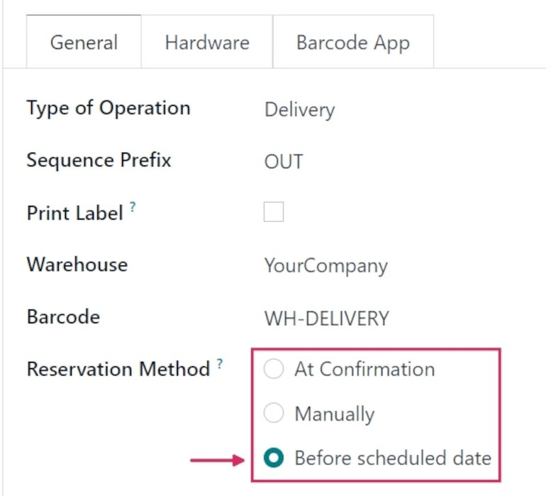
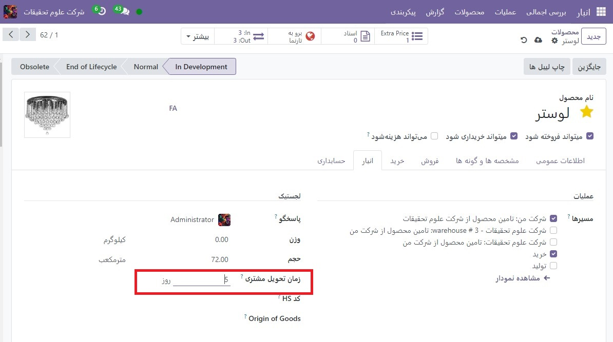
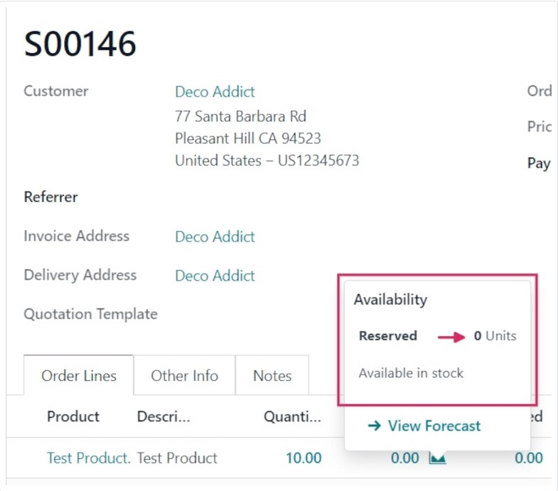
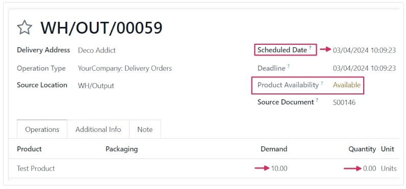

:nosearch:
:show-content:
:hide-page-toc:
:show-toc:

=========================================
قبل از رزرو تاریخ برنامه ریزی شده
=========================================

روش رزرو قبل از تاریخ برنامه ریزی شده به کاربران امکان می دهد تعداد روزهای مشخصی را انتخاب کنند که به عنوان حداکثر تعداد روزهای قبل از تاریخ تحویل برنامه ریزی شده عمل می کند، زمانی که محصولات موجود در یک سفارش فروش (SO) باید رزرو شوند.

پیکربندی
------------------------------------------
برای تنظیم روش رزرو روی قبل از تاریخ برنامه ریزی شده، به برنامه  :menuselection:`انبار --> پیکربندی --> انواع عملیات` بروید. سپس، نوع عملیات مورد نظر را برای پیکربندی انتخاب کنید، یا با کلیک بر روی جدید یک مورد جدید ایجاد کنید.

در تب عمومی، قسمت روش های رزرو را بیابید و قبل از تاریخ برنامه ریزی شده را انتخاب کنید.

.. note::
    هنگامی که نوع عملیات در فرم نوع عملیات به رسید تغییر می کند، روش های رزرو در دسترس نیستند.

پس از انتخاب، یک قسمت رزرو جدید قبل از تاریخ برنامه ریزی شده در زیرآن ظاهر می شود. از این قسمت می توان تعداد روزهای قبل و روزهای قبل از ستاره گذاری را از 0 پیش فرض تغییر داد.

تغییر روزهای قبل از مقدار، حداکثر تعداد روزهای قبل از تاریخ برنامه ریزی شده را تغییر می دهد که محصولات باید رزرو شوند.

تغییر روزهای قبل از زمانی که مقدار ستاره ‌دار است، حداکثر تعداد روزهای قبل از تاریخ برنامه‌ریزی‌شده را تغییر می‌دهد که در صورت ستاره‌دار شدن (مورد علاقه) محصولات باید رزرو شوند.

فرم محصول را ویرایش کنید

-----------------------------------------------------------------
قبل از اینکه بتوان از روش رزرو قبل از تاریخ برنامه ریزی شده استفاده کرد، اطمینان حاصل کنید که زمان تحویل مشتری به محصولاتی که قصد فروش با این روش را دارند اضافه شده است.

برای انجام این کار، به برنامه  :menuselection:`انبار --> محصولات --> محصولات` بروید و محصول مورد نظر را برای پیکربندی انتخاب کنید.

در فرم محصول، روی تب انبار کلیک کنید و در قسمت Logistics، مقدار را در قسمت زمان سرنخ مشتری تغییر دهید.

برای این گردش کار مثال، آن را به 5 روز تغییر دهید.

این تاریخ تحویل برنامه ریزی شده برای این محصول خاص را پنج روز پس از تاریخ ایجاد سفارش فروش تعیین می کند.

جریان کار
---------------------------------------------
برای مشاهده عملکرد روش رزرو قبل از تاریخ برنامه ریزی شده، با رفتن به برنامه فروش ‣ جدید، یک SO جدید ایجاد کنید.

یک مشتری را در قسمت مشتری اضافه کنید، سپس در برگه خطوط سفارش، روی افزودن یک محصول کلیک کنید و محصولی را از منوی کشویی که دارای زمان سفارش مشتری پیکربندی شده است، انتخاب کنید تا به فرم نقل قول اضافه شود.

در نهایت در ستون تعداد مقدار مورد نظر محصول را برای فروش تنظیم کنید.

برای این نمونه گردش کار، تعداد را روی 10 تنظیم کنید.

پس از آماده شدن، برای تأیید سفارش فروش، روی تأیید کلیک کنید.

روی نماد سبز رنگ 📈 (گراف ناحیه) در خط محصول کلیک کنید تا راهنمای ابزار در دسترس بودن محصول نمایان شود. این راهنمای ابزار تعداد واحدهای رزرو شده برای این سفارش را نشان می دهد. از آنجایی که روش رزرو روی قبل از تاریخ برنامه ریزی شده تنظیم شده است، مقدار رزرو شده 0 واحد است.

با این حال، زیر آن مقدار، موجود در انبار خوانده می شود. این به این دلیل است که مقدار موجود است، اما تاریخ برنامه ریزی شده، برای گردش کار این مثال، پنج روز از تاریخ سفارش است.

.. note::
    
    اگر مقدار موجودی کافی برای محصول موجود در SO وجود نداشته باشد، نماد 📈 (گراف ناحیه) به جای سبز، قرمز است.

    به جای نشان دادن تعداد واحدهای رزرو شده برای سفارش، نکته ابزار در دسترس بودن، رزرو شده را می‌خواند و تعداد واحدهای موجود را نشان می‌دهد (به عنوان مثال، 0 واحد).
    به‌علاوه، مگر اینکه مجموعه‌ای برای تکمیل مجدد یا رسید زنده وجود داشته باشد، در متن قرمز رنگ «در دسترس بودن آینده» وجود ندارد.

برای مشاهده فرم سفارش تحویل، دکمه هوشمند تحویل را کلیک کنید.

در فرم سفارش تحویل، وضعیت موجود در قسمت موجودی محصول به جای سبز به صورت موجود، با متن زرد درج شده است. این به این دلیل است که موجودی کافی برای این سفارش در دسترس است، اما هنوز مقداری رزرو نشده است.

توجه داشته باشید که فیلد تاریخ برنامه ریزی شده، بالای فیلد در دسترس بودن محصول، تاریخ پنج روز از تاریخ ایجاد سفارش را نشان می دهد. این نشان می دهد که محصولات تا سه روز از تاریخ امروز (دو روز قبل از تاریخ تحویل برنامه ریزی شده) رزرو نشده اند.

در برگه عملیات در خط تولید، اعداد در ستون تقاضا و ستون مقدار مطابقت ندارند (در این مورد، ستون تقاضا 10.00 را نشان می‌دهد، در حالی که ستون مقدار 0 را فهرست می‌کند).

ستون تعداد 0 را فهرست می کند زیرا محصولات تا دو روز قبل از تاریخ تحویل رزرو نشده اند. Odoo به‌محض رسیدن تاریخ برنامه‌ریزی‌شده، محصولات را به‌طور خودکار رزرو می‌کند، در این مرحله ستون‌های تقاضا و مقدار مطابقت دارند.

.. tip::
    اگر محصولات موجود در SO باید زودتر از تاریخ رزرو برنامه ریزی شده رزرو شوند، می توان رزرو را به صورت دستی لغو کرد. برای رزرو دستی محصولات زودتر از زمان مقرر، روی بررسی در دسترس بودن در بالای فرم کلیک کنید.

    با این کار وضعیت موجود در فیلد در دسترس بودن محصول سبز می شود و عدد موجود در ستون مقدار را برای مطابقت با ستون تقاضا تغییر می دهد.

    پس از آماده شدن، روی تاییداعتبار کلیک کنید.

.. seealso::
   - :doc:`manual reservation`
   - :doc:`at confirmation reservation`