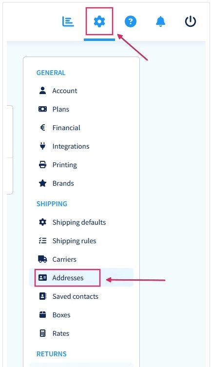
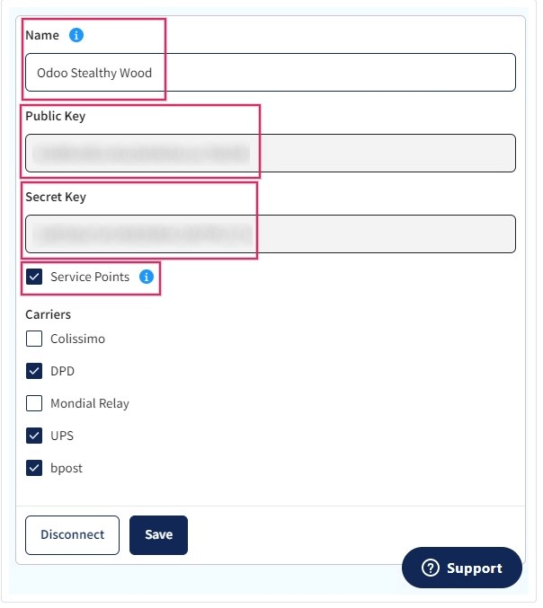

:nosearch:
:show-content:
:hide-page-toc:
:show-toc:

=========================================================
خدمات حمل و نقل Sendcloud را در Odoo راه اندازی کنید
========================================================

**Sendcloud** یک تجمیع کننده خدمات حمل و نقل است که ادغام شرکت های حمل و نقل اروپایی با Odoo را تسهیل می کند. پس از ادغام، کاربران می توانند حامل های حمل و نقل را در عملیات موجودی در پایگاه داده Odoo خود انتخاب کنند.

راه اندازی در Sendcloud
---------------------------------------------
یک حساب کاربری ایجاد کنید و اپراتورها را فعال کنید
برای شروع، به پلتفرم **Sendcloud** بروید تا حساب را پیکربندی کنید و اعتبار رابط را ایجاد کنید. با حساب **Sendcloud** وارد شوید یا در صورت نیاز یک حساب جدید ایجاد کنید.

.. note::
    برای ایجاد حساب جدید، Sendcloud یک شماره  :abbr:`VAT (Value-Added Tax identification)`  یا شماره  :abbr:`EORI (Economic Operators Registration and Identification)`  می خواهد. پس از تکمیل تنظیمات حساب، شرکت های حمل و نقل را که در پایگاه داده Odoo استفاده می شود، فعال (یا غیرفعال کنید).

.. important::
    ادغام Odoo از Sendcloud تنها در صورتی روی طرح‌های رایگان Sendcloud کار می‌کند که یک حساب بانکی مرتبط باشد، زیرا **Sendcloud** به صورت رایگان ارسال نمی‌شود. برای استفاده از قوانین حمل و نقل یا مخاطبین شخصی حامل سفارشی، یک طرح پولی **Sendcloud** مورد نیاز است.

پیکربندی انبار
-------------------------------
پس از ورود به حساب Sendcloud، به **تنظیمات ‣ ارسال ‣ آدرس ها** بروید و فیلد آدرس انبار را پر کنید.

برای اجازه دادن به Sendcloud برای پردازش برگشت‌ها نیز، یک آدرس بازگشت مورد نیاز است. در قسمت **Miscellaneous** فیلدی به نام ,نام آدرس (اختیاری) وجود دارد. نام انبار Odoo باید در اینجا وارد شود و شخصیت ها باید دقیقاً یکسان باشند.

اعتبارنامه Sendcloud را ایجاد کنید
---------------------------------------------------------------------
در حساب Sendcloud، به تنظیمات ‣ ادغام در منوی سمت راست بروید. بعد، Odoo Native را جستجو کنید. سپس روی اتصال کلیک کنید.

پس از کلیک بر روی Connect، صفحه به صفحه تنظیمات Sendcloud API هدایت می شود، جایی که کلیدهای عمومی و مخفی تولید می شوند. مرحله بعدی نامگذاری Integration است. قرارداد نامگذاری به شرح زیر است: Odoo نام شرکت، با نام شرکت کاربر جایگزین نام شرکت.

سپس، کادر کنار Service Points را علامت بزنید و خدمات حمل و نقل را برای این ادغام انتخاب کنید. پس از ذخیره، کلیدهای عمومی و مخفی تولید می شوند.

.. tip::
    همچنین با رفتن به برنامه انبار ‣ پیکربندی ‣ تحویل ‣ روش های حمل و نقل می توانید به روش های حمل و نقل دسترسی پیدا کنید.

.. important::
    هنگامی که برچسب های بازگشتی ایجاد می شوند، Sendcloud به طور خودکار حساب Sendcloud پیکربندی شده را شارژ می کند.