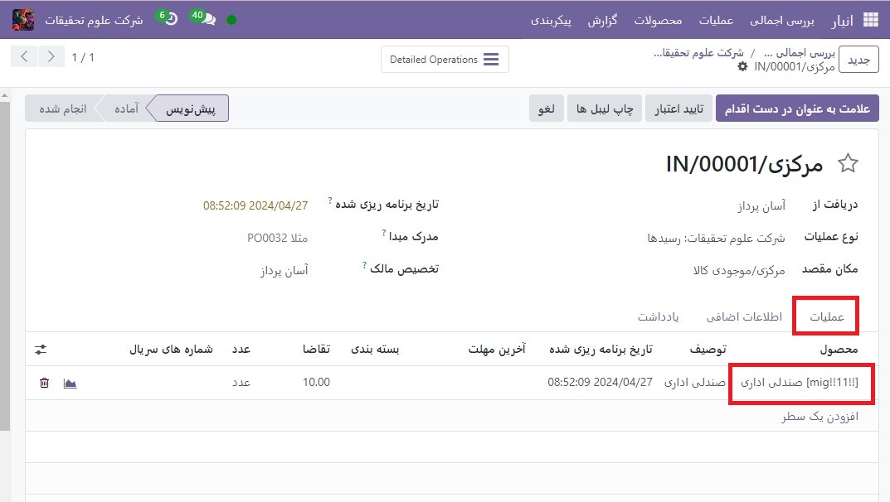
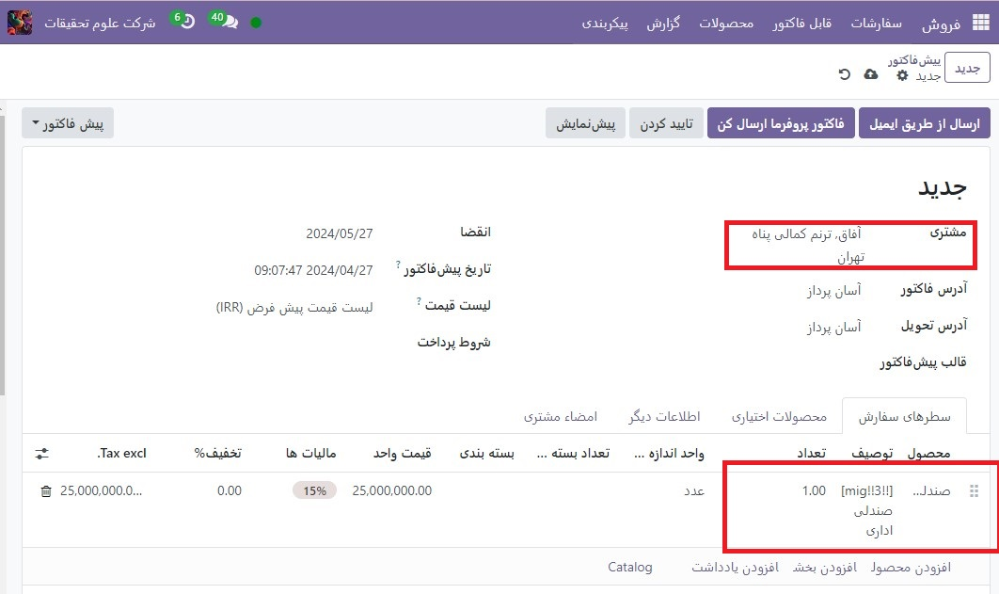
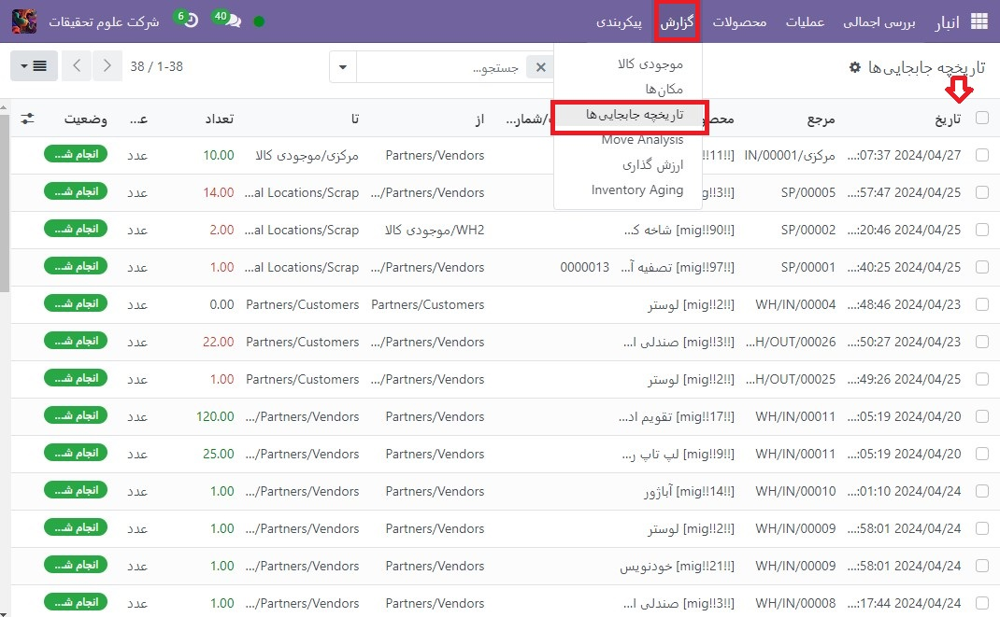
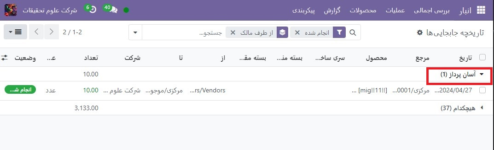

:nosearch:
:show-content:
:hide-page-toc:
:show-toc:

======================================================================================
فروش امانی: خرید و فروش سهام/ موجودی / کالای موجود/ بدون آنکه مالک آن باشید.
======================================================================================

محموله :بیشتر اوقات، محصولات ذخیره شده در انبار یک شرکت یا از تامین کنندگان خریداری می شوند یا در داخل تولید می شوند. با این حال، گاهی اوقات تأمین‌کنندگان به شرکت‌ها اجازه می‌دهند تا محصولات را در انبار شرکت ذخیره و به فروش برسانند، بدون اینکه مجبور باشند آن اقلام را از قبل خریداری کنند. 

ارسال یک روش مفید برای تامین کنندگان برای راه اندازی محصولات جدید و تحویل آسان به مشتریان است. همچنین این یک راه عالی برای شرکتی است که محصولات را ذخیره می کند (گیرنده کالا) تا در ازای تلاش های خود چیزی به دست آورند. گیرندگان حتی می توانند برای راحتی نگهداری محصولاتی که در واقع مالک آن نیستند، هزینه ای دریافت کنند.

تنظیم محموله را فعال کنید
---------------------------------------------------
برای دریافت، ذخیره و فروش سهام محموله، این ویژگی باید در تنظیمات فعال شود. برای این کار به  :menuselection:`انبار --> پیکربندی --> تنظیمات` رفته و در قسمت **قابلیت رهگیری** کادر کنار **محموله** را علامت بزنید و سپس **ذخیره** را کلیک کنید تا تمام شود.

.. image:: ./img/advancedoperations/o6.jpg
    :align: center
    :alt: انبار

موجودی محموله را دریافت کنید (و ذخیره کنید).
--------------------------------------------------------
با فعال شدن این ویژگی در Odoo، اکنون می توان محموله را در یک انبار دریافت کرد. از داشبورد انبار اصلی، روی بخش رسیدها کلیک کنید. سپس روی جدید کلیک کنید.

.. note::
    سهام محموله در واقع از فروشنده خریداری نشده است. به سادگی دریافت و ذخیره می شود. به همین دلیل، هیچ پیش فاکتور یا سفارش خریدی در دریافت سهام محموله وجود ندارد. بنابراین، هر دریافت موجودی محموله با ایجاد رسیدهای دستی آغاز می شود.

فروشنده ای را برای وارد کردن در قسمت دریافت از انتخاب کنید و سپس همان فروشنده را برای وارد کردن در قسمت تخصیص مالک انتخاب کنید.

.. image:: ./img/advancedoperations/o7.jpg
    :align: center
    :alt: انبار

.. important::
    از آنجایی که محصولات دریافت شده از فروشنده متعلق به همان فروشنده خواهد بود، فیلدهای دریافت از و تخصیص مالک باید مطابقت داشته باشند.

پس از تنظیم فیلدهای مربوط به فروشنده، محصولات را در خطوط تولید وارد کنید و مقادیر دریافتی را در انبار در ستون تقاضا تنظیم کنید. اگر ویژگی واحدهای اندازه گیری فعال باشد، واحداندازه گیری نیز قابل تغییر است. پس از دریافت تمام موجودی محموله، رسید را تأیید کنید.

فروش و تحویل محموله
------------------------------------------------------
پس از دریافت موجودی محموله به انبار، می توان آن را مانند هر محصول موجود دیگری که گزینه قابل فروش در فرم محصول فعال است، فروخت.

برای ایجاد یک سفارش فروش، به برنامه فروش رفته و از نمای کلی پیش فاکتور ها، روی جدید کلیک کنید. در مرحله بعد، یک مشتری را برای وارد کردن در قسمت مشتری انتخاب کنید.

.. note::
    مشتری باید با فروشنده ای که موجودی محموله دریافت شده (و ذخیره شده) در انبار را عرضه کرده است متفاوت باشد.

محصول محموله را زیر ستون محصول در خطوط سفارش اضافه کنید، مقدار را تنظیم کنید و هر گونه جزئیات مربوط به محصول را در فرم پر کنید. پس از تکمیل پیش فاکتور، روی تأیید کلیک کنید.

هنگامی که  :abbr:`RFQ (Requested for Quotation)`  تأیید شد، به یک سفارش فروش تبدیل می شود. از اینجا، محصولات را می توان با کلیک بر روی دکمه هوشمند **تحویل**، و انتخاب اعتبارسنجی برای تأیید اعتبار تحویل، تحویل داد.

قابلیت پیگیری و گزارش موجودی محموله
--------------------------------------------------------
اگرچه سهام محموله متعلق به فروشنده ای است که آن را عرضه کرده است، و نه متعلق به شرکتی است که آن را در انبار خود ذخیره می کند، محصولات محموله همچنان در گزارش های موجودی خاص ظاهر می شوند.

برای یافتن گزارش‌های موجودی، به انبار ‣ گزارش بروید و گزارشی را برای مشاهده انتخاب کنید.

.. note::
    از آنجایی که گیرنده در واقع دارای سهام محموله نیست، این محصولات در گزارش ارزش گذاری سهام منعکس نمی شوند و هیچ تاثیری بر ارزش گذاری موجودی گیرنده ندارند.

گزارش انتقال محصول
----------------------------------------------------
برای مشاهده تمام اطلاعات مربوط به جابجایی های موجودی سهام، با رفتن به برنامه **انبار ‣ گزارش ‣ انتقال محصول** به داشبورد تاریخچه محصول بروید. برای محصولات محموله، اطلاعات این گزارش مانند هر محصول دیگری است: تاریخچه انتقال محصولات آن قابل بررسی است. مقدار انجام شده و سند مرجع موجود است. و مکان های آن نیز موجود است. سهام محموله از محل شریک/فروشندگان منشأ خواهد گرفت.

.. tip::
    برای مشاهده حرکات یک محصول محموله بر اساس مالکیت، فیلتر گروه بندی براساس را انتخاب کنید، پارامتر افزودن گروه سفارشی را انتخاب کنید و سپس تخصیص مالک را انتخاب کنید، و اعمال را به پایان برسانید.

.. tip::
    برای مشاهده واحدهای پیش‌بینی‌شده موجودی محموله، به برنامه انبار ‣ گزارش ‣ موجودی پیش‌بینی شده بروید.

گزارش موجودی
--------------------------------------------------------
با رفتن به برنامه انبار ‣ گزارش ‣ گزارش موجودی، داشبورد موجودی انبار را مشاهده کنید. از این گزارش، مکان‌های موجود در انبار، علاوه بر مقادیر در هر مکان، نمایش داده می‌شود. برای محصولات محموله، ستون مالک با مالک آن محصولات یا فروشنده اصلی که محصولات را در وهله اول عرضه کرده است پر می شود.
