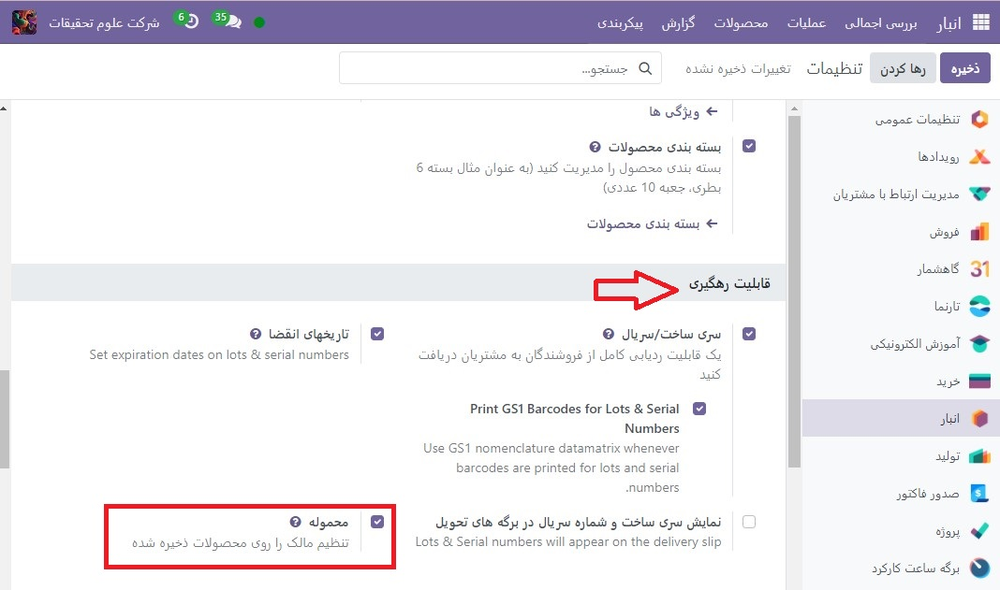
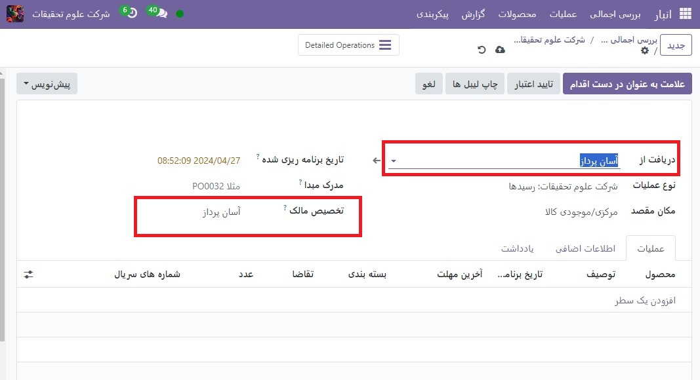

:nosearch:
:show-content:
:hide-page-toc:
:show-toc:

===================================================
محموله: خرید و فروش سهام بدون داشتن آن
===================================================

محموله :بیشتر اوقات، محصولات ذخیره شده در انبار یک شرکت یا از تامین کنندگان خریداری می شوند یا در داخل تولید می شوند. با این حال، گاهی اوقات تأمین‌کنندگان به شرکت‌ها اجازه می‌دهند تا محصولات را در انبار شرکت ذخیره و به فروش برسانند، بدون اینکه مجبور باشند آن اقلام را از قبل خریداری کنند. 

ارسال یک روش مفید برای تامین کنندگان برای راه اندازی محصولات جدید و تحویل آسان به مشتریان است. همچنین این یک راه عالی برای شرکتی است که محصولات را ذخیره می کند (گیرنده کالا) تا در ازای تلاش های خود چیزی به دست آورند. گیرندگان حتی می توانند برای راحتی نگهداری محصولاتی که در واقع مالک آن نیستند، هزینه ای دریافت کنند.

تنظیم محموله را فعال کنید
---------------------------------------------------
برای دریافت، ذخیره و فروش سهام محموله، این ویژگی باید در تنظیمات فعال شود. برای این کار به  :menuselection:`انبار --> پیکربندی --> تنظیمات` رفته و در قسمت **قابلیت رهگیری** کادر کنار **محموله** را علامت بزنید و سپس **ذخیره** را کلیک کنید تا تمام شود.

موجودی محموله را دریافت کنید (و ذخیره کنید).
--------------------------------------------------------
با فعال شدن این ویژگی در Odoo، اکنون می توان محموله را در یک انبار دریافت کرد. از داشبورد انبار اصلی، روی بخش رسیدها کلیک کنید. سپس روی جدید کلیک کنید.

.. note::
    سهام محموله در واقع از فروشنده خریداری نشده است. به سادگی دریافت و ذخیره می شود. به همین دلیل، هیچ پیش فاکتور یا سفارش خریدی در دریافت سهام محموله وجود ندارد. بنابراین، هر دریافت موجودی محموله با ایجاد رسیدهای دستی آغاز می شود.

فروشنده ای را برای وارد کردن در قسمت دریافت از انتخاب کنید و سپس همان فروشنده را برای وارد کردن در قسمت تخصیص مالک انتخاب کنید.

.. important::
    از آنجایی که محصولات دریافت شده از فروشنده متعلق به همان فروشنده خواهد بود، فیلدهای دریافت از و تخصیص مالک باید مطابقت داشته باشند.

پس از تنظیم فیلدهای مربوط به فروشنده، محصولات را در خطوط تولید وارد کنید و مقادیر دریافتی را در انبار در ستون تقاضا تنظیم کنید. اگر ویژگی واحدهای اندازه گیری فعال باشد، واحداندازه گیری نیز قابل تغییر است. پس از دریافت تمام موجودی محموله، رسید را تأیید کنید.

فروش و تحویل محموله
------------------------------------------------------
پس از دریافت موجودی محموله به انبار، می توان آن را مانند هر محصول موجود دیگری که گزینه قابل فروش در فرم محصول فعال است، فروخت.

برای ایجاد یک سفارش فروش، به برنامه فروش رفته و از نمای کلی پیش فاکتور ها، روی جدید کلیک کنید. در مرحله بعد، یک مشتری را برای وارد کردن در قسمت مشتری انتخاب کنید.
