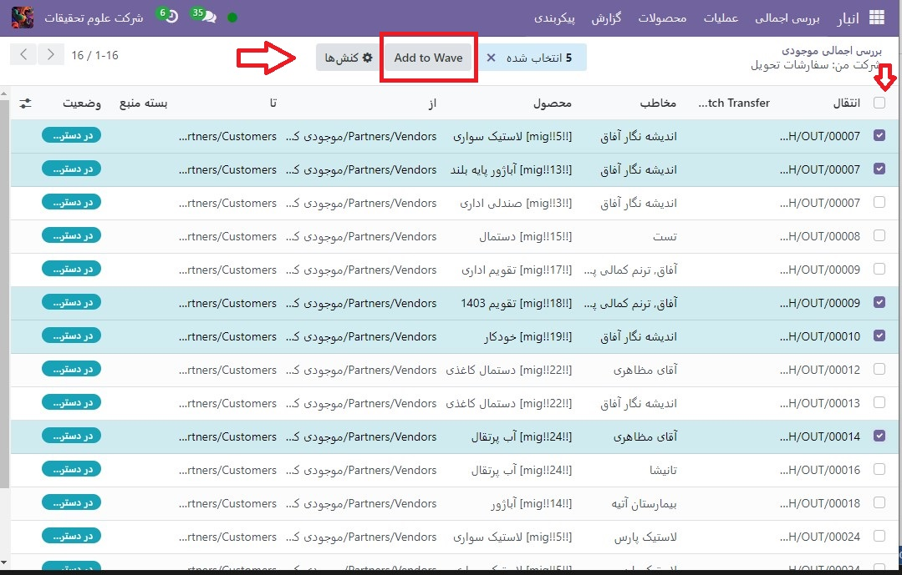

:nosearch:
:show-content:
:hide-page-toc:
:show-toc:

=================================
فرآیند انتقال امواج
=================================

در حالی که یک انتقال دسته ای گروهی از چندین برداشت است، یک انتقال موج فقط شامل برخی از قسمت های برداشت های مختلف است. هر دو روش برای انتخاب سفارش در انبار استفاده می شود و بسته به موقعیت ممکن است یکی از روش ها بهتر از دیگری باشد.

برای رسیدگی به سفارشات یک دسته محصول خاص، یا واکشی محصولاتی که در یک مکان هستند، **انتقال موج** روش ایده آلی است.

در Odoo، انتقال موج در واقع انتقال دسته ای با یک مرحله اضافی است: انتقال ها قبل از گروه بندی در یک دسته تقسیم می شوند.

پیکربندی
--------------------------------------------------------------
قبل از ایجاد یک **انتقال موج**، گزینه های **انتقال دسته ای** و انتقال موج باید فعال شوند.

ابتدا به  :menuselection:`انبار --> پیکربندی --> تنظیمات` بروید. در قسمت عملیات، **انتقال دسته ای** و **انتقال موج** را فعال کنید. سپس روی **ذخیره** کلیک کنید تا تنظیمات اعمال شود.

.. image:: ./img/advancedoperations/o1.jpg
    :align: center
    :alt: انبار

محصولات را به یک موج اضافه کنید
------------------------------------------------------
اکنون که تنظیمات فعال شده اند، با افزودن محصولات به یک موج، انتقال موج را شروع کنید.

انتقال موج فقط می تواند شامل خطوط محصول از انتقال از همان نوع عملیات باشد. برای مشاهده تمامی نقل و انتقالات و خطوط تولید در یک عملیات خاص، ابتدا به داشبورد انبار مراجعه کرده و کارت نوع عملیات مورد نظر را پیدا کنید. سپس منوی گزینه ها (آیکون سه نقطه در گوشه کارت نوع عملیات) را باز کرده و روی عملیات کلیک کنید.

در صفحه عملیات، خطوط محصولی را که می‌خواهید در موج جدید یا موجود **اضافه** کنید، انتخاب کنید. سپس روی **اضافه کردن به موج** کلیک کنید.

.. tip::
    از فیلترها در نوار جستجو برای گروه بندی خطوط با همان محصول، مکان، حامل و غیره استفاده کنید.

پس از آن، یک کادر پاپ آپ ظاهر می شود.
--------------------------------------------------------
برای افزودن خطوط انتخاب شده به یک انتقال موج موجود، گزینه یک انتقال موج موجود را انتخاب کرده و از منوی کشویی، انتقال موج موجود را انتخاب کنید.
برای ایجاد یک انتقال موج جدید، گزینه a new wave transfer را انتخاب کنید. در صورت ایجاد یک انتقال موج جدید، یک کارمند نیز می تواند در قسمت اختیاری Responsible تنظیم شود. پس از انتخاب گزینه های مورد نظر، روی تایید کلیک کنید تا خطوط محصول به یک موج اضافه شود.

مشاهده انتقال امواج
----------------------------------------------------
برای مشاهده تمام انتقالات موج و وضعیت آنها، به فهرست **انبار ‣ عملیات ‣ انتقال موج** بروید. با رفتن به  :menuselection:`بارکد --> انتقال دسته ی` ، می‌توانید انتقال امواج را نیز در برنامه بارکد مشاهده کنید.

