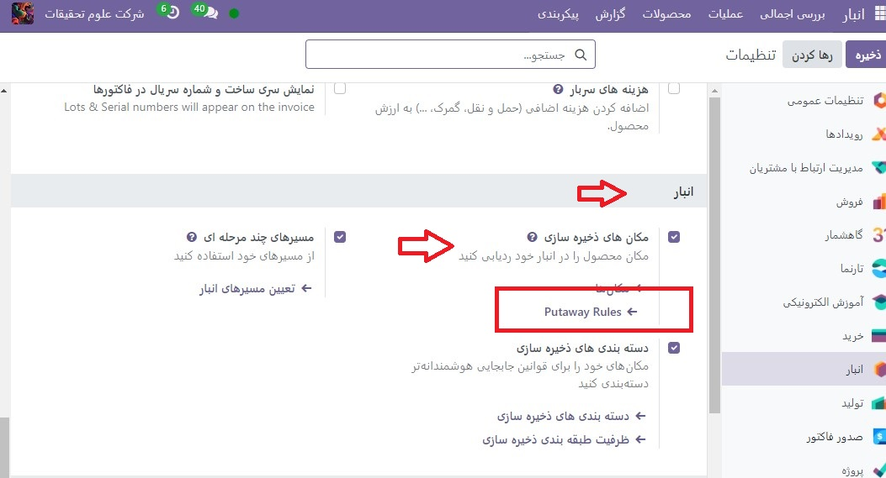
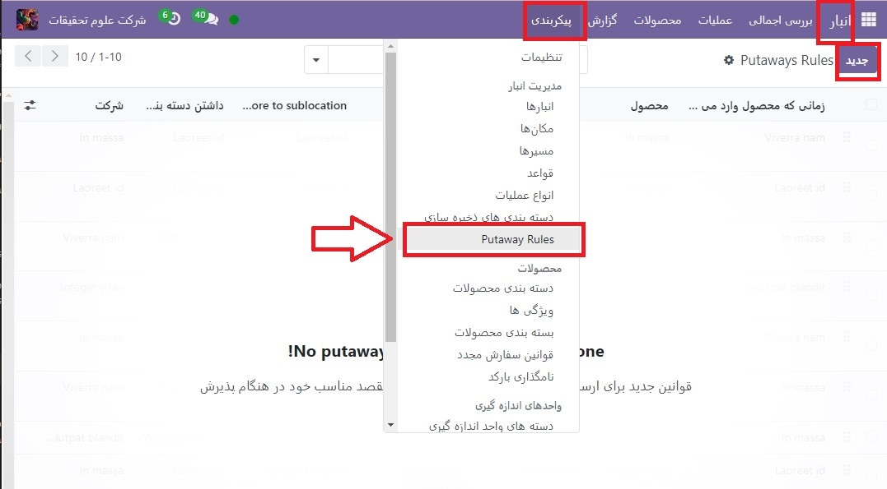
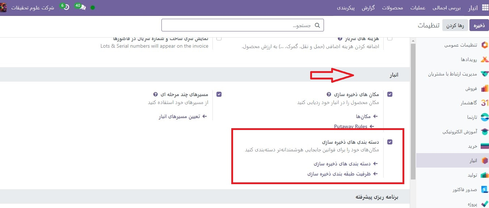
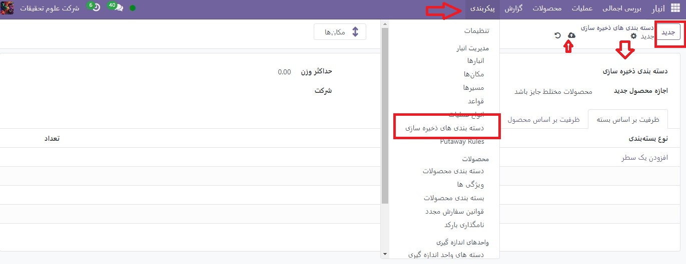
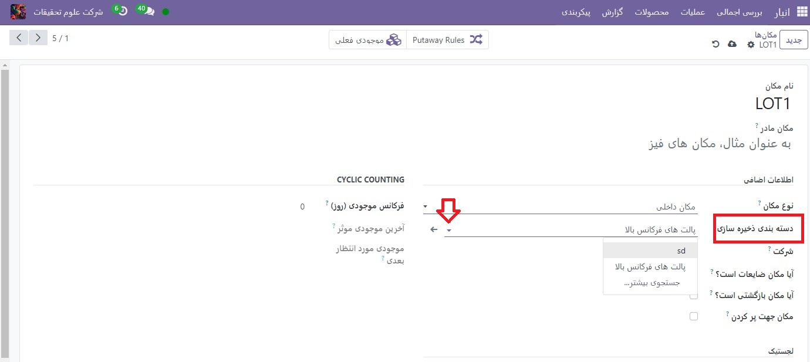

:nosearch:
:show-content:
:hide-page-toc:
:show-toc:

===================================================
قوانین کنارگذاشتن
===================================================

Putaway فرآیند مسیریابی محصولات به مکان های ذخیره سازی مناسب پس از رسیدن محموله است.

Odoo می‌تواند این کار را به‌طور یکپارچه با استفاده از قوانین کنارگذاشتن انجام دهد، قوانینی که نحوه حرکت محصولات را در مکان‌های مشخص شده انبار دیکته می‌کنند.

به محض رسیدن محموله، عملیات بر اساس قوانین جابجایی تولید می شود تا به طور موثر محصولات را به مکان های مشخص منتقل کنند و از بازیابی آسان برای سفارشات تحویل آینده اطمینان حاصل کنند.

در انبارهایی که انواع خاصی از محصولات را پردازش می‌کنند، قوانین نگهداری می‌توانند با هدایت آن‌ها به مکان‌های متفاوتی که توسط مدیر انبار تعیین می‌شود، از نگهداری مواد فرار در نزدیکی جلوگیری کنند.

پیکربندی
-----------------------------------------------------
برای استفاده از قوانین (کنارگذاشتن)putaway، به برنامه  :menuselection:`انبار --> پیکربندی --> تنظیمات`بروید و ویژگی **مسیرهای چند مرحله ای** را در بخش انبار فعال کنید. با انجام این کار، ویژگی مکان های ذخیره سازی نیز به صورت خودکار فعال می شود.
در نهایت روی **ذخیره** کلیک کنید.

putaway rule را تعریف کنید
برای مدیریت جایی که محصولات خاص برای ذخیره سازی هدایت می شوند، به برنامه  :menuselection:`انبار --> پیکربندی --> Dputaway rule ` بروید. از دکمه جدید برای پیکربندی یک قانون putaway جدید در یک محصول یا دسته محصول استفاده کنید که این قانون بر آن تأثیر می گذارد.

.. important::
    قوانین Putaway را می توان برای هر دسته محصول/محصول و/یا نوع بسته تعریف کرد (تنظیم بسته ها باید در برنامه  :menuselection:`انبار --> پیکربندی --> تنظیمات`برای آن فعال باشد).

در همین راستا، وقتی محصول به مکان می رسد، قانون **putaway** برای ایجاد عملیاتی برای انتقال محصول به فروشگاه به مکان راه اندازی می شود.

برای این کار، فروشگاه به مکان باید یک مکان فرعی از مکان اول باشد (به عنوان مثال، 2WH/موجودی کالا یک مکان خاص با نام در داخل WH2 است تا محصولات ذخیره شده در اینجا راحت تر پیدا شوند).

.. example::
    در یک مکان انبار، 2WH، مکان های فرعی زیر وجود دارد:

    2WH / موجودی کالا

    2WH 

    با پر کردن فیلد Store با مکان موجودی کالا/2WH وقتی محصول، اعمال به 2WH رسید، همه لوسترها ذخیره شده‌اند.

    این کار را برای همه محصولات تکرار کنید و ذخیره را بزنید.

    .. image:: ./img/advancedoperations/o14.jpg
        :align: center
        :alt: انبار 

اولویت قانون Putaway
------------------------------------------------
Odoo یک قانون putaway را بر اساس لیست اولویت زیر (از بالاترین به پایین ترین) انتخاب می کند تا زمانی که مطابقت پیدا شود:

    #. نوع بسته بندی و محصول

    #. نوع بسته بندی و دسته بندی محصول

    #. نوع بسته بندی

    #. تولید - محصول

    #. رده محصولات

دسته های ذخیره سازی
--------------------------------------------------
دسته ذخیره سازی یک ویژگی مکان اضافی است. دسته‌های ذخیره‌سازی به کاربر این امکان را می‌دهند که مقدار محصولاتی را که می‌توان در آن مکان ذخیره کرد و نحوه انتخاب مکان با قوانین جابه‌جایی تعیین کرد.

پیکربندی
--------------------------------------------------
برای فعال کردن دسته‌های ذخیره‌سازی، به برنامه  :menuselection:`انبار --> پیکربندی --> تنظیمات`بروید و ویژگی دسته بندی های ذخیره سازی را در بخش انبار فعال کنید. سپس، روی **ذخیره** کلیک کنید

.. important::
    برای فعال کردن دسته‌های ذخیره‌سازی، ویژگی مکان‌های ذخیره‌سازی باید فعال باشد.

دسته بندی ذخیره سازی را تعریف کنید
-------------------------------------------------------------------------
برای ایجاد یک دسته ذخیره سازی، به برنامه  :menuselection:`انبار --> پیکربندی --> دسته بندی های ذخیره سازی` بروید و روی **جدید** کلیک کنید.

در فرم دسته ذخیره سازی، یک نام برای قسمت **دسته بندی ذخیره سازی** تایپ کنید.

گزینه هایی برای محدود کردن ظرفیت بر اساس وزن، محصول یا نوع بسته در دسترس هستند. فیلد اجازه محصول جدید مشخص می کند که چه زمانی مکان برای ذخیره یک محصول در دسترس در نظر گرفته می شود:

    #. اگر مکان خالی باشد: فقط در صورتی می توان یک محصول را در آنجا اضافه کرد که مکان خالی باشد.

    #. اگر محصولات یکسان هستند: فقط در صورتی می توان یک محصول را به آنجا اضافه کرد که همان محصول قبلاً وجود داشته باشد.

    #. محصولات مخلوط را مجاز کنید: چندین محصول مختلف را می توان همزمان در این مکان ذخیره کرد

.. example::
    قوانین جابه‌جایی را برای اقلام ذخیره‌شده در پالت ایجاد کنید و با ایجاد دسته ذخیره‌سازی پالت‌های فرکانس بالا، از بررسی ظرفیت ذخیره‌سازی در زمان واقعی اطمینان حاصل کنید.

    دسته بندی ذخیره سازی  را نامگذاری کنید و در قسمت اجازه محصول جدید گزینه اگر همه ی محصولات یکسان باشندرا انتخاب کنید.

    سپس، ظرفیت بسته را در تب ظرفیت بسته بندی تعریف کنید، تعداد بسته ها را برای نوع بسته تعیین شده مشخص کنید و حداکثر 2.00 پالت را برای یک مکان خاص تنظیم 

    .. image:: ./img/advancedoperations/o17.jpg
        :align: center
        :alt: انبار 

پس از ذخیره تنظیمات دسته ذخیره سازی، دسته ذخیره سازی را می توان به یک مکان مرتبط کرد.

برای انجام این کار، با رفتن به برنامه  :menuselection:`انبار --> پیکربندی --> مکان ها` به مکان بروید و مکان را انتخاب کنید. روی **ویرایش** کلیک کنید و دسته ایجاد شده را در قسمت دسته بندی ذخیره سازی انتخاب کنید.

