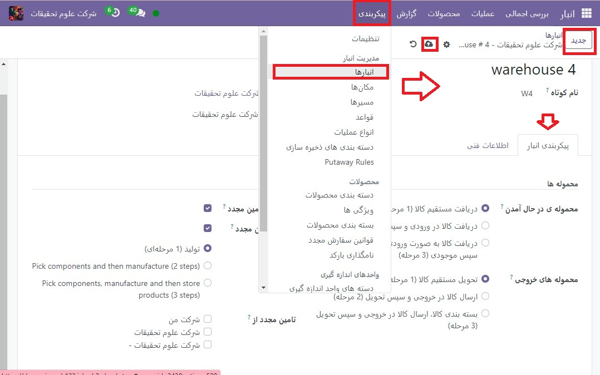
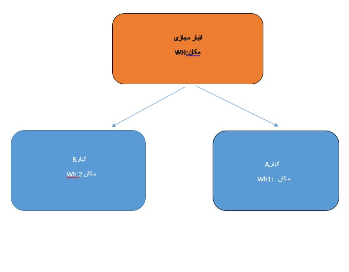

:nosearch:
:show-content:
:hide-page-toc:
:show-toc:

=============================================================
فروش سهام از چندین انبار با استفاده از مکان های مجازی
=============================================================

در حالی که نگهداری موجودی و فروش موجودی از یک انبار ممکن است برای شرکت‌های کوچک‌تر کارساز باشد، شرکت‌های بزرگ‌تر ممکن است نیاز داشته باشند انبارهای متعددی را در مکان‌های مختلف نگهداری کنند یا از آنها بفروشند.

گاهی اوقات محصولات موجود در یک سفارش فروش ممکن است از دو (یا چند) انبار تهیه شود. در Odoo، بیرون کشیدن محصولات از چندین انبار برای برآورده کردن تقاضاهای فروش می تواند با استفاده از مکان های مجازی انجام شود.

.. important::
    راه حل در این سند، توصیف استفاده از یک انبار مجازی برای انجام سفارشات برای چندین انبار، دارای محدودیت هایی است. قبل از اقدام به موارد زیر توجه کنید:

    #. وقتی فیلد انبار در یک سفارش فروش روی یک انبار مجازی تنظیم می شود، آدرس انبار مجازی در فرم های برداشت، بسته بندی و تحویل نشان داده می شود، نه آدرس انبار واقعی.

    #. هر مکان دارای یک انبار_id (فیلد پنهان) است. به این معنی که موجودی موجود در انبار مجازی، مجموع موجودی انبارهای واقعی نخواهد بود، بلکه مجموع موجودی در مکان هایی خواهد بود که شناسه انبار آنها انبار مجازی است

.. Danger::
    محدودیت بالقوه برای کسانی که از تحویل دو یا سه مرحله ای استفاده می کنند:

     #. منطقه خروجی یا بسته بندی در فرم های مختلف به اشتباه به عنوان آدرس انبار مجازی فهرست شده است.

     #. هیچ راه حلی برای تحویل دو یا سه مرحله ای وجود ندارد.

     #.فقط در صورتی ادامه دهید که تنظیم آدرس انبار مجازی به عنوان منطقه خروجی یا بسته بندی برای گردش کار شرکت منطقی باشد.

.. note::
    برای ایجاد مکان‌های مجازی در انبارها و انجام مراحل زیر، ویژگی‌های **مکان های ذخیره سازی** و **مسیرهای چند مرحله ای** باید فعال باشند.

    برای انجام این کار، به برنامه  :menuselection:`انبار --> پیکربندی --> تنظیمات` بروید، به بخش انبار بروید و گزینه های **مکان های ذخیره سازی** و **مسیرهای چند مرحله ای** را فعال کنید. سپس، تغییرات را **ذخیره** کنید تا تمام شود.

    .. image:: ./img/advancedoperations/o20.jpg
        :align: center
        :alt: انبار 

مکان والد مجازی ایجاد کنید
---------------------------------------------------
قبل از ایجاد هر مکان ذخیره مجازی، یک انبار جدید ایجاد کنید که به عنوان یک انبار مجازی عمل می کند - مکان اصلی سایر انبارهای فیزیکی.

.. spoiler:: چرا یک انبار "مجازی"؟
    انبارهای مجازی برای شرکت هایی که دارای انبارهای فیزیکی متعدد هستند عالی هستند. این به این دلیل است که زمانی ممکن است وضعیتی پیش بیاید که انبار یک محصول خاص تمام شود، اما انبار دیگری همچنان انبار موجود باشد. در این مورد، از موجودی این دو (یا چند) انبار می توان برای انجام یک سفارش فروش استفاده کرد.

    انبار "مجازی" به عنوان یک جمع کننده واحد از تمام موجودی ذخیره شده در انبارهای فیزیکی شرکت عمل می کند و (برای اهداف ردیابی) برای ایجاد سلسله مراتبی از مکان ها در Odoo استفاده می شود.

برای ایجاد یک انبار جدید، به برنامه  :menuselection:`انبار --> پیکربندی --> انبار`بروید و روی جدید کلیک کنید. از اینجا، نام انبار و نام کوتاه را می توان تغییر داد، و سایر جزئیات انبار را می توان در تب پیکربندی انبار تغییر داد.

در آخر، روی ذخیره کلیک کنید تا ایجاد یک انبار معمولی به پایان برسد. برای تکمیل پیکربندی انبار مادر مجازی، مراحل زیر را دنبال کنید.

ایجاد انبارهای کودک
-------------------------------------
حداقل دو انبار کودک برای پیوند به انبار مجازی ایجاد کنید.

.. important::
    به منظور جمع‌آوری انبارها از چند انبار برای انجام یک سفارش فروش، باید حداقل دو انبار وجود داشته باشد که به‌عنوان مکان‌های فرزند انبار مکان والدین مجازی عمل می‌کنند.

برای انجام این کار، به برنامه  :menuselection:`انبار --> پیکربندی --> انبارها` بروید، روی **جدید** کلیک کنید و دستورالعمل‌های قبلی را برای پیکربندی مکان‌های موجودی فیزیکی دنبال کنید.

.. example::

    انبار والد
    انبار: انبار مجازی
    مکان WH:
    انبارهای فرزند
    انبارها: انبار A و انبار B
    مکان: Wh1 و Wh2

