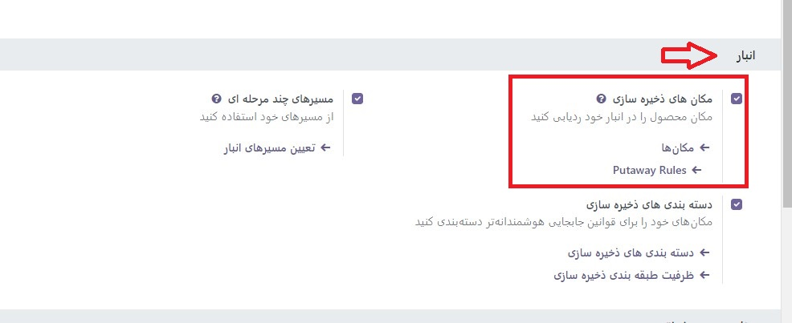
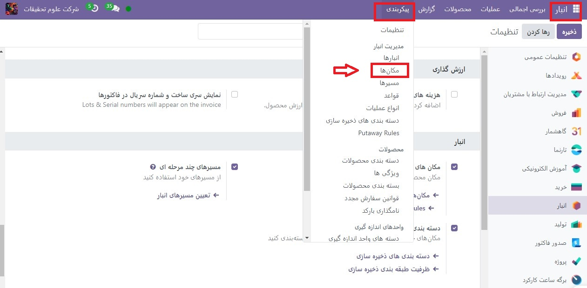
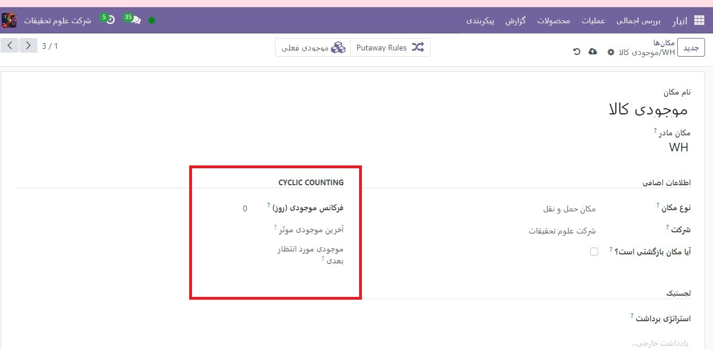
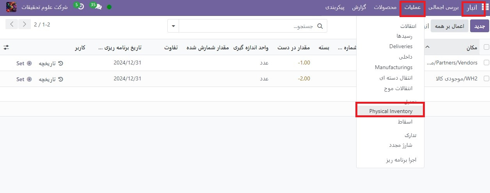
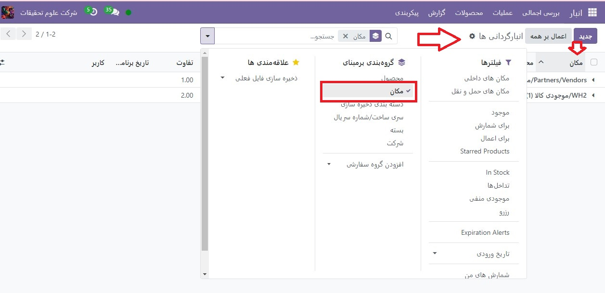

:nosearch:
:show-content:
:hide-page-toc:
:show-toc:

=========================================
تعداد دوره ها
=========================================

برای اکثر شرکت ها، موجودی انبار فقط یک بار در سال باید شمارش شود. به همین دلیل است که به طور پیش فرض، پس از انجام تعدیل موجودی در Odoo، تاریخ برنامه ریزی شده برای شمارش موجودی بعدی برای 31 دسامبر سال جاری تعیین شده است.

با این حال، برای برخی از مشاغل، داشتن یک شمارش دقیق موجودی در همه زمان‌ها بسیار مهم است. این شرکت ها از شمارش چرخه برای دقیق نگه داشتن سطوح حیاتی سهام استفاده می کنند. شمارش چرخه ای روشی است که توسط آن شرکت ها موجودی خود را بیشتر در مکان های خاص شمارش می کنند تا اطمینان حاصل شود که شمارش موجودی فیزیکی آنها با سوابق موجودی آنها مطابقت دارد.

پیکربندی

--------------------------------------------------
در Odoo، شمارش دوره ها بر اساس مکان انجام می شود. بنابراین، ویژگی **مکان‌های ذخیره‌سازی** باید قبل از انجام شمارش دوره فعال شود.

برای فعال کردن این ویژگی، به برنامه  :menuselection:`انبار --> پیکربندی --> تنظیمات` بروید و به بخش انبار بروید. سپس، کادر کنار مکان‌های ذخیره‌سازی را علامت بزنید و روی ذخیره کلیک کنید.

فرکانس شمارش موجودی را بر اساس مکان تغییر دهید
------------------------------------------------------------------------
هنگامی که ویژگی مکان‌های ذخیره‌سازی فعال می‌شود، و مکان‌های متعددی در انبار ایجاد می‌شوند، فراوانی تعداد موجودی را می‌توان برای مکان‌های خاص تغییر داد.
برای مشاهده و ویرایش مکان‌ها، به برنامه  :menuselection:`انبار --> پیکربندی  --> مکان ها` بروید. این یک صفحه مکان‌ها را نشان می‌دهد که حاوی همه مکان‌هایی است که در حال حاضر در انبار ایجاد و فهرست شده‌اند.

از این صفحه، روی یک مکان کلیک کنید تا صفحه تنظیمات و پیکربندی آن مکان نشان داده شود.

در بخش شمارش دوره ای، فیلد فرکانس موجودی (روزها) را پیدا کنید، که باید به طور پیش‌فرض روی 0 تنظیم شود (اگر این مکان قبلاً ویرایش نشده باشد). در این قسمت، مقدار را به تعداد روزهای دلخواه برای دفعات شمارش تغییر دهید.

.. example::
    مکانی که هر 30 روز یک بار به شمارش موجودی نیاز دارد، باید فرکانس موجودی (روز) روی 30 تنظیم شود.

اکنون، هنگامی که یک تعدیل موجودی در این مکان اعمال می شود، تاریخ شمارش برنامه ریزی شده بعدی به طور خودکار بر اساس مقدار وارد شده در قسمت فرکانس موجودی (روزها) تنظیم می شود.

موجودی را بر اساس مکان بشمارید
----------------------------------------------------------------
برای انجام یک شمارش دوره برای یک مکان خاص در انبار، به برنامه  :menuselection:`انبار --> عملیات -->  Physical Inventory(موجودی فیزیکی)`  بروید. این یک صفحه تنظیمات موجودی را نشان می دهد که شامل تمام محصولات موجود در حال حاضر است و هر محصول در خط خودش فهرست شده است.

از این صفحه، گزینه‌های فیلترها و گروه بندی (قابل دسترسی با کلیک بر روی نماد ⬇️ (فلش پایین) در سمت چپ نوار جستجو…) می‌تواند برای انتخاب مکان‌های خاص و انجام شمارش موجودی استفاده شود.

برای انتخاب یک مکان خاص، و مشاهده همه محصولات در آن مکان، روی نماد ⬇️ (فلش رو به پایین) در سمت چپ نوار جستجو کلیک کنید. سپس در ستون گروه بندی برمبنای، روی افزودن گروه سفارشی کلیک کنید تا یک منوی کشویی جدید نمایان شود.

از منوی کشویی روی مکان کلیک کنید. با انجام این کار، محصولات بر اساس مکان‌های ذخیره‌سازی آن‌ها در صفحه تنظیمات موجودی طبقه‌بندی می‌شوند، و یک شمارش دوره می‌تواند برای همه محصولات در آن مکان انجام شود.

.. tip::
    در انبارهای بزرگ با مکان های متعدد و حجم بالای محصولات، جستجو برای مکان خاص مورد نظر آسان تر است. برای انجام این کار، از صفحه تنظیمات موجودی، روی نماد ⬇️ (فلش پایین) در سمت راست نوار جستجو کلیک کنید.

    سپس در ستون فیلترها، روی **افزودن فیلترسفارشی** کلیک کنید تا یک پنجره پاپ آپ افزودن فیلتر سفارشی باز شود.

    در فیلد اول روی مقدار کلیک کرده و از لیست گزینه ها مکان را انتخاب کنید. در فیلد دوم شامل را انتخاب کنید. در قسمت سوم، **نام مکان** مورد جستجو را تایپ کنید.

    روی **افزودن** کلیک کنید تا آن مکان در صفحه ظاهر شود.

    .. image:: ./img/inventorymanagement/m28.jpg
        :align: center
        :alt: انبار

فرکانس شمارش کامل موجودی را تغییر دهید
----------------------------------------------------
در حالی که شمارش دوره ‌ها معمولاً در هر مکان انجام می‌شود، تاریخ برنامه‌ریزی‌شده برای شمارش کامل موجودی همه محصولات موجود در انبار نیز می‌تواند به‌صورت دستی تغییر کند تا تاریخ را زودتر از تاریخ فهرست‌ شده افزایش دهد.

برای تغییر تاریخ برنامه ریزی شده پیش فرض، به برنامه  :menuselection:`انبار --> پیکربندی --> تنظیمات` بروید. سپس، در بخش عملیات، فیلد تنظیم روز و ماه موجودی سالانه را پیدا کنید که شامل یک فیلد کشویی است که به طور پیش فرض روی 31 دسامبر تنظیم شده است.

