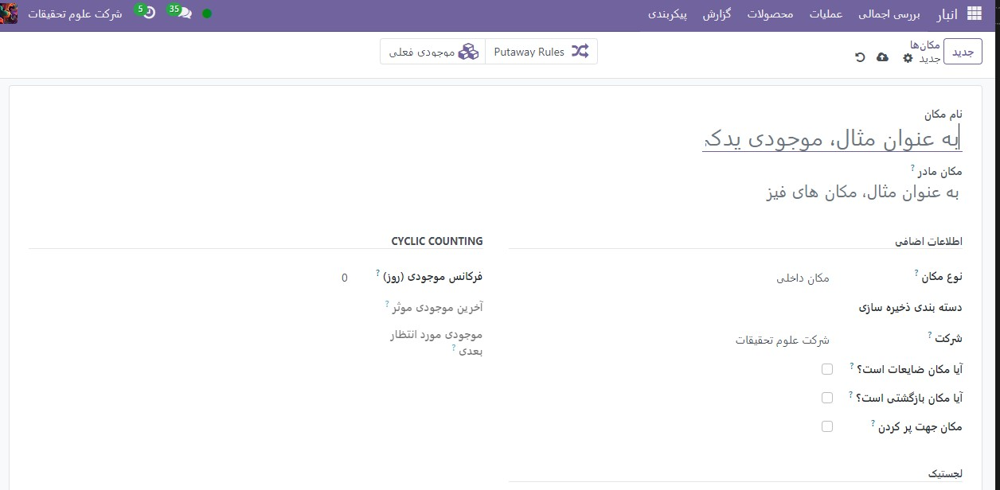

:nosearch:
:show-content:
:hide-page-toc:
:show-toc:

=========================================
مکان ها
=========================================

موقعیت مکانی یک فضای خاص در یک انبار است. این می تواند یک قفسه، اتاق، راهرو و غیره باشد. سه نوع مکان در Odoo وجود دارد:

  - مکان های فیزیکی فضاهایی در یک انبار متعلق به شرکت کاربر هستند. اینها می توانند محلی باشند که اقلام مانند راهرو یا قفسه در آن ذخیره می شوند، یا منطقه ای که عملیات انجام می شود، مانند جایگاه های بارگیری و تخلیه.

  - مکان های شریک مانند مکان های فیزیکی هستند با این تفاوت که در انبار مشتری یا فروشنده وجود دارند.

  - مکان‌های مجازی مکان‌هایی هستند که از نظر فیزیکی وجود ندارند، اما می‌توان اقلامی را که در فهرست موجودی نیستند قرار داد. اینها می توانند اقلامی باشند که هنوز وارد موجودی نشده اند، مانند محصولاتی که در راه انبار هستند، یا اقلامی که به دلیل از دست دادن یا سایر عوامل دیگر در موجودی نیستند.

.. important::

    برای استفاده از مکان‌ها، تنظیمات مکان‌های ذخیره‌سازی باید فعال باشد. برای انجام این کار، به  :menuselection:`انبار --> پیکربندی --> تنظیمات` بروید، به عنوان انبار پایین بروید و کادر انتخاب **مکان های ذخیره سازی** را فعال کنید.

    .. image:: ./img/inventorymanagement/m30.jpg
        :align: center
        :alt: انبار

یک مکان جدید در یک انبار ایجاد کنید
----------------------------------------------------------------
با شروع از برنامه انبار،  :menuselection:`پیکربندی --> مکان ها --> ایجاد ` را انتخاب کنید. سپس فرم مکان جدید را می توان به صورت زیر پیکربندی کرد:

   - نام مکان: نامی که برای ارجاع به مکان استفاده می شود

   - مکان والد: مکان یا انباری که مکان جدید در آن وجود دارد

   - نوع مکان: دسته ای را انتخاب کنید که مکان به آن تعلق دارد

   - شرکت: شرکتی که مالک انباری است که محل در داخل آن است

   - آیا محل ضایعات است؟: این کادر را علامت بزنید تا اجازه دهید کالاهای اسقاط یا آسیب دیده در این مکان ذخیره شوند

   - آیا مکان بازگشتی است؟: این کادر را علامت بزنید تا اجازه دهید محصولات به این مکان بازگردانده شوند

   - بارکد: شماره بارکد اختصاص داده شده به مکان

   -استراتژی حذف: استراتژی برای چگونگی برداشت اقلام از موجودی

سلسله مراتب مکان ایجاد کنید
--------------------------------------
تنظیمات موقعیت مکانی والدین در فرم مکان جدید امکان وجود یک مکان را در یک انبار یا مکان دیگری فراهم می کند. هر مکان می تواند به عنوان یک **مکان والد** عمل کند، و هر مکان والدین می تواند چندین مکان در درون خود داشته باشد، که امکان ایجاد یک ساختار سلسله مراتبی تقریبا نامحدود را فراهم می کند.

.. example::
    سلسله مراتب مکان می تواند به گونه ای سازماندهی شود که یک قفسه در یک راهرو قرار گیرد که در داخل اتاقی قرار دارد که در داخل انبار کلی قرار دارد.

برای ایجاد سلسله مراتب مکان در مثال بالا، انبار را به عنوان والد اتاق، اتاق را به عنوان والد راهرو و راهرو را به عنوان والد قفسه تنظیم کنید. این را می توان با یک سلسله مراتب با هر بزرگی تطبیق داد.
