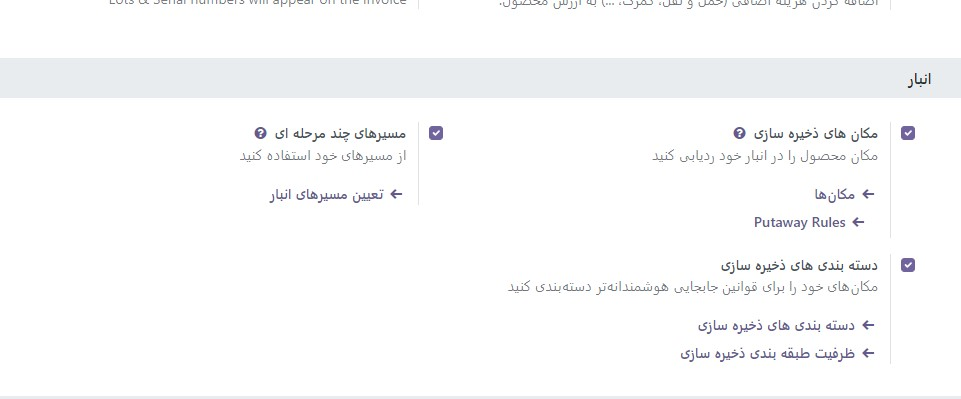

:nosearch:
:show-content:
:hide-page-toc:
:show-toc:

=============================================================
انبارها و مکان ها را مدیریت کنید
=============================================================

اصلاحات
-------------------------------

انبار
--------------------------------
در Odoo، انبار ساختمان/مکان واقعی است که اقلام یک شرکت در آن انبار می شود. چندین انبار را می توان در Odoo راه اندازی کرد و کاربر می تواند بین انبارها حرکت ایجاد کند.

مکان
--------------------------------
موقعیت مکانی یک فضای خاص در داخل انبار است. این می تواند یک مکان فرعی از انبار (قفسه، طبقه، راهرو و غیره) باشد. بنابراین، یک مکان تنها بخشی از یک انبار است و نمی توان یک مکان را به چند انبار مرتبط کرد. در Odoo، می‌توان مکان‌های زیادی را در صورت نیاز در یک انبار پیکربندی کرد.

 - سه نوع مکان وجود دارد:

   #. مکان های فیزیکی مکان های داخلی هستند که بخشی از انبارهایی هستند که شرکت در اختیار دارد. آنها می توانند محل بارگیری و تخلیه انبار، قفسه، بخش و غیره باشند.

   #. مکان‌های شریک فضاهایی در انبار مشتری و/یا فروشنده هستند. آنها مانند مکان های فیزیکی کار می کنند، با تنها تفاوت این که متعلق به شرکت کاربر نیستند.

   #. مکان‌های مجازی مکان‌هایی هستند که وجود ندارند، اما زمانی که محصولات هنوز (یا دیگر) از نظر فیزیکی در موجودی نیستند، می‌توانند در آن‌ها قرار بگیرند. آنها هنگام ثبت محصولات گم شده (از دست دادن موجودی) یا حسابداری محصولاتی که در راه انبار هستند (تدارکات) مفید هستند

در Odoo، مکان ها به صورت سلسله مراتبی ساختار می شوند. مکان‌ها را می‌توان به‌عنوان یک درخت، وابسته به رابطه والد-فرزند، ساختار داد. این سطوح تجزیه و تحلیل دقیق تری از عملیات انبار و سازماندهی انبارها ارائه می دهد.

پیکربندی
-------------------------------------
برای فعال کردن مکان‌ها، به **تنظیمات ‣ تنظیمات** بروید و مکان‌های **ذخیره‌سازی** را فعال کنید. سپس، روی **ذخیره** کلیک کنید.

