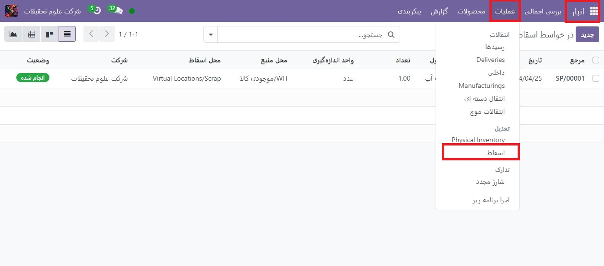
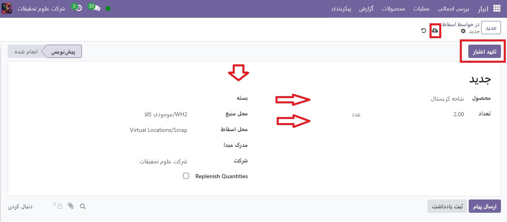
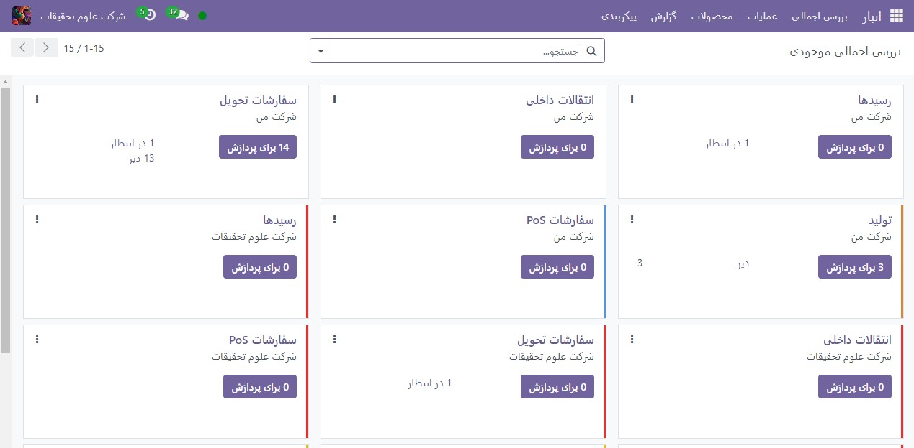
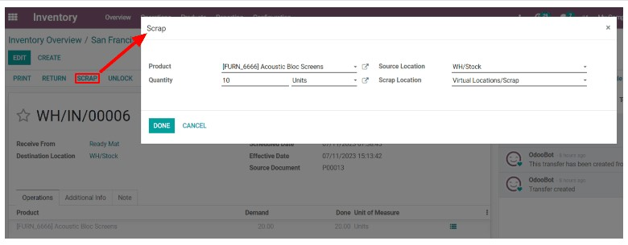
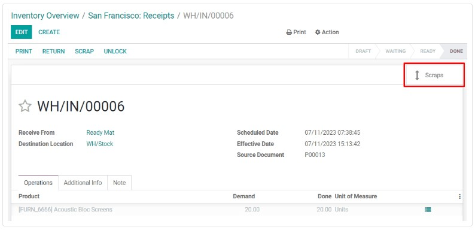

:nosearch:
:show-content:
:hide-page-toc:
:show-toc:

=============================================================
اقلام اسقاطی انبار
=============================================================

در برخی موارد، ممکن است محصول موجود در موجودی آسیب دیده یا معیوب باشد. اگر امکان تعمیر یا بازگرداندن محصول وجود نداشته باشد، موجودی Odoo به کاربران اجازه می دهد آن را از بین ببرند و اطمینان حاصل شود که شمارش موجودی قابل استفاده دقیق باقی می ماند.

.. tip::
    با رفتن به **انبار ‣ عملیات ‣ ضایعات(اسقاطی)** می توان سفارشات ضایعات را مشاهده کرد. هر سفارش قراضه تاریخ و زمان ایجاد سفارش را به همراه محصول و مقداری که اسقاط شده است نشان می دهد.

برای مشاهده تعداد کل هر مورد حذف شده، به برنامه **انبار ‣ پیکربندی ‣ مکان ها** بروید. برای نمایش مکان‌های مجازی، فیلتر داخلی را از نوار جستجو... حذف کنید. در نهایت، مکان مجازی/محل ضایعات را انتخاب کنید.

به طور پیش‌فرض، حذف یک محصول آن را از موجودی فیزیکی حذف می‌کند و آن را در یک مکان مجازی با عنوان مکان‌های مجازی/ضایعات(اسقاط) قرار می‌دهد. مکان مجازی یک فضای فیزیکی نیست، بلکه یک نام در Odoo است که برای پیگیری مواردی که دیگر در موجودی فیزیکی نیستند استفاده می‌شود.

اسقاط از انبار
--------------------------------------------------------
برای از بین بردن محصول موجود در انبار، با رفتن به **انبار‣ عملیات ‣ ضایعات(اسقاط)** شروع کنید. در صفحه سفارش اسقاط، روی جدید کلیک کنید تا یک سفارش اسقاط جدید پیکربندی شود.

در **سفارش ضایعات**، محصول در حال اسقاط را از منوی کشویی محصول انتخاب کنید، سپس مقدار را در قسمت تعداد وارد کنید. مکان منبع به طور پیش‌فرض محلی است که محصول در آن ذخیره می‌شود، و مکان ضایعات پیش‌فرض مکان‌های مجازی/ضایعات است، اما هر یک از این موارد را می‌توان با انتخاب مکان دیگری از منوهای کشویی مربوطه تغییر داد.

در نهایت روی تاییداعتبار کلیک کنید تا محصول حذف شود. شمارش موجودی موجود برای به‌روزرسانی‌های محصول اسقاط شده برای کم کردن مقدار اسقاط شده.

اسقاط از یک رسید، انتقال، یا تحویل
---------------------------------------------------------------------------
همچنین امکان اسقاط محصولات در حین عملیات دریافت، انتقال و تحویل وجود دارد. این امر در صورتی ضروری باشد که هنگام دریافت کالا، انتقال آنها از مکانی به مکان دیگر یا آماده سازی آنها برای تحویل، معیوب تشخیص داده شود.

برای حذف یک محصول در حین عملیات دریافت، انتقال یا تحویل، با رفتن به برنامه انبار شروع کنید. در صفحه نمای کلی، بسته به نوع عملیاتی که محصول از آن حذف می شود، دکمه برای پردازش را در کارت رسیدها، نقل و انتقالات داخلی یا سفارشات تحویل انتخاب کنید.

.. note::
    برای اینکه کارت انتقال‌های داخلی در صفحه نمای کلی برنامه انبار ظاهر شود، باید تنظیمات مکان‌های **ذخیره‌سازی** را فعال کنید. برای انجام این کار، به **تنظیمات ‣ تنظیمات** بروید، سپس کادر انتخاب کنار مکان‌های ذخیره‌سازی را در زیر عنوان انبار فعال کنید.

همچنین، فهرستی از تمام سفارش‌های تحویل، رسیدها و نقل و انتقالات را می‌توانید با رفتن به **انبار ‣ عملیات ‣ نقل و انتقالات** مشاهده کنید.
سپس با کلیک بر روی آن، سفارش تحویل، رسید یا انتقال را از صفحه مربوطه باز کنید. یک دکمه **اسقاط** در بالای صفحه ظاهر می شود. روی آن کلیک کنید تا پنجره پاپ آپ اسقاط باز شود.

.. important::
    دکمه  اسقاط  فقط روی رسیدی ظاهر می شود که اعتبارسنجی شده باشد. این به این دلیل است که Odoo فقط اجازه می دهد محصولات پس از وارد شدن به انبار از بین بروند.

در پنجره بازشو اسقاط، محصول در حال حذف را از منوی کشویی محصول انتخاب کنید. سپس مقدار را در قسمت تعداد وارد کنید.

مکان منبع به طور پیش‌فرض محلی است که محصول در آن ذخیره می‌شود، و مکان اسقاط پیش‌فرض مکان‌های مجازی/اسقاط است، اما هر یک از این موارد را می‌توان با انتخاب مکان دیگری از منوهای کشویی مربوطه تغییر داد.

در نهایت روی ایجاد کلیک کنید تا محصول از بین برود. پس از انجام این کار، پنجره پاپ آپ اسقاط ناپدید می شود و یک دکمه هوشمند اسقاط ها در سمت چپ بالای صفحه ظاهر می شود. روی آن کلیک کنید تا تمام سفارشات اسقاط ایجاد شده از آن عملیات را مشاهده کنید.

