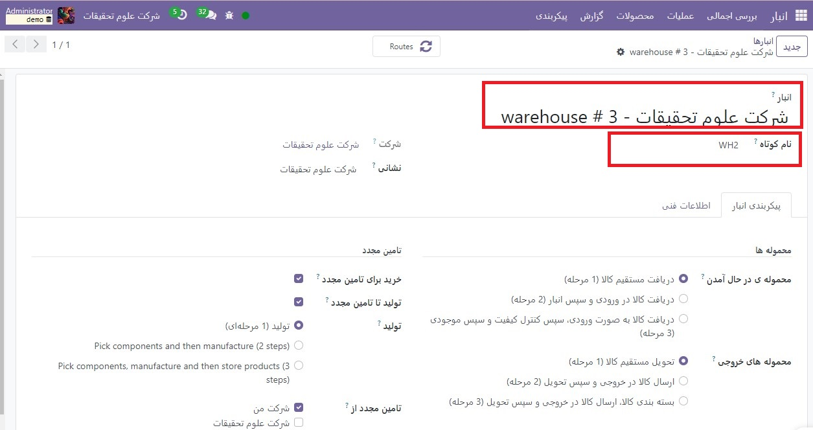
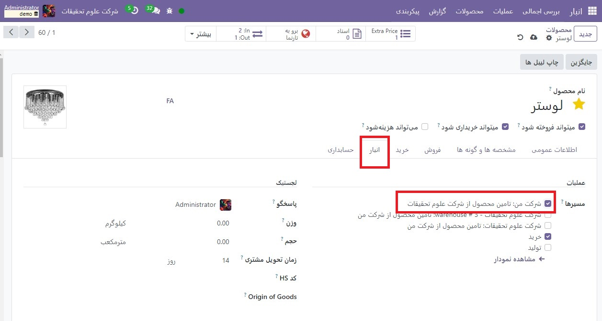
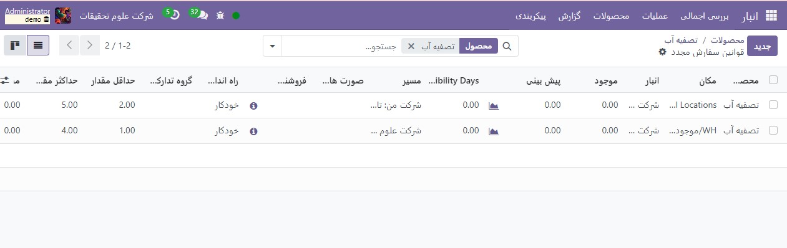
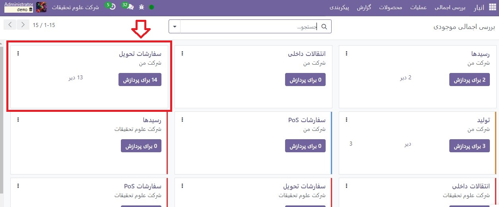
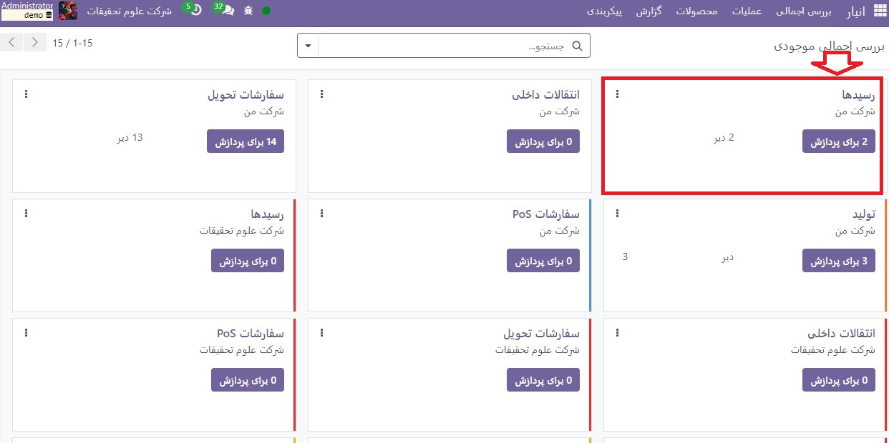
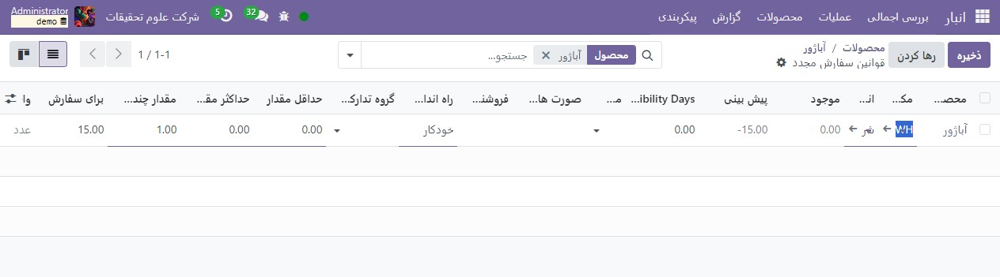

:nosearch:
:show-content:
:hide-page-toc:
:show-toc:

=============================================================
انتقال محصولات بین انبارها با استفاده از شارژکردن
=============================================================

برای شرکت هایی که از انبارهای متعدد استفاده می کنند، اغلب لازم است اقلام بین آنها منتقل شود. به این انتقال بین انباری گفته می شود. موجودی Odoo فرآیند اداری انتقال بین انبار را انجام می دهد تا اطمینان حاصل کند که شمارش موجودی در حین و پس از انتقال دقیق باقی می ماند. این سند روش انجام انتقال بین انباری با استفاده از شارژ کردن را به تفصیل شرح می دهد.

انبارها را برای تکمیل مجدد بین انبارها پیکربندی کنید
---------------------------------------------------------------------------
ابتدا، با رفتن به  :menuselection:`انبار --> پیکربندی --> تنظیمات`، مطمئن شوید که تنظیمات **مسیرهای چند مرحله ای** فعال است و سپس کادر زیر برگه انبار را علامت بزنید. این گزینه‌های پیکربندی اضافی را هنگام ایجاد یک انبار دوم که برای تکمیل مجدد بین انبار مورد نیاز است، فراهم می‌کند.

به طور پیش فرض، Odoo دارای یک انبار اصلی است که قبلاً پیکربندی شده است. اگر قبلاً یک انبار اضافی ایجاد نشده است، این کار را اکنون از ماژول موجودی با انتخاب  :menuselection:`پیکربندی --> انبارها --> جدید` انجام دهید. در غیر این صورت، انباری را که محصولات به آن منتقل می شوند را از صفحه انبارها انتخاب کنید و سپس روی ویرایش کلیک کنید تا تنظیمات آن تغییر کند. انبار را به صورت زیر پیکربندی کنید:

  - انبار: نامی را انتخاب کنید که قبلاً برای انبار دیگری استفاده نشده است (مثلاً انبار جایگزین)
  - نام کوتاه: نام کوتاهی را انتخاب کنید که با آن انبار شناسایی شود (مانند ALT_WH)

روی **ذخیره** کلیک کنید و انبار جدید ایجاد می شود. علاوه بر این، یک فیلد تامین مجدد از جدید در فرم انبار ظاهر می شود. روی **ویرایش** کلیک کنید و سپس کادر کنار انباری را که برای تامین مجدد انباری که در حال پیکربندی است استفاده می شود، علامت بزنید.

.. note::
    برای اهداف این نمایش، انباری که محصولات از آن (خروجی) منتقل می‌شوند، "شرکت من" و انباری که محصولات به آن منتقل می‌شوند (ورودی) با عنوان "علوم تحقیقات" خواهد بود.

محصولات را برای تکمیل مجدد در انبار پیکربندی کنید
----------------------------------------------------------------
محصولات همچنین باید به درستی پیکربندی شوند تا بتوانند بین انبارها منتقل شوند. به برنامه  انبار‣ محصولات ‣ محصولات بروید و یک محصول موجود را انتخاب کنید یا در صورت لزوم یک محصول جدید ایجاد کنید

سپس در فرم محصول، به تب انبار رفته و چک باکس X: Supply Product from Y را فعال کنید، که X انباری است که محصولات منتقل شده را دریافت می کند و Y انباری است که محصولات از آن منتقل می شوند

یک انبار را از انبار دیگر شارژ کنید
----------------------------------------------------------
با شروع دربرنامه موجودی، محصولات ‣ محصولات را انتخاب کنید و سپس محصولی را انتخاب کنید که دوباره پر می شود. روی دکمه دوباره شارژ کنید در سمت چپ بالای صفحه محصول کلیک کنید و فرم پاپ آپ را به صورت زیر پر کنید:

  - مقدار: تعداد واحدهایی که به انبار در حال تکمیل مجدد ارسال می شود

  - تاریخ برنامه ریزی شده: تاریخی که قرار است دوباره تکمیل شود

  - انبار: انباری که دوباره شارژ می شود

  - مسیرهای ترجیحی: X را انتخاب کنید: عرضه محصول از Y، با X به عنوان انباری است که باید دوباره شارژ شود و Y انباری است که محصول از آن منتقل می شود.

روی **تایید** کلیک کنید و سفارش تحویل برای انبار خروجی به همراه رسید انباری که محصول را دریافت می کند ایجاد می شود. بسته به تنظیمات پیکربندی برای انبارهای خروجی و ورودی، پردازش سفارشات و رسیدهای تحویل بین یک تا سه مرحله نیاز دارد. این سند نحوه پردازش تحویل و رسیدهای یک مرحله ای را شرح می دهد.

پردازش سفارش تحویل
-----------------------------------------
مرحله اول تکمیل سفارش، پردازش تحویل از انباری است که محصول از آنجا منتقل می شود. در داشبورد انبار، دکمه x برای پردازش را در کارت تحویل سفارشات برای انبار خروجی انتخاب کنید، سپس سفارش تحویل ایجاد شده برای تکمیل را انتخاب کنید. در صفحه سفارش تحویل، روی دکمه بررسی در دسترس بودن در بالا سمت راست کلیک کنید تا مقدار محصول مورد نظر را رزرو کنید. پس از ارسال، روی دکمه اعتبارسنجی کلیک کنید تا مقادیر ارسال شده ثبت شود

رسید را پردازش کنید
--------------------------------------------------
پس از رسیدن کالا به انبار ورودی، رسید ایجاد شده برای آن انبار نیز باید پردازش شود. به داشبورد موجودی بازگردید و دکمه X برای پردازش را در کارت رسیدها برای انبار ورودی انتخاب کنید، سپس رسید ایجاد شده برای تکمیل را انتخاب کنید. در صفحه رسید، روی دکمه تایید اعتبار در سمت راست بالای صفحه کلیک کنید تا مقادیر دریافتی ثبت شود..

پس از پردازش رسید، محصولات منتقل شده اکنون در موجودی انبار ورودی ظاهر می شوند. با بازگشت به صفحه محصول و انتخاب دکمه X مقدار موجود در بالای صفحه می‌توانید شماره موجودی هر دو انبار را مشاهده کنید.

تکمیل خودکار بین انبارها
-----------------------------------------------------------
با استفاده از قوانین سفارش مجدد، می توان فرآیند شارژ کردن یک انبار از انبار دیگر را خودکار کرد.

برای شروع، به برنامه **انبار ‣ محصولات ‣ محصولات** بروید و سپس محصولی را که دوباره شارژ می شود انتخاب کنید. از صفحه محصول، دکمه هوشمند قوانین سفارش مجدد را در بالای فرم انتخاب کنید و سپس در صفحه بعد روی **جدید** کلیک کنید تا فرم به صورت زیر پیکربندی شود:

  - مکان: مکانی که قانون سفارش مجدد پس از فعال شدن دوباره پر می شود، در این مورد، انبار ورودی
  - حداقل مقدار: زمانی که مقدار موجود در انبار ورودی کمتر از این عدد باشد، قانون سفارش مجدد فعال خواهد شد.
  - حداکثر مقدار: هنگامی که قانون سفارش مجدد فعال می شود، محصول تا این مقدار در انبار ورودی دوباره شارژ می شود.
  - مقدار چندگانه: مشخص کنید که آیا محصول باید در دسته هایی با مقدار معینی دوباره شارژ شود. به عنوان مثال، یک محصول را می توان در دسته های 20 تایی دوباره شارژ کرد
  -واحداندازه گیری: واحد اندازه گیری مورد استفاده برای سفارش مجدد محصول. این مقدار می تواند به سادگی واحد یا یک واحد اندازه گیری خاص برای وزن، طول و غیره باشد.

.. tip::
    با کلیک روی **ذخیره** کار را تمام کنید و قانون ترتیب مجدد ایجاد می شود. اکنون، زمانی که زمان‌بندی هر روز به‌طور خودکار اجرا می‌شود، برای هر قانون ترتیب‌دهی مجدد که راه‌اندازی شده است، یک انتقال ایجاد می‌شود

پس از اجرای برنامه زمانبندی، سفارش تحویل و رسید به ترتیب برای انبارهای خروجی و ورودی ایجاد می شود. هم سفارش تحویل و هم رسید باید با همان روشی که در بالا توضیح داده شده پردازش شود.

