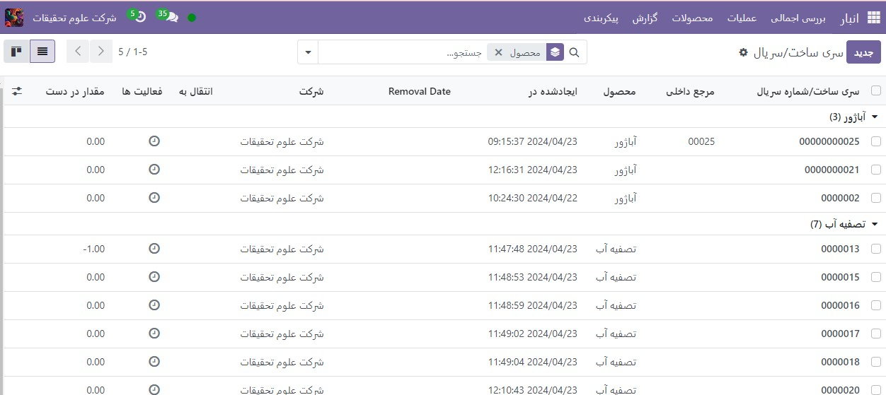
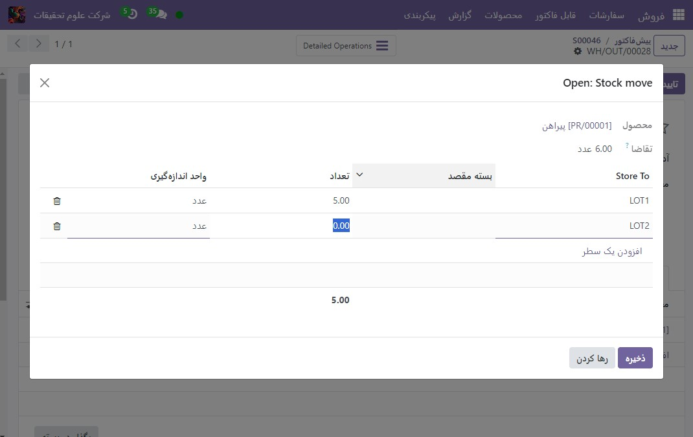

:nosearch:
:show-content:
:hide-page-toc:
:show-toc:

=================================
حذف FIFO
=================================

استراتژی حذف First In, First Out (FIFO) محصولاتی را با اولین تاریخ ورود انتخاب می کند. این روش برای شرکت هایی مفید است که محصولاتی را می فروشند که چرخه تقاضای کوتاهی دارند، مثلاً لباس. با استفاده از FIFO، شرکت ها می توانند از حفظ طولانی مدت سهام سبک های خاص جلوگیری کنند.

.. example::
    مقادیر مختلف محصول، تی شرت، با شماره های لات، در تاریخ 1 و 25 آگوست می رسد. برای سفارشی که در 1 سپتامبر انجام شده است، استراتژی حذف FIFO مواردی را که طولانی‌ترین مدت در انبار بوده‌اند، اولویت‌بندی می‌کند. بنابراین، محصولات دریافت شده در تاریخ 1 آگوست ابتدا برای چیدن انتخاب می شوند.

    .. image:: ./img/removalstrategies/r1.jpg
        :align: center
        :alt: انبار

تاریخ ورود
------------------------------------
برای مشاهده تعداد محصول یا شماره سریالی که ابتدا به موجودی رسیده است، به برنامه **انبار‣ محصولات ‣ سری/شماره سریال** بروید.

سپس، نماد ▶️ (پیکان رو به راست) را در سمت راست خط محصول انتخاب کنید تا فهرستی از تعداد سری یا شماره سریال محصول موجود در انبار نشان داده شود. فیلد Created On تاریخ ایجاد سری/ شماره سریال را نشان می دهد که اساساً تاریخ ورود است.

جریان کار
---------------------------------------------
برای درک اینکه چگونه FIFO محصولات را به سمت خارج می چرخاند، مثال زیر را در نظر بگیرید، با تمرکز بر سه تعداد زیادی پیراهن سفید.

پیراهن‌ها از دسته همه/لباس‌ها هستند، جایی که FIFO به عنوان استراتژی حذف نیرو تعیین شده است.

پیراهن های سفید توسط شناسه (سری) در برگه موجودی فرم محصول پیگیری می شوند.

برای مشاهده عملی استراتژی حذف، با رفتن به برنامه فروش و ایجاد یک پیش فاکتور جدید، یک سفارش تحویل برای شش پیراهن سفید ایجاد کنید.

پس از کلیک بر روی تأیید سفارش فروش، با استفاده از استراتژی حذف **FIFO**، سفارش تحویل با قدیمی ترین شماره های پیراهن رزرو می شود.

برای مشاهده جزئیات انتخاب، روی نماد ⦙≣ (فهرست گلوله‌دار) که در سمت راست خط تولید پیراهن سفید در برگه عملیات سفارش تحویل قرار دارد، کلیک کنید. با انجام این کار، پنجره بازشو باز می شود.

در پنجره بازشوی Open: Stock move، فیلد انتخاب از جایی که مقادیر برای برآورده کردن تقاضا از آنجا انتخاب شده است را نشان می دهد. از آنجایی که سفارش درخواست شش پیراهن داشت، هر پنج پیراهن از LOT1 و یک پیراهن از LOT2 انتخاب شده‌اند.

