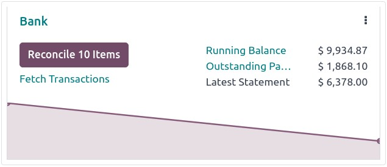
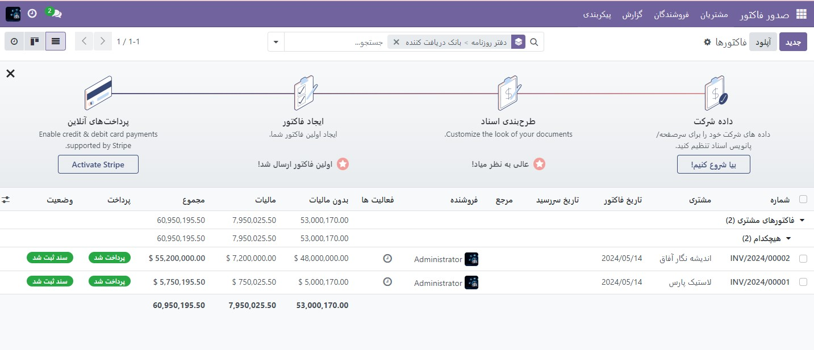

:nosearch:
:show-content:
:hide-page-toc:
:show-toc:

=============================================
تسویه حساب بانکی
=============================================

تطبیق بانکی فرآیند تطبیق تراکنش های بانکی شما با سوابق تجاری شما، مانند صورتحساب های مشتری، قبوض فروشنده و پرداخت ها است. این نه تنها برای اکثر مشاغل اجباری است، بلکه چندین مزیت از جمله کاهش خطر خطا در گزارش‌های مالی، شناسایی فعالیت‌های متقلبانه و بهبود مدیریت جریان نقدی را ارائه می‌دهد.

به لطف مدل‌های تطبیق بانکی، Odoo ورودی‌های مطابق را به‌طور خودکار از قبل انتخاب می‌کند.

.. seealso::
   - :doc:`transactions`

دیدگاه تطبیق بانکی
----------------------------------------------------
برای دسترسی به نمای تطبیق یک دفترروزنامه بانکی، به **داشبورد حسابداری** خود بروید و یکی از این موارد:

    - روی نام روزنامه (به عنوان مثال، بانک) کلیک کنید تا همه تراکنش‌ها، از جمله تراکنش‌هایی که قبلا تطبیق داده شده‌اند یا

    - روی دکمه تطبیق موارد کلیک کنید تا تمام تراکنش‌هایی که Odoo از قبل برای تطبیق انتخاب شده‌اند نمایش داده شود. می‌توانید فیلتر  مطابقت ندارد را از نوار جستجو حذف کنید تا تراکنش‌های قبلاً تطبیق‌شده را نیز شامل شود.

دیدگاه تطبیق بانک به سه بخش مجزا ساختار یافته است: تراکنش‌ها، ورودی‌های طرف مقابل، و ورودی حاصل.

معاملات
------------------
بخش تراکنش ها در سمت چپ تمام تراکنش های بانکی را نشان می دهد که جدیدترین آنها ابتدا نمایش داده می شود. برای انتخاب یک تراکنش کلیک کنید.

ورودی های همتا
---------------------
بخش ورودی های طرف مقابل در سمت راست پایین گزینه هایی را برای مطابقت با تراکنش بانکی انتخاب شده نمایش می دهد. چندین برگه در دسترس است، از جمله مطابقت با ورودی‌های موجود، پرداخت‌های دسته‌ای، عملیات دستی، و بحث، که حاوی گفتگو برای تراکنش بانکی انتخاب شده است.

ورودی حاصل
---------------------
بخش ورودی به دست آمده در بالا سمت راست، تراکنش بانکی انتخابی را که با ورودی‌های همتای همتای خود مطابقت دارد نشان می‌دهد و شامل بدهی‌ها یا اعتبارات باقی‌مانده است. در این بخش، می توانید تطبیق را تأیید کنید یا آن را به عنوان To Check علامت بزنید. هر دکمه مدل تطبیقی نیز در بخش ورودی حاصل موجود است.

معاملات را تطبیق دهید
-----------------------------------------------
تراکنش‌ها را می‌توان به‌طور خودکار با استفاده از مدل‌های تطبیق مطابقت داد، یا می‌توان آنها را با ورودی‌های موجود، پرداخت‌های دسته‌ای، عملیات دستی و دکمه‌های مدل تطبیق مطابقت داد.

  #. از میان تراکنش های بانکی بی همتا، تراکنش را انتخاب کنید.

  #. همتا را تعریف کنید. چندین گزینه برای تعریف همتای وجود دارد، از جمله تطبیق ورودی های موجود، عملیات دستی، پرداخت های دسته ای و دکمه های مدل تطبیق.

  #. اگر ورودی به‌دست‌آمده کاملاً متعادل نیست، آن را با اضافه کردن ورودی مشابه موجود دیگر یا حذف آن با یک عملیات دستی، متعادل کنید.

  #. برای تایید تطبیق و رفتن به تراکنش بعدی، روی دکمه اعتبارسنجی کلیک کنید.

.. tip::
    اگر مطمئن نیستید که چگونه یک تراکنش خاص را تطبیق دهید و می خواهید بعداً با آن برخورد کنید، به جای آن از دکمه بررسی استفاده کنید. تمام تراکنش‌هایی که به‌عنوان **To Check** علامت‌گذاری شده‌اند را می‌توان با استفاده از فیلتر **To Check** نمایش داد.

.. note::
    تراکنش های بانکی تا زمان تسویه در حساب معلق روزنامه ثبت می شود. در این مرحله، تطبیق با جایگزینی حساب معلق بانکی با حساب دریافتنی، پرداختنی، یا معوق مربوطه، ثبت دفتر معاملات را اصلاح می کند.

با ورودی های موجود مطابقت دهید
---------------------------------------------------------
این صفحه حاوی ورودی های تطبیق پذیری است که Odoo به طور خودکار از قبل بر اساس مدل های اصلاح شده انتخاب کرده است. ترتیب ورود بر اساس مدل‌های تطبیق است و ورودی‌های پیشنهادی ابتدا ظاهر می‌شوند.

.. note::
    نوار جستجو در صفحه مطابقت با ورودی های موجود به شما امکان می دهد موارد خاص روزنامه را جستجو کنید.

پرداخت های دسته ای
----------------------------------------
پرداخت های دسته ای به شما این امکان را می دهد که پرداخت های مختلف را گروه بندی کنید تا تطبیق آسان شود. از تب پرداخت های دسته ی برای یافتن پرداخت های دسته ای برای مشتریان و فروشندگان استفاده کنید. همانند برگه  مطابق با ورودی های موجود ، تب پرداخت های دسته ای دارای نوار جستجو است که به شما امکان می دهد پرداخت های دسته ای خاص را جستجو کنید.

عملیات دستی
-----------------------------------------------
اگر ورودی موجود برای مطابقت با تراکنش انتخابی وجود نداشته باشد، در عوض ممکن است بخواهید با انتخاب حساب و مبلغ صحیح، تراکنش را به صورت دستی تطبیق دهید. سپس، هر یک از فیلدهای اختیاری مربوطه را تکمیل کنید.

.. tip::
    حتی در مواردی که فقط یک پرداخت جزئی دریافت می شود، می توانید از گزینه کاملاً پرداخت شده برای تطبیق پرداخت استفاده کنید. یک خط جدید در بخش ورودی به دست آمده ظاهر می شود تا موجودی باز ثبت شده در حساب دریافتنی به طور پیش فرض را منعکس کند. می توانید با کلیک بر روی خط جدید در قسمت ورودی حاصل و انتخاب حساب برای ثبت موجودی باز، حساب دیگری را انتخاب کنید.

دکمه های مدل تطبیق پذیر
------------------------------------------------------
از دکمه مدل تطبیق برای عملیات دستی که اغلب استفاده می شود استفاده کنید. این دکمه های سفارشی به شما امکان می دهد تا به سرعت تراکنش های بانکی را به صورت دستی تطبیق دهید و همچنین می توانید از آنها در ترکیب با ورودی های موجود استفاده کنید.
