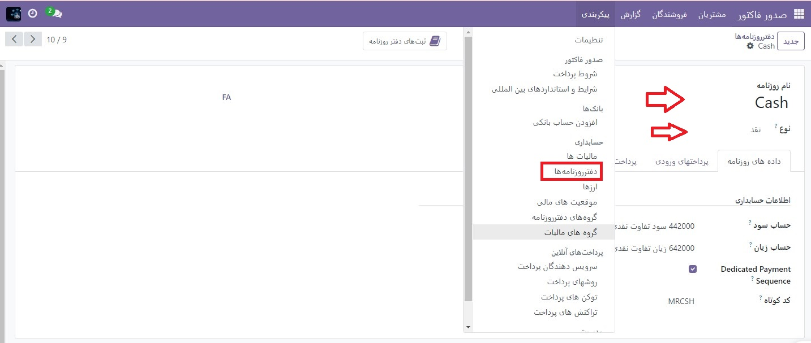
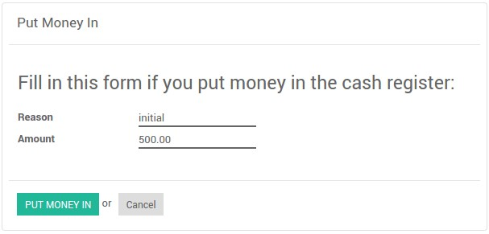

:nosearch:
:show-content:
:hide-page-toc:
:show-toc:

=============================================
صندوق
=============================================

صندوق, صندوق روزنامه ای برای ثبت تراکنش های دریافت و پرداخت است. کل پول داخل و خارج را محاسبه می کند و کل موجودی را محاسبه می کند.

   #. روزنامه نقدی را در حسابداری ‣ پیکربندی ‣ دفترروزنامه پیکربندی کنید.

   #. در برگه ورودی های روزنامه، حساب بدهی و اعتبار پیش فرض و همچنین واحد پول روزنامه را می توان پیکربندی کرد.

کاربرد
-------------------------------------
چگونه پرداخت های نقدی را ثبت کنیم؟

برای ثبت پرداخت نقدی مخصوص مشتری دیگر، باید مراحل زیر را دنبال کنید:

   #. به **حسابداری ‣ داشبورد ‣ نقدی ‣ ثبت تراکنش ها** بروید

    #. تراز شروع و پایان را پر کنید

    #. معاملات را با مشخص کردن مشتریان مرتبط با تراکنش ثبت کنید

واریز پول
-------------------------------------
واریز پول در برای قرار دادن پول نقد به صورت دستی قبل از شروع تراکنش ها استفاده می شود. از پنجره ثبت تراکنش ها، به قسمت بیشتر ‣ واریزپول بروید

برداشت پول
---------------------------------------
برداشت پول برای جمع‌آوری/دریافت پول نقد به صورت دستی پس از پایان تمام تراکنش‌های شما استفاده می‌شود. از پنجره‌های ثبت تراکنش، به بیشتر بروید ‣ برداشت پول 

تراکنش ها به ثبت نام پرداخت نقدی جاری اضافه می شوند.