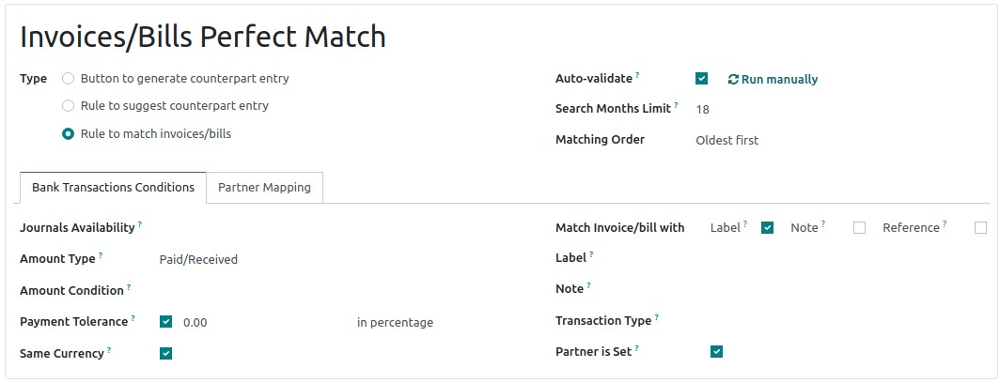
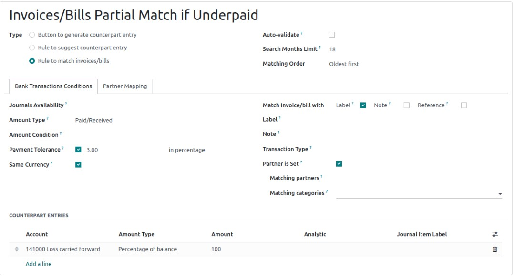
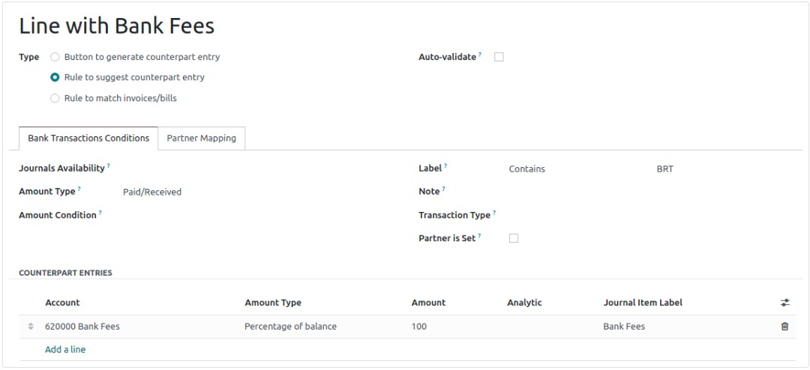

:nosearch:
:show-content:
:hide-page-toc:
:show-toc:

=========================
مدل های تطبیق پذیر
=========================

مدل‌های تطبیق برای خودکارسازی فرآیند تطبیق بانک استفاده می‌شوند، که به ویژه هنگام برخورد با ورودی‌های تکراری مانند کارمزد بانکی مفید است. مدل‌های تطبیق پذیرنیز می‌توانند در رسیدگی به تخفیف‌های نقدی مفید باشند.

هر مدل بر اساس نوع مدل و شرایط تراکنش بانکی ایجاد می شود.

انواع مدل تطبیق پذیر

---------------------------------------------------------
مدل های تطبیق با رفتن به حسابداری(صدور فاکتور) ‣ پیکربندی ‣ بانک ها: مدل های تطبیق پذیر در دسترس هستند. برای هر مدل تطبیق، یک نوع باید تنظیم شود. سه نوع مدل وجود دارد:

دکمه ایجاد ورودی همتا: یک دکمه در قسمت ورودی حاصل از نمای تطبیق بانک ایجاد می شود. اگر کلیک شود، این دکمه یک ورودی مشابه برای تطبیق با تراکنش فعال بر اساس قوانین تنظیم شده در مدل ایجاد می کند. قوانین مشخص شده در مدل، حساب(های)، مبلغ(ها)، برچسب(ها)، و توزیع تحلیلی ورودی مشابه را تعیین می کند.

قانون پیشنهاد ورود همتا: برای تراکنش‌های تکراری برای تطبیق تراکنش با ورودی جدید براساس شرایطی که باید با اطلاعات معامله مطابقت داشته باشد استفاده می‌شود.

قانون تطبیق فاکتورها/قبض ها: برای تراکنش های مکرر برای تطبیق تراکنش با فاکتورها، صورتحساب ها یا پرداخت های موجود بر اساس شرایطی که باید با اطلاعات تراکنش مطابقت داشته باشد استفاده می شود.

مدل‌های تطبیق پیش‌ فرض
---------------------------------------------------------
در Odoo، بسته به محلی سازی مالی شرکت، مدل های مختلفی به طور پیش فرض در دسترس هستند. در صورت نیاز می توان این موارد را به روز کرد. کاربران همچنین می توانند با کلیک کردن بر روی **جدید**، مدل های تطبیق خود را ایجاد کنند.

.. important::
    اگر یک رکورد با چندین مدل تطبیق مطابقت داشته باشد، اولین مورد در دنباله مدل ها اعمال می شود. می‌توانید با کشیدن و رها کردن دسته کنار نام، ترتیب را مجدداً مرتب کنید.
    
    .. image:: ./img/bank/b8.jpg
        :align: center
        :alt: حسابداری

فاکتورها / صورتحساب ها مطابقت کامل دارند
--------------------------------------------------------------
این مدل باید در بالای دنباله مدل‌ها قرار گیرد، زیرا Odoo را قادر می‌سازد تا مطابق شرایط یا صورت‌حساب‌های موجود با یک تراکنش بانکی را پیشنهاد دهد.

وقتی گزینه تأیید خودکار انتخاب شد و شرایط مدل کاملاً برآورده شد، Odoo به طور خودکار پرداخت را تطبیق می دهد. در این مورد، انتظار دارد که در خط صورت‌حساب بانک، مرجع فاکتور/پرداخت (همانطور که Label انتخاب شده است) و نام شریک (همانطور که شریک تنظیم شده است) را پیدا کند تا ورودی همتای صحیح را پیشنهاد کند و پرداخت را به‌طور خودکار تطبیق دهد.

فاکتور‌ها/صورت‌حساب‌ها در صورت پرداخت ناقص مطابقت جزئی دارند
-----------------------------------------------------------------------------
این مدل فاکتور مشتری یا صورت‌حساب فروشنده را پیشنهاد می‌کند که تا حدی با پرداخت مطابقت دارد، زمانی که مبلغ دریافتی کمی کمتر از مبلغ فاکتور باشد، برای مثال در مورد تخفیف‌های نقدی. تفاوت با حساب نشان داده شده در برگه ورودی های همتا تطبیق داده می شود.

نوع مدل تطبیق، قاعده ای برای مطابقت با فاکتورها/صورتحساب ها است و تحمل پرداخت باید تنظیم شود

مطابق با کارمزد بانکی
----------------------------------------------
این مدل یک ورودی همتا را طبق قوانین تعیین شده در مدل پیشنهاد می کند. در این مورد، مدل تطبیق نوع قانون برای پیشنهاد ورود طرف مقابل است و از برچسب می‌توان به عنوان مثال برای شناسایی اطلاعات مربوط به کارمزدهای بانکی در برچسب تراکنش استفاده کرد..

نقشه برداری شریک تجاری
----------------------------------------------
نقشه برداری شریک به شما امکان می‌دهد قوانینی را برای تطبیق خودکار تراکنش‌ها با حساب صحیح شریک ایجاد کنید، در زمان صرفه‌جویی کنید و خطر خطاهایی را که می‌تواند در حین تطبیق دستی رخ دهد، کاهش دهید. به عنوان مثال، می توانید یک قانون نقشه  برداری شریک برای پرداخت های دریافتی با شماره های مرجع یا کلمات کلیدی خاص در توضیحات تراکنش ایجاد کنید. هنگامی که پرداخت دریافتی با این معیارها مطابقت دارد، Odoo به طور خودکار آن را به حساب مشتری مربوطه نشان می دهد.

برای ایجاد یک قانون نگاشت شریک، به تب Partner Mapping بروید و Find Text در Label، Find Text in Notes و Partner را وارد کنید.
