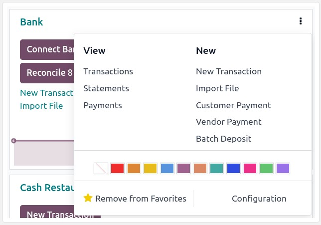
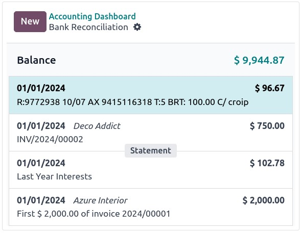

:nosearch:
:show-content:
:hide-page-toc:
:show-toc:

======================
معاملات
======================

وارد کردن تراکنش‌ها از صورت‌حساب‌های بانکی شما، امکان پیگیری تراکنش‌های حساب بانکی و تطبیق آن‌ها با موارد ثبت شده در حسابداری شما را فراهم می‌کند.

همگام سازی بانک فرآیند را خودکار می کند. با این حال، اگر نمی‌خواهید از آن استفاده کنید یا اگر بانک شما هنوز پشتیبانی نمی‌شود، گزینه‌های دیگری وجود دارد:

    - واردات تراکنش های بانکی تحویل شده توسط بانک شما؛

    - تراکنش های بانکی را به صورت دستی ثبت کنید. 

.. note::
    گروه بندی تراکنش ها بر اساس بیانیه اختیاری است.

.. tip::
    نکته

    به طور متناوب، شما همچنین می توانید:

    روی ⋮ روی مجله بانک کلیک کنید و فایل وارد کنید را انتخاب کنید.

    یا با کلیک بر روی ⋮ در مجله بانک و انتخاب معاملات ، سپس روی نماد چرخ دنده (⚙) کلیک کرده و وارد کردن رکوردرا انتخاب کنید. 

سپس فایل را انتخاب کرده و آپلود کنید.

پس از تنظیم گزینه‌های قالب‌بندی لازم و نگاشت ستون‌های فایل با فیلدهای Odoo مربوطه، می‌توانید تراکنش‌های بانکی خود را تست و وارد کنید.

تراکنش های بانکی را به صورت دستی ثبت کنید
---------------------------------------------------------------
همچنین می توانید تراکنش های بانکی خود را به صورت دستی ثبت کنید. برای انجام این کار، به داشبورد **حسابداری** بروید، روی مجله بانک و سپس روی **جدید** کلیک کنید. حتماً فیلدهای شریک و برچسب را پر کنید تا روند تطبیق آسان شود. 

اعلان بانک
------------------------------------------------------
صورت‌حساب بانکی سندی است که توسط یک بانک یا موسسه مالی ارائه می‌شود و تراکنش‌هایی را که در یک حساب بانکی خاص در یک دوره زمانی مشخص انجام شده است، فهرست می‌کند.

در حسابداری Odoo، گروه بندی معاملات بر اساس اعلان بانک مربوط به آنها اختیاری است، اما بسته به جریان کسب و کارتان، ممکن است بخواهید آنها را برای اهداف کنترلی ثبت کنید. 

.. important::
    اگر می خواهید مانده های پایانی صورت های بانکی خود را با مانده های پایانی سوابق مالی خود مقایسه کنید، فراموش نکنید که یک تراکنش افتتاحیه برای ثبت موجودی حساب بانکی از تاریخ شروع همگام سازی یا وارد کردن تراکنش ها ایجاد کنید. این برای اطمینان از صحت حسابداری شما ضروری است. 

برای دسترسی به لیست صورت‌حساب‌ها، به داشبورد حسابداری خود بروید، روی دکمه عمودی (⋮) در کنار بانک یا روزنامه نقدی که می‌خواهید بررسی کنید و سپس روی صورت‌حساب کلیک کنید.

ایجاد اعلان بانک از نمای kanban
--------------------------------------------
نمای تطبیق بانک را با کلیک بر روی نام مجله بانک باز کنید و تراکنش مربوط به آخرین تراکنش صورت حساب بانکی خود را شناسایی کنید. روی دکمه اعلان بانک کلیک کنید.

جزئیات اعلان بانک را پر کنید و ذخیره کنید.اعلان بانک جدید ایجاد شده شامل تراکنش های قبلی پس از آخرین اعلان بانک است.

ایجاد اعلان بانک از نمای لیست
--------------------------------------------------
لیست تراکنش ها را با کلیک بر روی نام مجله بانک و رفتن به نمای لیست باز کنید. تمام تراکنش‌های مربوط به صورت‌حساب بانک را انتخاب کنید و در ستون صورت‌حساب، صورت‌حساب موجود را انتخاب کنید یا با تایپ مرجع آن، کلیک بر روی **ایجاد و ویرایش**…، تکمیل جزئیات صورت‌حساب و ذخیره، صورت حساب جدیدی ایجاد کنید.

