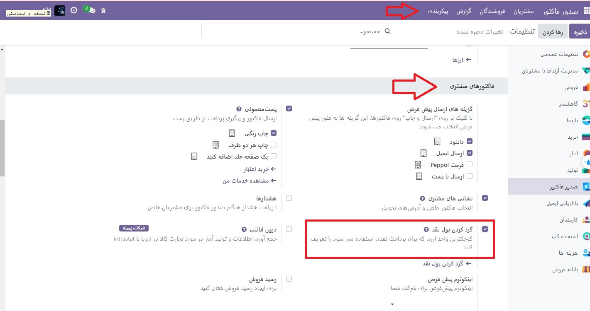
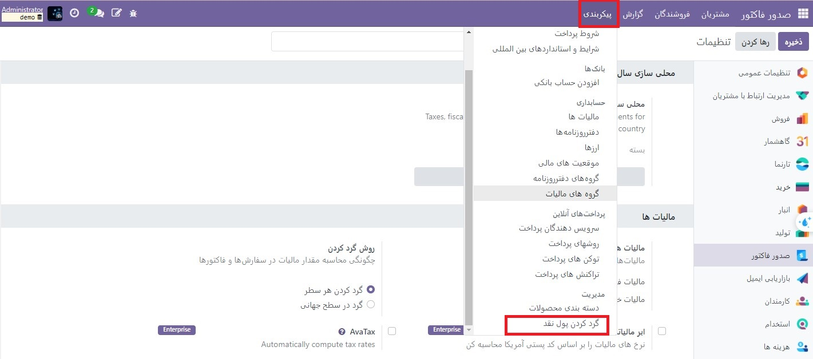

:nosearch:
:show-content:
:hide-page-toc:
:show-toc:

=============================
گرد کردن پول نقد
=============================

گرد کردن وجه نقد زمانی لازم است که کمترین ارزش فیزیکی ارز یا کوچکترین سکه بالاتر از حداقل واحد حساب باشد.

برای مثال، برخی از کشورها از شرکت‌های خود می‌خواهند که در صورت پرداخت نقدی، کل مبلغ یک فاکتور را جمع کنند.

پیکربندی
------------------------
به  :menuselection:`صدورفاکتور --> پیکربندی --> تنظیمات --> فاکتورهای مشتری` رفته و گردکردن پول نقد را فعال کنید، سپس بر روی ذخیره کلیک کنید.

به قسمت  :menuselection:`صدورفاکتور --> پیکربندی --> گردکردن پول نقد` بروید و روی جدید کلیک کنید.

در اینجا دقت گرد کردن، استراتژی گرد کردن و روش گرد کردن خود را تعریف کنید.

Odoo از دو استراتژی گرد کردن پشتیبانی می کند:

   #. افزودن یک خط گرد: یک خط گرد بر روی فاکتور اضافه می شود. شما باید تعریف کنید که کدام حساب گردآوری های نقدی را ثبت می کند.

   #. تغییر مقدار مالیات: گرد کردن در بخش مالیات اعمال می شود.

گردکردن را اعمال کنید
----------------------------------------------
هنگام ویرایش پیش نویس فاکتور، برگه اطلاعات دیگر را باز کنید، به بخش **اطلاعات حسابداری** بروید و **روش گرد کردن نقدی** مناسب را انتخاب کنید.
