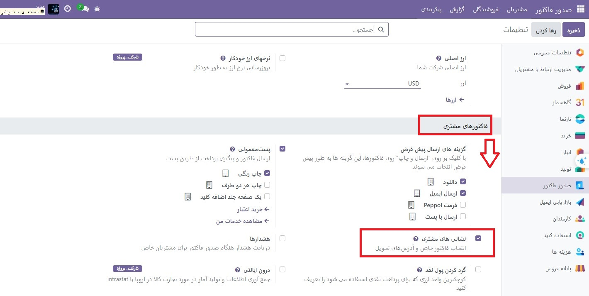

:nosearch:
:show-content:
:hide-page-toc:
:show-toc:

=============================
آدرس های تحویل و فاکتور
=============================

شرکت ها اغلب دارای مکان های متعددی هستند و معمولاً یک فاکتور مشتری باید به یک آدرس و تحویل به آدرس دیگری ارسال شود. ویژگی آدرس‌های مشتری Odoo برای رسیدگی به این سناریو طراحی شده است و تعیین آدرس مورد استفاده برای هر مورد را آسان می‌کند.

.. seealso::
   - :doc:`invoicing processes`

پیکربندی
-----------------------------------------
برای تعیین فاکتور و آدرس تحویل سفارش فروش، ابتدا به **حسابداری(صدورفاکتور) ‣ پیکربندی ‣ تنظیمات** بروید. در قسمت **فاکتورهای مشتری، آدرس های مشتری** را فعال کرده و روی **ذخیره** کلیک کنید.

در مورد قیمت‌ها و سفارش‌های فروش، اکنون فیلدهایی برای آدرس فاکتور و آدرس تحویل وجود دارد. اگر مشتری یک فاکتور یا آدرس تحویل در سابقه تماس خود داشته باشد، فیلد مربوطه به طور پیش‌فرض از آن آدرس استفاده می‌کند، اما به جای آن می‌توان از آدرس هر مخاطبی استفاده کرد.

فاکتور و تحویل به آدرس های مختلف
----------------------------------------------------
سفارشات تحویل و گزارش برگه تحویل آنها از آدرسی که به عنوان آدرس تحویل در سفارش فروش تنظیم شده است استفاده می کند. به‌طور پیش‌فرض، گزارش‌های صورت‌حساب، آدرس حمل و نقل و آدرس فاکتور را نشان می‌دهند تا مشتری اطمینان حاصل کند که تحویل به محل صحیح می‌رود.

ایمیل ها نیز به آدرس های مختلف می روند. قیمت و سفارش فروش طبق معمول به ایمیل مخاطب اصلی ارسال می شود، اما فاکتور به ایمیل آدرسی که به عنوان آدرس فاکتور در سفارش فروش تعیین شده است ارسال می شود.
