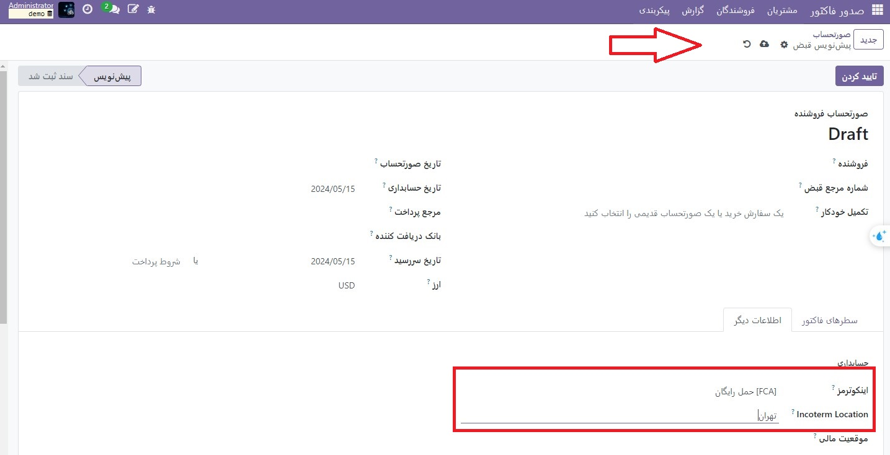

:nosearch:
:show-content:
:hide-page-toc:
:show-toc:

=============================
incoterms
=============================

:abbr:`Incoterms (International Commercial Terms)` اصطلاحات تجاری استاندارد شده ای است که در معاملات بین المللی برای تعریف حقوق و مسئولیت های خریداران و فروشندگان استفاده می شود. آنها تعهدات مربوط به تحویل کالا، انتقال خطرات و توزیع هزینه ها را بین طرفین درگیر تعیین می کنند. اینکوترمز جزئیات مهمی مانند نقطه انتقال ریسک و هزینه ها از فروشنده به خریدار، مسئولیت حمل و نقل، بیمه، ترخیص کالا از گمرک و سایر جنبه های مربوط به معامله را مشخص می کند.

.. seealso::
   - :doc:`customer invoices`
   - :doc:`vendor bills`

   - اینکوترم را تعریف کنید  
برای تعریف اینکوترم به صورت دستی، یک فاکتور یا صورتحساب ایجاد کنید، روی برگه اطلاعات دیگر کلیک کنید و **Incoterm** را انتخاب کنید.

   - مکان اینکوترم
یک مکان مرتبط با اینکوترم انتخابی را می توان در قسمت اطلاعات دیگر در قسمت **Incoterm Location** به فاکتور یا صورتحساب اضافه کرد.

.. example::
    اگر کد انتخابی اینکوترم CIF (Cost, Insurance, Freight) باشد، مکان مرتبط ممکن است مقصدی باشد که کالا در آن تحویل داده می‌شود.

پیکربندی پیش فرض اینکوترم
-------------------------------------------
می‌توانید یک قانون پیش‌ فرض اینکوترم تنظیم کنید تا فیلد اینکوترم به‌طور خودکار در تمام صورت‌حساب‌ها و صورت‌حساب‌های تازه ایجاد شده پر شود. در قسمت  :menuselection:`صدورفاکتور --> پیکربندی --> تنظیمات`، به قسمت **فاکتورهای مشتری** بروید و یک Incoterm را در قسمت Default Incoterm انتخاب کنید.
