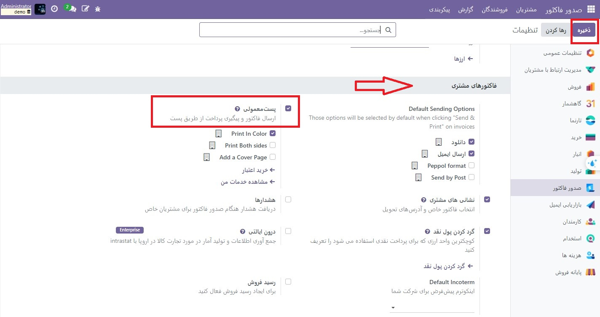
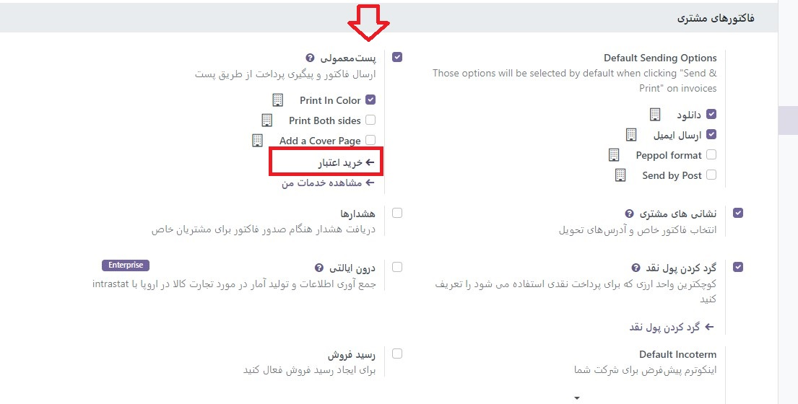

:nosearch:
:show-content:
:hide-page-toc:
:show-toc:

=============================
پست معمولی
=============================

ارسال ایمیل مستقیم می تواند یک استراتژی موثر برای جلب توجه افراد باشد، به خصوص زمانی که صندوق ورودی ایمیل آنها پر است. با Odoo، می توانید فاکتورها و گزارش های پیگیری را از طریق سامانه پستی در سراسر جهان ارسال کنید، همه از داخل پایگاه داده خود.

پیکربندی
-----------------------------------------
برای فعال کردن **پست معمولی** به بخش  :menuselection:`صدورفاکتور --> پیکربندی --> تنظیمات --> فاکتورهای مشتری` بروید.

برای تبدیل آن به یک ویژگی پیش‌ فرض، در قسمت گزینه‌های ارسال پیش‌ فرض، ارسال با پست را انتخاب کنید.

ارسال فاکتور از طریق پست
--------------------------------------
فاکتور خود را باز کنید، روی ارسال و چاپ کلیک کنید و گزینه ارسال با پست را انتخاب کنید. قبل از ارسال نامه مطمئن شوید که آدرس مشتری شما، از جمله کشور، به درستی تنظیم شده است.

قیمت گذاری
-----------------------------------------
پست معمولی یک سرویس خرید درون برنامه ای (IAP) است که برای کار کردن به تمبرهای پیش پرداخت (=اعتبار) نیاز دارد. ارسال یک سند یک مهر مصرف می کند.

برای خرید تمبر، به **حسابداری ‣ پیکربندی ‣ تنظیمات ‣ فاکتورهای مشتری: پست معمولی**، روی **خرید اعتبار** کلیک کنید یا به تنظیمات ‣ خریدهای درون برنامه ای: Odoo IAP بروید و روی **مشاهده خدمات من** کلیک کنید.

