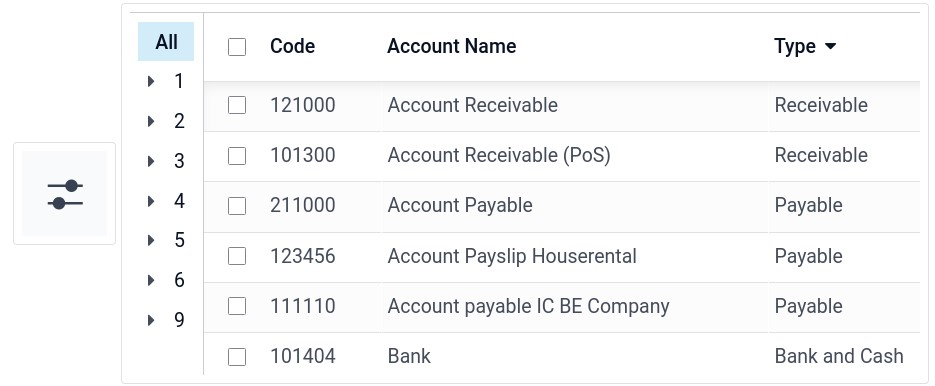
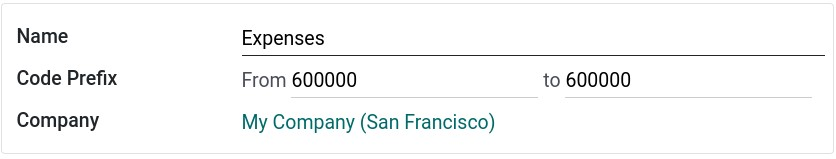

:nosearch:
:show-content:
:hide-page-toc:
:show-toc:

===============================
نمودار حساب
===============================

نمودار حساب ها (COA) فهرستی از تمام حساب های مورد استفاده برای ثبت تراکنش های مالی در دفتر کل یک سازمان است. نمودار حساب ها را می توانید در قسمت حسابداری ‣ پیکربندی ‣ نمودار حساب ها پیدا کنید.

هنگام مرور نمودار حساب های خود، می توانید حساب ها را بر اساس کد، نام حساب یا نوع مرتب کنید، اما گزینه های دیگری در منوی کشویی موجود است.

پیکربندی یک حساب کاربری
----------------------------------------------
کشوری که در طول ایجاد پایگاه داده خود (یا شرکت اضافی در پایگاه داده خود) انتخاب می کنید، تعیین می کند که کدام بسته محلی سازی مالی به طور پیش فرض نصب شده است. این بسته شامل یک نمودار استاندارد از حساب ها است که قبلاً مطابق با مقررات کشور پیکربندی شده است. می توانید مستقیماً از آن استفاده کنید یا آن را مطابق با نیازهای شرکت خود تنظیم کنید.

برای ایجاد یک حساب جدید، به :menuselection:`صدورفاکتور --> پیکربندی --> نمودارحساب` بروید، روی ایجاد کلیک کنید و (حداقل) فیلدهای مورد نیاز (کد، نام حساب، نوع) را پر کنید.

.. warning::
    پس از ارسال یک ورودی دفترروزنامه، امکان تغییر محلی سازی مالی یک شرکت وجود ندارد.

کد و نام
---------------------------------------
هر حساب با کد و نام خود مشخص می شود که هدف حساب را نیز نشان می دهد.

تایپ کنید
------------------------------------------

    - پیکربندی صحیح نوع حساب بسیار مهم است زیرا اهداف متعددی را دنبال می کند:

    - اطلاعات در مورد هدف و رفتار حساب

    - گزارش های حقوقی و مالی خاص کشور را تهیه کنید

    - قوانینی را برای بستن یک سال مالی تنظیم کنید

    - ورودی های افتتاحیه را ایجاد کنید

برای پیکربندی نوع حساب، انتخابگر کشویی فیلد Type را باز کنید و نوع مربوطه را از لیست زیر انتخاب کنید:

دارایی های
-------------------------------------------
برخی از انواع حساب ها می توانند ایجاد ورودی های دارایی را خودکار کنند. برای خودکار کردن ورودی‌ها، روی مشاهده در خط حساب کلیک کنید و به تب **تنظیم خودکار**بروید.

برای تب تنظیم خودکارسه انتخاب دارید:

   #. خیر: این مقدار پیش فرض است. هیچ اتفاقی نمی افتد.

   #. ایجاد در پیش نویس: هر زمان که یک تراکنش در حساب پست می شود، یک ورودی پیش نویس ایجاد می شود اما تایید نمی شود. ابتدا باید فرم مربوطه را پر کنید.

   #. ایجاد و اعتبارسنجی: همچنین باید یک مدل هزینه معوق را انتخاب کنید. هر زمان که یک تراکنش در حساب پست می شود، یک ورودی ایجاد می شود و بلافاصله تأیید می شود.

مالیات های پیش فرض
----------------------------------------
در منوی مشاهده یک حساب، یک مالیات پیش‌ فرض را انتخاب کنید تا هنگام انتخاب این حساب برای خرید یا فروش محصول اعمال شود.

برچسب ها
------------------------------------------
برخی از گزارش های حسابداری نیاز به تنظیم برچسب روی حساب های مربوطه دارند. برای افزودن یک برچسب، در قسمت **مشاهده**، روی فیلد **برچسب ها** کلیک کنید و یک برچسب موجود یا ایجاد یک برچسب جدید را انتخاب کنید.

گروه های حساب
------------------------------
گروه‌های حساب برای فهرست کردن چندین حساب به عنوان حساب‌های فرعی یک حساب بزرگ‌تر و در نتیجه ادغام گزارش‌هایی مانند تراز آزمایشی مفید هستند. به طور پیش فرض، گروه ها به طور خودکار بر اساس کد گروه کنترل می شوند. به عنوان مثال، یک حساب جدید 131200 قرار است بخشی از گروه 131000 باشد. شما می توانید یک گروه خاص را به یک حساب در قسمت **Group** در قسمت **View** نسبت دهید.

ایجاد گروه های حساب به صورت دستی
----------------------------------------------------------

.. note::
    کاربران عادی نباید نیازی به ایجاد گروه های حساب به صورت دستی داشته باشند. بخش زیر فقط برای موارد استفاده نادر و پیشرفته در نظر گرفته شده است.

برای ایجاد یک گروه حساب جدید، حالت توسعه دهنده را فعال کنید و به :menuselection:`صدورفاکتور --> پیکربندی --> گروه های حساب` بروید. در اینجا، یک گروه جدید ایجاد کنید و نام، پیشوند کد و شرکتی که آن حساب گروه باید در دسترس باشد را وارد کنید. توجه داشته باشید که باید پیشوند کد یکسانی را در هر دو قسمت از و به وارد کنید.

اجازه تطبیق پذیری بدهید
--------------------------------------------------
برخی از حساب‌ها، مانند حساب‌هایی که برای ثبت تراکنش‌های یک روش پرداخت ایجاد شده‌اند، می‌توانند برای تطبیق ورودی‌های مجله استفاده شوند.

به عنوان مثال، فاکتوری که با کارت اعتباری پرداخت می شود، در صورت تطبیق با پرداخت آن، می تواند به عنوان پرداخت شده علامت گذاری شود. بنابراین، حساب مورد استفاده برای ثبت پرداخت‌های کارت اعتباری باید طوری پیکربندی شود که امکان تطبیق را فراهم می‌کند.

برای انجام این کار، کادر اجازه تطبیق پذیری را در تنظیمات حساب علامت بزنید و ذخیره کنید. یا دکمه را از نمای نمودار حساب ها فعال کنید.
