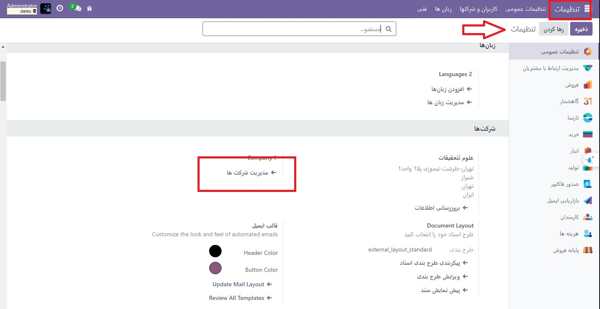
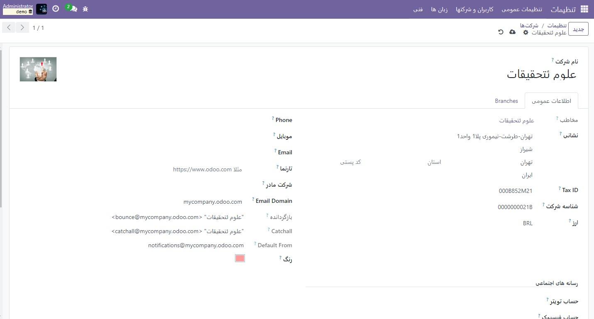
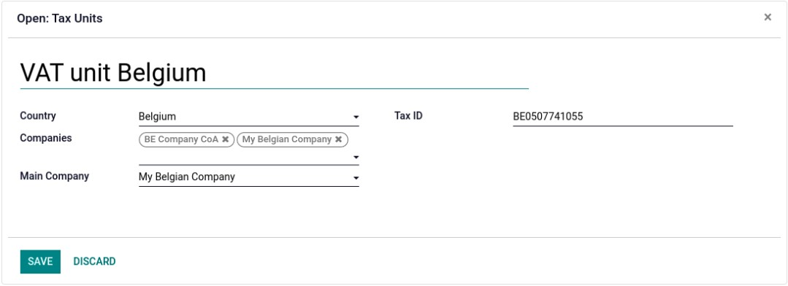
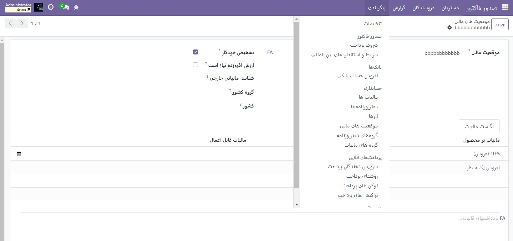
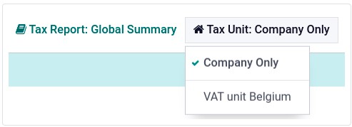

:nosearch:
:show-content:
:hide-page-toc:
:show-toc:

=============================================
واحدهای مالیات بر ارزش افزوده
=============================================

.. important::
    این قابلیت فقط برای محیط های چند شرکتی قابل اجرااست.

واحد مالیات بر ارزش افزوده مجموعه‌ای از شرکت‌های مشمول مالیات بر ارزش افزوده است که از نظر قانونی مستقل از یکدیگر هستند، اما از نظر مالی، سازمانی و اقتصادی به هم مرتبط هستند و بنابراین همان شرکت مشمول مالیات بر ارزش افزوده در نظر گرفته می‌شوند. واحدهای مالیات بر ارزش افزوده اجباری نیست، اما در صورت ایجاد، شرکت‌های تشکیل‌دهنده واحد باید متعلق به یک کشور، از واحد پولی استفاده کنند و یک شرکت به عنوان شرکت نماینده واحد مالیات بر ارزش افزوده تعیین شود. واحدهای مالیات بر ارزش افزوده یک شناسه مالیاتی خاص را دریافت می کنند که فقط برای اظهارنامه مالیاتی در نظر گرفته شده است. شرکت های تشکیل دهنده شناسه مالیاتی خود را برای مقاصد تجاری استفاده می کنند.

پیکربندی
---------------------------------------------
برای پیکربندی یک واحد مالیات بر ارزش افزوده، به تنظیمات ‣ تنظیمات عمومی بروید، به بخش شرکت‌ها بروید و روی مدیریت شرکت‌ها کلیک کنید. شرکتی را برای ایفای نقش نماینده انتخاب کنید و در برگه اطلاعات عمومی، فیلدهای اجباری صادرات XML. را هنگام صدور گزارش مالیاتی پر کنید: نام شرکت، آدرس، مالیات بر ارزش افزوده، ارز، تلفن و ایمیل.

سپس، روی تب واحدهای مالیات بر ارزش افزوده کلیک کنید، یک خط اضافه کنید، و یا یک واحد مالیات بر ارزش افزوده موجود را انتخاب کنید یا یک واحد جدید ایجاد کنید. نام واحد، کشور شرکت‌های تشکیل‌دهنده و گزارش مالیاتی، شرکت‌ها، شرکت اصلی که نقش نمایندگی را بر عهده دارد و شناسه مالیاتی واحد مالیات بر ارزش افزوده وارد کنید.

موقعیت مالی
------------------------------------------------
از آنجایی که معاملات بین اجزای تشکیل دهنده یک واحد مالیات بر ارزش افزوده مشمول مالیات بر ارزش افزوده نمی شود، می توان یک نقشه مالیاتی (موقعیت مالی) ایجاد کرد تا از اعمال مالیات بر ارزش افزوده در معاملات بین مؤسسه اجتناب شود.

مطمئن شوید که یک شرکت تشکیل دهنده قبلا انتخاب شده است، سپس به حسابداری(صدورفاکتور) ‣ پیکربندی ‣ موقعیت های مالی بروید و یک موقعیت مالی جدید ایجاد کنید. روی تب نگاشت مالیات کلیک کنید، مالیات بر محصول را که معمولاً برای تراکنش‌های غیر تشکیل دهنده اعمال می‌شود، و در اعمال کردن مالیات، مالیات 0% را برای اعمال برای تراکنش‌های تشکیل‌دهنده انتخاب کنید.

در صورت نیاز، همین کار را برای تب نگاشت حسابداری انجام دهید و این فرآیند را برای هر شرکت سازنده در پایگاه داده خود تکرار کنید.

.. example::
    بسته به بومی سازی، مالیات بسته ممکن است با تصویر نمایش داده شده متفاوت باشد

    .. image:: ./img/get/g5.jpg
        :align: center
        :alt: حسابداری

سپس، با باز کردن برنامه مخاطبین، موقعیت مالی را تعیین کنید. یک شرکت سازنده را جستجو کنید و کارت مخاطب را باز کنید. روی تب فروش و خرید کلیک کنید و در قسمت موقعیت های مالی، موقعیت مالی ایجاد شده برای واحد VAT را وارد کنید. فرآیند را برای هر فرم کارت شرکت تشکیل دهنده، در پایگاه داده هر شرکت تکرار کنید.

گزارش مالیاتی
--------------------------------------------
شرکت نماینده می تواند با مراجعه به قسمت حسابداری(صدورفاکتور) ‣ گزارش ‣ گزارش مالیاتی و انتخاب واحد مالیات بر ارزش افزوده در واحد مالیاتی به گزارش مالیات تجمیع واحد مالیات بر ارزش افزوده دسترسی داشته باشد. این گزارش شامل تراکنش‌های جمع‌آوری شده همه مؤلفه‌ها و صادرات .XML شامل نام و شماره مالیات بر ارزش افزوده شرکت اصلی است.

