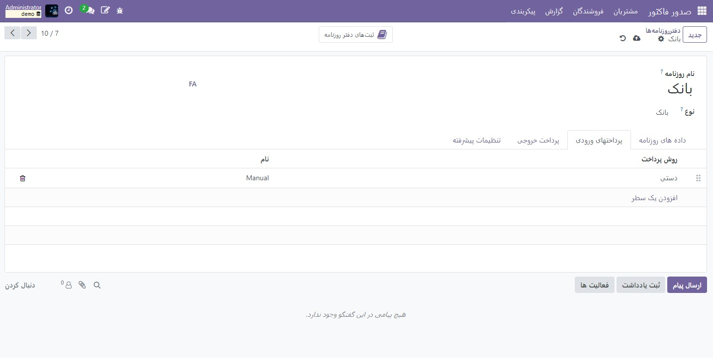
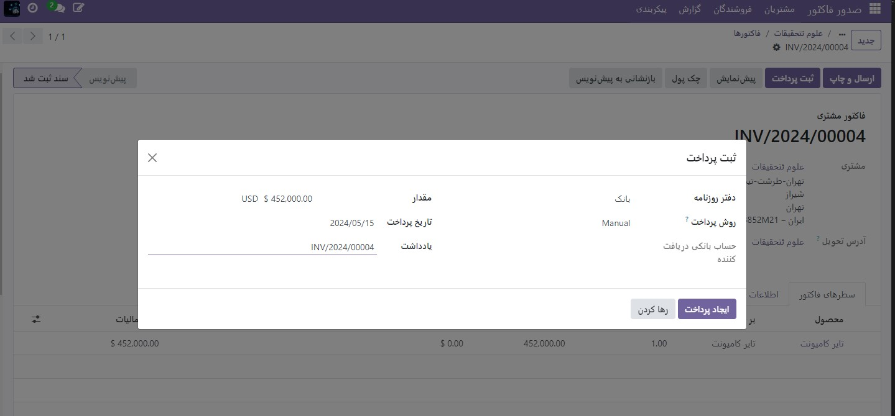

:nosearch:
:show-content:
:hide-page-toc:
:show-toc:

=============================
چک کردن
=============================

دو راه برای رسیدگی به پرداخت‌های دریافتی توسط چک در Odoo وجود دارد، یا با استفاده از حساب‌های معوق یا با دور زدن فرآیند تطبیق کردن.

استفاده از حساب‌های معوق توصیه می‌شود، زیرا موجودی حساب بانکی شما با در نظر گرفتن چک‌هایی که هنوز نقد نشده‌اند، دقیق می‌ماند.

.. note::
    هر دو روش در پایان فرآیند، داده های یکسانی را در حسابداری شما تولید می کنند. اما اگر چک هایی دارید که نقد نشده اند، روش حساب معوق این چک ها را در حساب رسیدهای معوق گزارش می کند. با این حال، وجوه در حساب بانکی شما ظاهر می شود، خواه تطبیق شده باشند یا نه، زیرا ارزش بانکی در لحظه صورتحساب بانک منعکس می شود.

روش اول: حساب معوق
------------------------------------------------
هنگامی که چک دریافت می کنید، پرداختی را با چک در فاکتور ثبت می کنید. سپس، هنگامی که حساب بانکی شما با مبلغ چک واریز شد، پرداخت و صورت‌حساب را تطبیق می‌دهید تا مبلغ از حساب رسید معوق به حساب بانکی منتقل شود.

.. tip::
    اگر می‌خواهید چنین پرداخت‌هایی را سریع شناسایی کنید، می‌توانید یک روش پرداخت جدید به نام چک ایجاد کنید. برای انجام این کار، به حسابداری(صدورفاکتور) ‣ پیکربندی ‣ دفترروزنامه ‣ بانک بروید، روی تب پرداخت های دریافتی کلیک کنید و یک خط اضافه کنید. به عنوان روش پرداخت، دستی را انتخاب کنید و چک ها را به عنوان نام وارد کنید.

روش دوم: دور زدن تطبیق کردن
--------------------------------------------------
هنگام دریافت چک، پرداختی را در فاکتور مربوطه ثبت می کنید. سپس مبلغ از حساب دریافتنی به حساب بانکی منتقل می شود و از تطبیق دور می زند و تنها یک ثبت در دفتر ایجاد می کند.

برای انجام این کار، باید تنظیمات زیر را دنبال کنید. به حسابداری(صدورفاکتور) ‣ پیکربندی ‣ دفترروزنامه ‣ بانک بروید. روی تب پرداخت‌های ورودی کلیک کنید و سپس یک خط اضافه کنید، دستی را به‌عنوان روش پرداخت انتخاب کنید و چک‌ها را به‌عنوان نام وارد کنید. روی دکمه تغییر منو کلیک کنید، حساب های دریافتی معوق را علامت بزنید و در ستون حساب های دریافتی معوق، حساب بانکی را برای روش پرداخت چک تنظیم کنید.

ثبت پرداخت
-----------------------------------------

پس از دریافت چک مشتری، به فاکتور مربوطه (حسابداری ‣ مشتری ‣ فاکتورها) بروید و روی ثبت پرداخت کلیک کنید. اطلاعات پرداخت را وارد کنید:

   - دفترروزنامه: بانک;

   - روش پرداخت: دستی (یا بررسی می کند که آیا روش پرداخت خاصی ایجاد کرده اید).

   - یادداشت: شماره چک را وارد کنید.

   - روی ایجاد پرداخت کلیک کنید.

ورودی های دفترروزنامه تولید شده بسته به روش ثبت پرداخت انتخابی متفاوت است.

