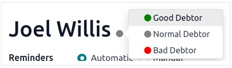

:nosearch:
:show-content:
:hide-page-toc:
:show-toc:

=============================
پیگیری فاکتورها
=============================

در صورت تاخیر در پرداخت، می توان پیام بعدی را برای مشتریان ارسال کرد. Odoo به شما کمک می‌کند تا پرداخت‌های دیرکرد را شناسایی کنید و به شما امکان می‌دهد یادآوری‌های مناسب را با استفاده از اقدامات پیگیری که به طور خودکار یک یا چند کنش را با توجه به تعداد روزهای معوق انجام می‌دهند، برنامه‌ریزی و ارسال کنید. می توانید پیگیری های خود را از طریق روش های مختلف مانند ایمیل، پست یا پیامک ارسال کنید.

پیکربندی
-------------------------------------
برای پیکربندی یک اقدام پیگیری، به حسابداری ‣ پیکربندی ‣ سطوح پیگیری بروید و (الف) سطح (های) پیگیری جدید را انتخاب یا ایجاد کنید. چندین اقدام پیگیری به طور پیش فرض در برگه اعلان در دسترس هستند و نام و همچنین تعداد روزها را می توان تغییر داد. اقدامات بعدی موجود عبارتند از:

   - ارسال ایمیل
   - ارسال نامه
   - ارسال پیام

با انتخاب یک الگوی محتوا می توانید از یک الگوی از پیش پر شده برای پیام های خود استفاده کنید. برای تغییر الگوی مورد استفاده، نشانگر را روی قسمت قرار دهید و روی –> کلیک کنید. در صورت فعال بودن، پیام‌های SMS دارای یک فیلد الگوی پیامک خاص هستند.

امکان ارسال خودکار یادآوری با فعال کردن گزینه خودکار، و پیوست کردن فاکتورهای باز با فعال کردن پیوست کردن فاکتورها، در یک اقدام بعدی خاص وجود دارد.

با کلیک بر روی تب **فعالیت**، زمان بندی فعالیت ها (وظایف) امکان پذیر است. به این ترتیب، زمانی که پیگیری آغاز می شود، یک فعالیت به طور خودکار برنامه ریزی می شود. برای انجام این کار، **برنامه ریزی فعالیت** را فعال کرده و یک فرد مسئول را برای کار انتخاب کنید. یک نوع فعالیت را انتخاب کنید و در صورت تمایل، خلاصه ای از نحوه مدیریت فعالیت وارد کنید.

گزارش های پیگیری
------------------------------------
صورتحساب های معوقی که باید آنها را پیگیری کنید در حسابداری ‣ مشتریان ‣ گزارش های پیگیری موجود است. به‌طور پیش‌فرض، Odoo بر اساس صورت‌حساب‌های عقب افتاده فیلتر می‌کند، اما می‌توانید در منوی فیلترها بر اساس نیاز به اقدام فیلتر کنید.

هنگام انتخاب فاکتور، می‌توانید تمام فاکتورهای پرداخت نشده مشتری (موقع یا عدم پرداخت) را مشاهده کنید که تاریخ سررسید فاکتورهای دیرکرد با رنگ قرمز ظاهر می‌شود. با کلیک بر روی  از پیگیری حذف شود ، می توانید فاکتورها را از یک یادآور حذف کنید. می توانید یادآورهای خودکار یا دستی و همچنین یک فرد مسئول را برای آن مشتری تنظیم کنید.

برای ارسال یادآوری، روی پیگیری کلیک کنید و اقدام(هایی) را که می خواهید انجام دهید را انتخاب کنید:

    - چاپ؛

    - پست الکترونیک؛

    - پیامک؛

    - از طریق پست.

از این نما می توانید فاکتورها را پیوست کنید و قالب های محتوا را تغییر دهید. پس از اتمام، روی **ارسال** یا **ارسال و چاپ** کلیک کنید.

.. note::

    اطلاعات تماس موجود در فاکتور یا فرم تماس برای ارسال یادآوری استفاده می شود.

    هنگامی که یادآوری ارسال می شود، در چت فاکتور ثبت می شود.

    اگر زمان مناسبی برای یادآوری نیست، می توانید تاریخ یادآوری بعدی را مشخص کنید. با توجه به تنظیم تاریخ یادآوری بعدی، گزارش بعدی را دریافت خواهید کرد.

.. tip::
    درست قبل از شروع فرآیند پیگیری، تمام صورت‌حساب‌های بانکی را تطبیق دهید تا از ارسال یادآوری به مشتری که قبلاً پرداخت کرده است، خودداری کنید.

سطح اعتماد بدهکار
---------------------------------------------
برای اینکه بدانید مشتری معمولاً دیر پرداخت می‌کند یا خیر، می‌توانید با علامت‌گذاری به‌عنوان بدهکار خوب، بدهکار عادی یا بد بدهکار در گزارش پیگیری، یک سطح اعتماد تعیین کنید. برای انجام این کار، روی گلوله کنار نام مشتری کلیک کنید و سطح اعتماد را انتخاب کنید.

یادآوری ها را به صورت دسته ای ارسال کنید
------------------------------------------------------------------
می‌توانید ایمیل‌های یادآور را به صورت دسته‌ای از صفحه گزارش‌های پیگیری ارسال کنید. برای انجام این کار، تمام گزارش‌ هایی را که می‌خواهید پردازش کنید، انتخاب کنید، روی نماد Action Gear کلیک کنید و   فرآیند پیگیری را انتخاب کنید.

.. seealso::
   - :doc:`snailmail`