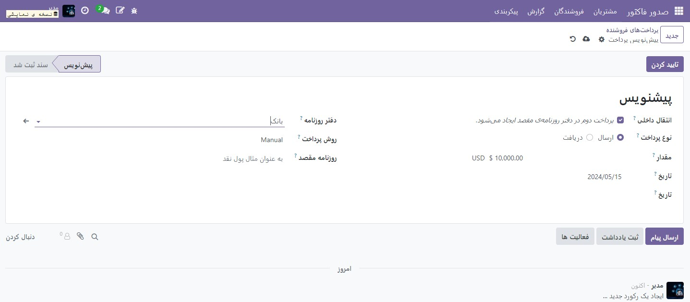

:nosearch:
:show-content:
:hide-page-toc:
:show-toc:

=============================
نقل و انتقالات داخلی
=============================

انتقال پول داخلی در Odoo قابل انجام است. حداقل دو حساب بانکی برای انجام نقل و انتقالات داخلی لازم است.

پیکربندی
-----------------------------------------
یک حساب انتقال داخلی به طور خودکار بر اساس محلی سازی شرکت شما و بسته به قوانین کشور شما در پایگاه داده شما ایجاد می شود. برای تغییر حساب انتقال داخلی پیش‌فرض، به :menuselection:`صدورفاکتور --> پیکربندی --> تنظیمات` بروید و به قسمت حساب های پیش فرض بروید.

ثبت حواله داخلی از یک بانک به بانک دیگر
--------------------------------------------------
اگر می‌خواهید پول را از یک بانک به بانک دیگر منتقل کنید، به داشبورد حسابداری دسترسی پیدا کنید، روی دکمه انتخاب کشویی (⋮) در بانکی که می‌خواهید از آن انتقال انجام دهید کلیک کنید، سپس روی پرداخت ها کلیک کنید. یک پرداخت را انتخاب یا ایجاد کنید، کادر انتخاب انتقال داخلی را علامت بزنید و قبل از تأیید انتقال داخلی، یک روزنامه مقصد را انتخاب کنید.

اکنون پول در حساب انتقال رزرو می شود و پرداخت دیگری به طور خودکار در دفترروزنامه مقصد ایجاد می شود.

پس از انجام این کار، می توانید طبق معمول خطوط صورت حساب بانکی خود را رزرو و تطبیق دهید.