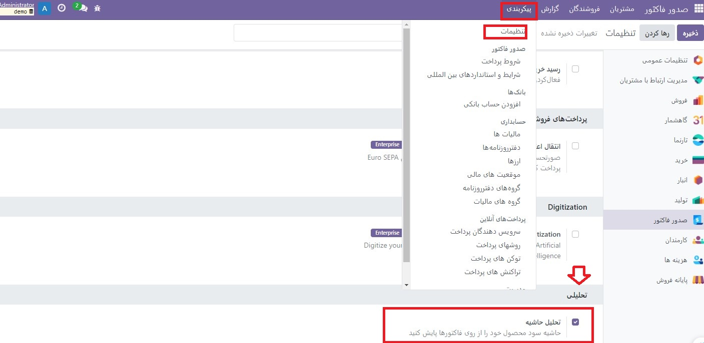
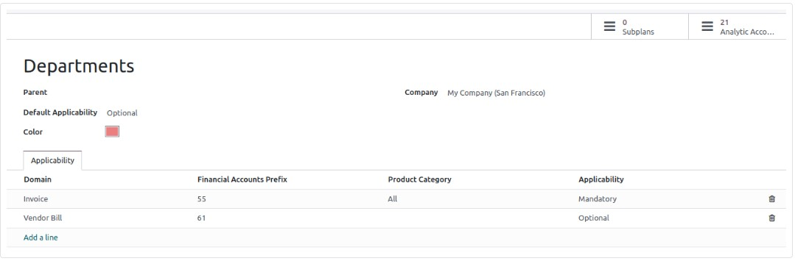
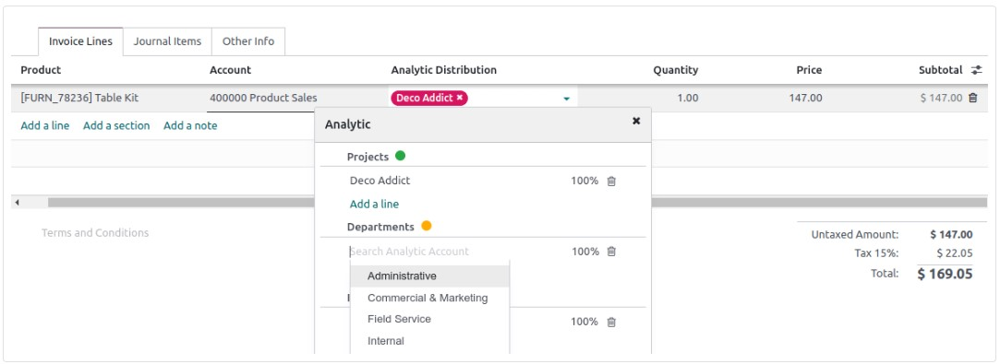

:nosearch:
:show-content:
:hide-page-toc:
:show-toc:

=============================================
حسابداری تحلیلی
=============================================

حسابداری تحلیلی به شما کمک می کند هزینه ها و درآمدها را پیگیری کنید و همچنین سودآوری یک پروژه یا خدمات را تجزیه و تحلیل کنید. هنگام ایجاد نوشته های مجله خود، ویجت تحلیلی امکان توزیع هزینه ها را در یک یا چند حساب تحلیلی می دهد.

پیکربندی
-------------------------------
با رفتن به  :menuselection:`صدورفاکتور --> پیکربندی --> تنظیمات --> تحلیلی` ویژگی حسابداری تحلیلی را فعال کنید.

حساب های تحلیلی
--------------------------------------------------------------
حساب های تحلیلی نمای کلی از هزینه ها و درآمد شما را ارائه می دهد.

با رفتن به  :menuselection:`صدورفاکتور --> پیکربندی --> تحلیل حساب:حسابداری تحلیلی` به حساب های تحلیلی موجود خود دسترسی پیدا کنید. برای ایجاد یک حساب تحلیلی جدید، روی جدید کلیک کنید و اطلاعات مورد نیاز را پر کنید:

   - حساب تحلیلی: نام حساب تحلیلی خود را اضافه کنید.

   - مشتری: مشتری مرتبط با پروژه خود را انتخاب کنید.

   - مرجع: یک مرجع اضافه کنید تا زمانی که صورت حساب خود را دریافت می کنید، پیدا کردن حساب را آسان تر کنید.

   - طرح: اضافه کردن یک طرح تحلیلی.

   - شرکت: اگر چندین شرکت را مدیریت می کنید، شرکتی را که حساب تحلیلی برای آن استفاده می شود انتخاب کنید.

   - ارز: واحد پول حساب تحلیلی را انتخاب کنید.

سپس، اطلاعات بودجه خود را پر کنید.

طرح های تحلیلی
----------------------------------------
برنامه های تحلیلی به شما امکان می دهد حسابداری خود را تجزیه و تحلیل کنید. به عنوان مثال، برای پیگیری هزینه ها و درآمدها بر اساس پروژه یا بخش.

با رفتن به بخش **صدورفاکتور ‣ پیکربندی ‣ حسابداری تحلیلی**: برنامه های تحلیلی می توانید به برنامه های تحلیلی دسترسی پیدا کنید. برای ایجاد طرح جدید روی جدید کلیک کنید.

توزیع تحلیلی
--------------------------
هنگام ایجاد فاکتور یا صورتحساب، طرحی را در ستون تحیلی اضافه کنید. این فیلد فقط در صورتی اجباری است که قبلاً طرح تحلیلی خود را حداقل به یک حساب تحلیلی مرتبط کرده باشید. پس از افزودن طرح، ویجتی باز می شود که در آن می توانید اطلاعات مختلف را پر کنید. می‌توانید برچسب‌هایی اضافه کنید تا حساب‌های تحلیلی مرتبط را منعکس کنید و تصمیم بگیرید که چگونه هزینه‌ها را بین حساب‌ها با اصلاح درصد تقسیم کنید.

مدل های توزیع تحلیلی
------------------------------------------------------------
مدل های توزیع تحلیلی به طور خودکار یک توزیع خاص را بر اساس معیارهای تعریف شده اعمال می کنند.

برای ایجاد یک مدل توزیع تحلیلی جدید، به  :menuselection:`صدورفاکتور --> پیکربندی --> مدل های توزیع تحلیلی` بروید، روی جدید کلیک کنید و شرایطی را که مدل شما باید داشته باشد را تنظیم کنید تا به طور خودکار اعمال شود:

   - پیشوند حساب ها: این توزیع تحلیلی برای همه حساب های مالی که پیشوند مشخص شده را به اشتراک می گذارند اعمال می شود.

   - شریک: شریکی را انتخاب کنید که توزیع تحلیلی برای آن استفاده شود.

   - دسته شریک: این فیلد به طور پیش فرض قابل مشاهده نیست: با کلیک بر روی دکمه انتخاب ستون ها آن را اضافه کنید و کادر دسته شریک را علامت بزنید. دسته شریکی را که توزیع تحلیلی برای آن استفاده خواهد شد، اضافه کنید.

   - محصول: محصولی را انتخاب کنید که توزیع تحلیلی برای آن استفاده شود.

   - دسته بندی محصول: این فیلد به طور پیش فرض قابل مشاهده نیست: با کلیک بر روی دکمه انتخاب ستون ها آن را اضافه کنید و کادر دسته بندی محصول را علامت بزنید. دسته محصولی را انتخاب کنید که توزیع تحلیلی برای آن استفاده شود.

   - تحلیلی: حساب های تحلیلی و توزیع آنها را اضافه کنید.

   - شرکت: شرکتی را انتخاب کنید که توزیع تحلیلی برای آن استفاده شود.

   - توزیع تحلیلی: در صورت احراز شرایط فوق، طرح تحلیلی تعریف شده در این زمینه و همچنین توزیعی که بین حساب های تحلیلی مختلف اعمال می شود به طور خودکار در ورودی انتخاب می شود.

.. tip::
    برای ویرایش انبوه چندین مدخل به طور همزمان، به **صدورفاکتور ‣ حسابداری ‣ اقلام روزنامه** بروید و مواردی را که باید به روز شوند انتخاب کنید. توزیع مورد نیاز را در ستون توزیع تحلیلی اضافه کنید و برای ذخیره بر روی نماد فلاپی دیسک کلیک کنید. الگوی توزیع تحلیلی ظاهر می شود و می توانید آن را برای استفاده بعدی ذخیره کنید.