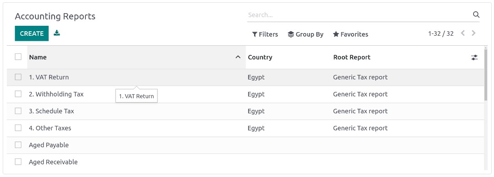
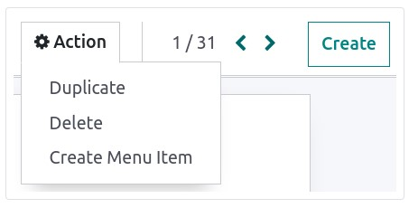
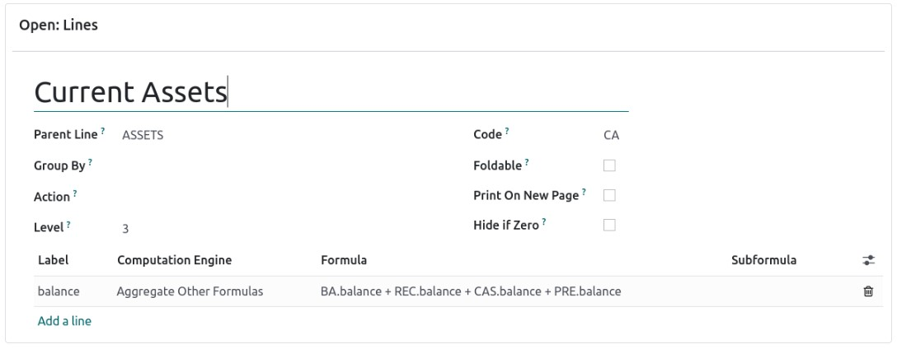

:nosearch:
:show-content:
:hide-page-toc:
:show-toc:

=============================================
گزارش های سفارشی
=============================================

Odoo دارای یک چارچوب گزارش دهی قدرتمند و آسان برای استفاده است. این ابزار به شما امکان می‌دهد گزارش‌های جدیدی مانند گزارش‌های مالیاتی، یا ترازنامه‌ها و صورت‌های درآمد را با گروه‌بندی‌ها و طرح‌بندی‌های خاص ایجاد کنید.

.. important::
    برای دسترسی به رابط ایجاد گزارش حسابداری، حالت توسعه دهنده را فعال کنید.

برای ایجاد یک گزارش جدید، به  :menuselection:`صدورفاکتور --> پیکربندی --> مدیریت:گزارشات حسابداری` بروید. از اینجا می‌توانید یک گزارش ریشه یا یک نسخه ایجاد کنید.

گزارش های ریشه ای
-----------------------------------------------
گزارش های ریشه ای را می توان به عنوان گزارش های حسابداری عمومی و خنثی در نظر گرفت. آنها به عنوان مدل هایی عمل می کنند که نسخه های حسابداری محلی بر اساس آنها ساخته شده اند. اگر گزارشی فاقد گزارش ریشه باشد، خود یک گزارش ریشه در نظر گرفته می شود.

هنگام ایجاد یک گزارش ریشه جدید، باید یک آیتم منو برای آن ایجاد کنید. برای انجام این کار، گزارش را باز کنید و سپس در همان گزارش، روی Action ‣ Create Menu Item کلیک کنید. صفحه را تازه کنید؛ این گزارش اکنون در بخش صدورفاکتور ‣ گزارش در دسترس است.

.. note::
    مواردی که نیاز به ایجاد یک گزارش ریشه جدید دارند، نادر هستند، مانند زمانی که مقامات مالیاتی یک کشور به یک نوع گزارش جدید و خاص نیاز دارند.

انواع
-----------------------------------
انواع ها نسخه های خاص کشوری از گزارش های ریشه هستند و بنابراین، همیشه به یک گزارش ریشه مراجعه می کنند. برای ایجاد یک نوع، هنگام ایجاد یک گزارش جدید، یک گزارش عمومی (ریشه) را در قسمت گزارشات ریشه انتخاب کنید.

هنگامی که یک گزارش ریشه از یکی از منوهای اصلی برنامه حسابداری باز می شود، همه انواع آن در انتخابگر متغیر در گوشه سمت چپ بالای نما نمایش داده می شود.

خطوط
------------------------
پس از ایجاد یک گزارش (چه ریشه یا نوع)، باید آن را با خطوط پر کنید. می توانید با کلیک بر روی افزودن یک خط یک خط جدید ایجاد کنید یا با کلیک روی آن خط موجود را تغییر دهید. همه خطوط نیاز به یک نام دارند و اگر می خواهید از مقدار آنها در فرمول ها استفاده کنید، می توانند یک کد اضافی اختیاری (به انتخاب شما) داشته باشند.

اصطلاحات
-------------------------------------------------
هر خط می تواند شامل یک یا چند عبارت باشد. عبارات را می توان به عنوان متغیرهای فرعی مورد نیاز یک خط گزارش مشاهده کرد. برای ایجاد یک عبارت، روی یک خط به گزارش خط اضافه کنید کلیک کنید.

هنگام ایجاد یک عبارت، باید برچسبی را که برای اشاره به آن عبارت استفاده می شود نسبت دهید. بنابراین، باید در بین عبارات هر خط منحصر به فرد باشد. هر دو موتور محاسباتی و فرمول نیز باید نشان داده شوند. موتور نحوه تفسیر فرمول(ها) و زیرفرمول(های) شما را مشخص می کند. در صورت نیاز می توان عبارات را با استفاده از موتورهای محاسباتی مختلف در یک خط ترکیب کرد.
