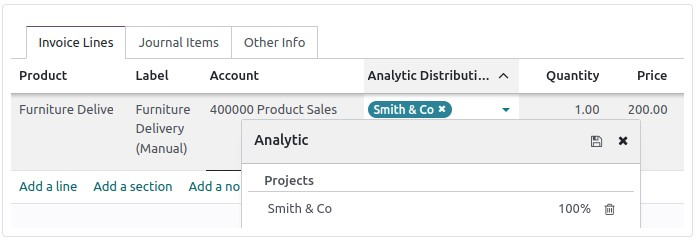
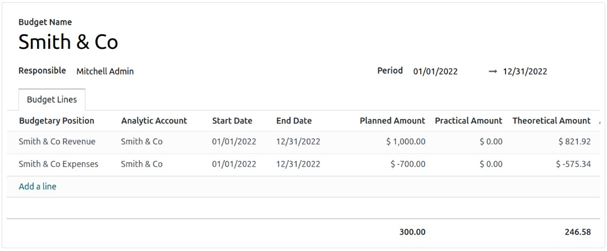

:nosearch:
:show-content:
:hide-page-toc:
:show-toc:

=============================================
بودجه مالی
=============================================

مدیریت بودجه بخش مهمی از اداره یک تجارت است. بودجه به مردم کمک می کند تا در مورد نحوه خرج کردن پول آگاه تر شوند و مردم را به سازماندهی و اولویت بندی کار خود برای رسیدن به اهداف مالی هدایت کنند. آنها اجازه برنامه ریزی برای یک نتیجه مالی مطلوب را می دهند و سپس عملکرد واقعی را در برابر برنامه اندازه گیری می کنند. Odoo بودجه ها را با استفاده از حساب های عمومی و تحلیلی مدیریت می کند.

پیکربندی
---------------------------------------------
به بخش  :menuselection:`صدورفاکتور --> پیکربندی --> تنظیمات --> تحلیلی` بروید و مدیریت بودجه را فعال کنید.

موقعیت های بودجه ای
--------------------------------------------------------
موقعیت های بودجه لیستی از حساب هایی هستند که می خواهید بودجه را برای آنها نگه دارید (معمولاً حساب های هزینه یا درآمد).

برای تعریف موقعیت های بودجه ای، به **حسابداری ‣ پیکربندی ‣ مدیریت: موقعیت های بودجه و جدید** بروید. یک نام به موقعیت بودجه خود اضافه کنید و شرکت مورد نظر را انتخاب کنید. برای افزودن یک یا چند حساب روی **افزودن یک سطر**کلیک کنید.

.. note::
    هر موقعیت بودجه ای می تواند هر تعداد حساب از نمودار حساب ها داشته باشد، اگرچه باید حداقل یک حساب داشته باشد.

حساب های تحلیلی
--------------------------------------------------------
Odoo باید بداند که کدام هزینه ها یا هزینه ها مربوط به یک بودجه مشخص است، زیرا حساب های کلی بالا ممکن است برای پروژه های مختلف استفاده شود. به  :menuselection:`صدورفاکتور --> پیکربندی --> حسابداری تحلیلی:برنامه های تحلیلی` بروید و روی جدید کلیک کنید تا یک حساب تحلیلی جدید به نام Smith & Co اضافه کنید.

قسمت نقشه باید تکمیل شود. برنامه ها حساب های تحلیلی متعدد را گروه بندی می کند. آنها هزینه ها و منافع را برای تجزیه و تحلیل عملکرد کسب و کار توزیع می کنند. برنامه های تحلیلی را می توان با رفتن به **حسابداری(صدورفاکتور) ‣ پیکربندی ‣ حسابداری تحلیلی: برنامه های تحلیلی** ایجاد یا پیکربندی کرد.

هنگام ایجاد یک فاکتور مشتری جدید و/یا قبض فروشنده، باید به این حساب تحلیلی مراجعه کنید.

بودجه را تعریف کنید
--------------------------------------------------------
بیایید اهداف خود را تعیین کنیم. ما مشخص کردیم که انتظار داریم با این پروژه 1000 به دست آوریم و مایلیم بیشتر از 700 هزینه نکنیم.

ابتدا نام بودجه خود را وارد کنید. سپس، دوره ای را انتخاب کنید که در آن بودجه قابل اعمال است. در مرحله بعد، موقعیت بودجه ای را که می خواهید ردیابی کنید اضافه کنید، حساب تحلیلی مربوطه را تعریف کنید و مبلغ برنامه ریزی شده را اضافه کنید.

.. note::
    هنگام ثبت مبلغ برنامه ریزی شده مربوط به هزینه ها، مبلغ باید منفی باشد.
