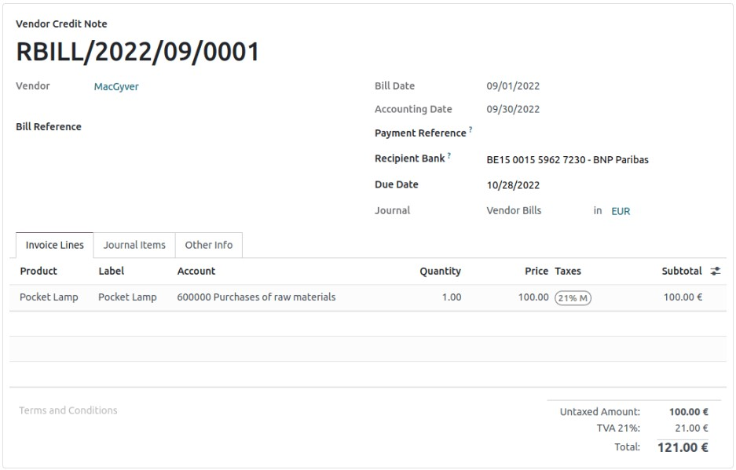

nosearch:
:show-content:
:hide-page-toc:
:show-toc:

=========================
حمل مالیات
=========================

هنگام انجام گزارش های مالیاتی، ویژگی انتقال مالیات اجازه می دهد مبالغ دفتری را از یک دوره به دوره دیگر بدون ایجاد ورودی های جدید منتقل کنید.

برای برآوردن الزامات قانونی مکان‌های خاص ایجاد شده است، جایی که مبالغ باید از دوره‌ای به دوره دیگر منتقل شود (مثلاً چون کل خط منفی است).

این ویژگی به طور پیش فرض در کشورهایی که مورد نیاز است مانند بلژیک، فرانسه و ایتالیا فعال می شود. هیچ پیکربندی خاصی مورد نیاز نیست.

