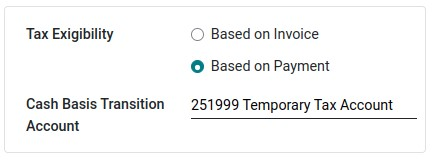

:nosearch:
:show-content:
:hide-page-toc:
:show-toc:

=============================================
مالیات بر مبنای نقدی
=============================================

مالیات بر مبنای نقدی در زمان پرداخت پرداخت می شود، برخلاف مالیات های استانداردی که هنگام تأیید فاکتور دریافت می شود. گزارش درآمد و هزینه های خود به دولت بر اساس روش نقدی در برخی کشورها و تحت برخی شرایط الزامی است.

.. example::
    شما محصولی را در سه ماهه اول سال مالی خود می فروشید و در سه ماهه دوم مبلغ پرداختی دریافت می شود. بر اساس روش نقدی، مالیاتی که باید بپردازید برای سه ماهه دوم است.

پیکربندی
-----------------------------------
به  :menuselection:`صدورفاکتور --> پیکربندی --> تنظیمات`رفته و در قسمت مالیات ها، مبنای نقدی را فعال کنید.

سپس، مجله مبنای نقدی مالیاتی را تعریف کنید. روی دکمه پیوند خارجی در کنار مجله کلیک کنید تا ویژگی های پیش فرض آن مانند نام مجله، نوع یا کد کوتاه به روز شود.

.. note::
    به‌طور پیش‌فرض، ورودی‌های ژورنال مجله مالیات‌های پایه نقدی با استفاده از کد کوتاه CABA نام‌گذاری می‌شوند.

پس از انجام این کار، به  :menuselection:`صدورفاکتور --> پیکربندی --> حسابداری:مالیات ها` برای پیکربندی مالیات خود بروید. می توانید با کلیک بر روی آن مالیات جدیدی ایجاد کنید یا مالیات موجود را به روز کنید

ستون حساب منعکس کننده حساب های انتقالی مناسب برای ارسال مالیات تا زمان ثبت پرداخت است.

در تب گزینه های پیشرفته، در مورد Exigilibity مالیات تصمیم بگیرید. بر اساس پرداخت را انتخاب کنید، بنابراین مالیات هنگام دریافت فاکتور پرداخت می شود. سپس می توانید حساب انتقال مبنای نقدی را نیز تعریف کنید که در آن مبلغ مالیات ثبت می شود تا زمانی که فاکتور اصلی تطبیق نشده باشد.

.. tip::
    پس از ثبت پرداخت، می توانید از دکمه هوشمند ورودی های نقدی روی فاکتور برای دسترسی مستقیم به آنها استفاده کنید.

اقلام مجله حساب درآمد در مقابل حساب درآمد خنثی هستند، اما برای اطمینان از گزارش های مالیاتی صحیح در Odoo با مبالغ مالیات پایه دقیق مورد نیاز هستند.

استفاده از یک حساب دریافتی مالیات پایه پیش‌ فرض توصیه می‌شود تا موجودی شما صفر باشد و حساب درآمد شما توسط حرکات غیرضروری حسابداری آلوده نشود. برای انجام این کار، به **پیکربندی ‣ تنظیمات ‣ مالیات** بروید و یک حساب دریافتی مالیات پایه را در زیر مبانی نقدی انتخاب کنید.

