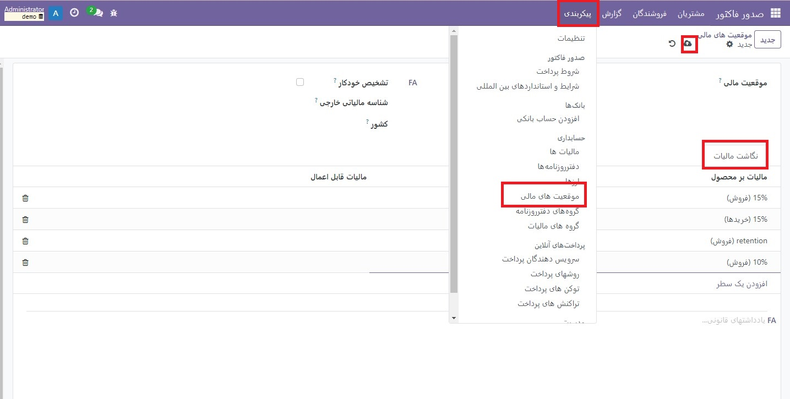

:nosearch:
:show-content:
:hide-page-toc:
:show-toc:

=============================================
موقعیت های مالی
=============================================

مالیات‌ها و حساب‌های پیش‌فرض روی محصولات و مشتریان برای ایجاد تراکنش‌های جدید به سرعت تنظیم می‌شوند. با این حال، بسته به محلی سازی مشتریان و ارائه دهندگان و نوع کسب و کار، استفاده از مالیات ها و حساب های مختلف برای یک تراکنش ممکن است ضروری باشد.

موقعیت های مالی اجازه ایجاد قوانینی را برای تطبیق مالیات ها و حساب های مورد استفاده برای یک معامله به طور خودکار می دهد.

آنها را می توان به صورت خودکار، دستی یا به یک شریک اختصاص داد.

پیکربندی
-------------------------------------
نقشه برداری مالیات و حساب

برای ویرایش یا ایجاد موقعیت مالی، به  :menuselection:`صدور فاکتور --> پیکربندی --> موقعیت های مالی` بروید و ورودی را برای تغییر باز کنید یا روی جدید کلیک کنید.

نقشه برداری مالیات ها و حساب ها بر اساس مالیات ها و حساب های پیش فرض تعریف شده در فرم محصول است.

برای نگاشت به مالیات یا حساب دیگری، ستون سمت راست (مالیات برای اعمال / حساب برای استفاده در عوض) را پر کنید.

  - برای حذف مالیات، فیلد مالیات قابل اعمال را خالی بگذارید.

  - برای جایگزینی مالیات با چندین مالیات دیگر، چندین خط را با استفاده از همان مالیات بر محصول اضافه کنید.

کاربرد
----------------------------------------
تشخیص خودکار

برای اعمال خودکار یک موقعیت مالی با توجه به مجموعه‌ای از شرایط، به **صدورفاکتور‣ پیکربندی ‣ موقعیت‌های مالی** بروید، موقعیت مالی را برای اصلاح باز کنید و تیک تشخیص خودکار را بزنید.

از آنجا، چندین شرط را می توان فعال کرد:

   - VAT مورد نیاز: شماره VAT مشتری باید در فرم تماس با آنها موجود باشد.

   - گروه کشور و کشور: موقعیت مالی فقط برای کشور یا گروه کشور انتخاب شده اعمال می شود.

.. note::
    اگر ویژگی تأیید شماره‌های مالیات بر ارزش افزوده فعال باشد، هر موقعیت مالی با فعال بودن VAT مورد نیاز، برای اعمال خودکار به شماره‌های VAT معتبر درون جامعه نیاز دارد.

    مالیات بر سفارشات تجارت الکترونیک پس از ورود مشتری یا تکمیل جزئیات صورتحساب خود به طور خودکار به روز می شود.

.. important::
    توالی موقعیت‌های مالی مشخص می‌کند که اگر همه شرایط تعیین‌شده در چندین موقعیت مالی به طور همزمان برآورده شوند، کدام موقعیت مالی اعمال می‌شود.

    به عنوان مثال، فرض کنید اولین موقعیت مالی در یک دنباله، کشور A را هدف قرار می دهد در حالی که موقعیت مالی دوم یک گروه کشوری را هدف قرار می دهد که شامل کشور A است. در این صورت، تنها اولین موقعیت مالی برای مشتریان از کشور A اعمال می شود.

برنامه دستی
-------------------------------
برای انتخاب دستی موقعیت مالی، باز کردن سفارش فروش، فاکتور یا صورتحساب، به برگه اطلاعات دیگر بروید و قبل از افزودن خطوط محصول، موقعیت مالی مورد نظر را انتخاب کنید.

به یک شریک اختصاص دهید
----------------------------------------------
برای تعیین اینکه کدام موقعیت مالی باید به طور پیش فرض برای یک شریک خاص استفاده شود، به **صدورفاکتور‣ مشتریان ‣ مشتریان** بروید، شریک را انتخاب کنید، **برگه فروش و خرید** را باز کنید و موقعیت مالی را انتخاب کنید.

.. seealso::
   - :doc:`taxes`