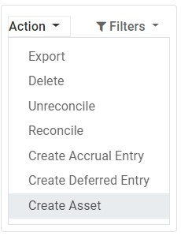

:nosearch:
:show-content:
:hide-page-toc:
:show-toc:

=============================================
دارایی های غیرجاری و دارایی های ثابت
=============================================

دارایی های غیرجاری که به عنوان دارایی های بلند مدت نیز شناخته می شوند، سرمایه گذاری هایی هستند که انتظار می رود پس از یک سال محقق شوند. آنها به جای هزینه کردن، سرمایه گذاری می شوند و در ترازنامه شرکت ظاهر می شوند. بسته به ماهیت آنها، ممکن است دچار استهلاک شوند.

دارایی های ثابت نوعی از دارایی های غیرجاری هستند و شامل املاک خریداری شده برای جنبه های تولیدی آن ها مانند ساختمان ها، وسایل نقلیه، تجهیزات، زمین و نرم افزار می شود.

به عنوان مثال، فرض کنید ماشینی را به قیمت 27000 دلار می‌خریم. ما قصد داریم آن را طی پنج سال مستهلک کنیم و پس از آن آن را به قیمت 7000 دلار می فروشیم. با استفاده از روش استهلاک خطی یا خطی، 4000 دلار هر سال به عنوان هزینه استهلاک هزینه می شود. پس از پنج سال، مقدار استهلاک انباشته گزارش شده در ترازنامه برابر با 20000 دلار است که ما را با 7000 دلار ارزش غیر قابل استهلاک یا ارزش نجات باقی می گذارد.

حسابداری Odoo با ایجاد تمام ورودی های استهلاک به طور خودکار در حالت پیش نویس، استهلاک را مدیریت می کند. سپس به صورت دوره ای پست می شوند.

Odoo از روش های استهلاک زیر پشتیبانی می کند:
-----------------------------------------------------------

خط مستقیم

انحطاط (روبه کاهش)

انحطاط و سپس خط مستقیم

.. note::
    سرور یک بار در روز بررسی می کند که آیا ورودی باید ارسال شود. سپس ممکن است تا 24 ساعت طول بکشد تا تغییری از پیش‌نویس به پست شده مشاهده کنید.

پیش نیازها
--------------------------------------
چنین تراکنش‌هایی باید به جای حساب هزینه پیش‌فرض، در یک حساب دارایی ثبت شوند.

یک حساب دارایی را پیکربندی کنید
------------------------------------------------------------
برای پیکربندی حساب خود در نمودار حساب ها، به قسمت  :menuselection:`صدورفاکتور --> پیکربندی --> نمودار حساب` رفته و بر روی Create کلیک کرده و فرم را پر کنید.

.. note::
    نوع این حساب باید دارایی های ثابت یا دارایی های غیرجاری باشد.

    - هزینه ای را به حساب مناسب ارسال کنید

    - حساب را در پیش نویس صورتحساب انتخاب کنید

    - در پیش‌ نویس صورت‌حساب، حساب مناسب را برای همه دارایی‌هایی که می‌خرید انتخاب کنید.

    - یک حساب هزینه متفاوت برای محصولات خاص انتخاب کنید

    - شروع به ویرایش محصول کنید، به تب حسابداری بروید، حساب هزینه مناسب را انتخاب کنید و ذخیره کنید.

.. tip::
    امکان ایجاد خودکار ثبت دارایی برای این محصولات وجود دارد

تغییر حساب یک آیتم مجله ارسال شده
-----------------------------------------------------
برای انجام این کار، مجله خریدهای خود را با رفتن به صدورفاکتور ‣ حسابداری ‣ خریدها باز کنید، مورد مجله ای را که می خواهید تغییر دهید انتخاب کنید، روی حساب کلیک کنید و مورد مناسب را انتخاب کنید.

ورودی دارایی ها
------------------------------

یک ورودی جدید ایجاد کنید

یک ورودی دارایی به طور خودکار تمام ورودی های مجله را در حالت پیش نویس ایجاد می کند. سپس آنها یک به یک در زمان مناسب پست می شوند.

برای ایجاد یک **ورودی جدید**، به **حسابداری ‣ حسابداری ‣ دارایی ها** بروید، روی ایجاد کلیک کنید و فرم را پر کنید.

روی انتخاب خریدهای مرتبط کلیک کنید تا یک مورد مجله موجود را به این ورودی جدید پیوند دهید. سپس برخی از فیلدها به طور خودکار پر می شوند و مورد مجله اکنون در برگه خرید مرتبط فهرست می شود.

پس از اتمام، می توانید بر روی محاسبه استهلاک (در کنار دکمه Confirm) کلیک کنید تا تمام مقادیر تابلوی استهلاک ایجاد شود. این تابلو تمام ورودی هایی را که Odoo برای استهلاک دارایی شما ارسال می کند و در چه تاریخی به شما نشان می دهد.

.. image:: ./img/vendor/v6.jpg
    :align: center
    :alt: پایانه فروش

"Prorata Temporis" به چه معناست؟
--------------------------------------------------------------
ویژگی Prorata Temporis برای استهلاک دارایی های شما با دقیق ترین دقت ممکن مفید است.

با این ویژگی، اولین ورودی در تابلوی استهلاک بر اساس زمان باقی مانده بین تاریخ Prorata و تاریخ اول استهلاک به جای زمان پیش فرض بین استهلاک ها محاسبه می شود.

روش های مختلف استهلاک چیست؟
---------------------------------------------------------------
روش استهلاک خط مستقیم، ارزش استهلاک پذیر اولیه را بر تعداد استهلاک های برنامه ریزی شده تقسیم می کند. همه ورودی های استهلاک دارای مقدار یکسانی هستند.

روش کاهش ارزش، ارزش استهلاک پذیر را در ضریب کاهشی برای هر ورودی ضرب می کند. هر ورودی استهلاک مقدار کمتری نسبت به ورودی قبلی دارد. آخرین ورودی استهلاک از ضریب نزولی استفاده نمی کند، بلکه دارای مقداری است که با مانده ارزش استهلاک پذیر مطابقت دارد به طوری که در پایان مدت زمان مشخص شده به 0 دلار می رسد.

روش استهلاک خط مستقیم نزولی از روش کاهشی استفاده می کند، اما با حداقل استهلاک برابر با روش خط مستقیم. این روش استهلاک سریع را در ابتدا تضمین می کند و پس از آن یک استهلاک ثابت را دنبال می کند.

دارایی ها از مجله خریدها
------------------------------------------------
شما می توانید یک ورودی دارایی از یک آیتم مجله خاص در مجله خرید خود ایجاد کنید.

برای انجام این کار، مجله خریدهای خود را با رفتن به حسابداری(صدور) ‣ حسابداری ‣ خریدها باز کنید و مورد مجله ای را که می خواهید به عنوان دارایی ثبت کنید انتخاب کنید. مطمئن شوید که در حساب درست پست شده است (نگاه کنید به: تغییر حساب یک آیتم مجله ارسال شده).

سپس روی Action کلیک کنید، ایجاد دارایی را انتخاب کنید و فرم را به همان روشی که برای ایجاد یک ورودی جدید انجام می دهید پر کنید.

اصلاح یک دارایی
-------------------------------------
شما می توانید مقادیر یک دارایی را برای افزایش یا کاهش ارزش آن تغییر دهید.

برای انجام این کار، دارایی را که می خواهید تغییر دهید باز کنید و روی اصلاح استهلاک کلیک کنید. سپس فرم را با مقادیر استهلاک جدید پر کنید و روی در حال اصلاح کلیک کنید.

کاهش در ارزش، یک ورودی جدید در مجله برای کاهش ارزش ارسال می‌کند و تمام ورودی‌های مجله پست نشده آینده فهرست‌شده در هیئت استهلاک را اصلاح می‌کند.

افزایش ارزش مستلزم پر کردن فیلدهای اضافی مربوط به حرکات حساب و ایجاد یک ورودی جدید دارایی با افزایش ارزش است. ورودی افزایش ناخالص دارایی با یک دکمه هوشمند قابل دسترسی است.

واگذاری دارایی های ثابت
--------------------------------------------------
فروش دارایی یا واگذاری آن به معنای حذف آن از ترازنامه است.

برای انجام این کار، دارایی مورد نظر خود را باز کنید، روی Sell یا Dispos کلیک کنید و فرم را پر کنید.

سپس حسابداری Odoo تمام ثبت های روزانه لازم برای دفع دارایی را تولید می کند، از جمله سود یا زیان حاصل از فروش، که بر اساس تفاوت بین ارزش دفتری دارایی در زمان فروش و مبلغ فروخته شده است.

.. note::
    برای ثبت فروش دارایی، ابتدا باید فاکتور مشتری مرتبط را ارسال کنید تا بتوانید فروش دارایی را با آن پیوند دهید.

مدل های دارایی
-----------------------------------------
می‌توانید مدل‌های دارایی ایجاد کنید تا ورودی‌های دارایی خود را سریع‌تر ایجاد کنید. اگر به طور مکرر دارایی های مشابهی را خریداری می کنید، بسیار مفید است.

برای ایجاد یک مدل، به  :menuselection:`صدورفاکتور --> پیکربندی --> مدل دارایی ها` بروید، روی ایجاد کلیک کنید و فرم را به همان روشی که برای ایجاد یک ورودی جدید انجام می دهید پر کنید.

.. tip::
    همچنین می توانید یک ورودی تایید شده دارایی را با باز کردن آن از قسمت حسابداری(صدورفاکتور) ‣ حسابداری ‣ دارایی و سپس با کلیک بر روی دکمه **ذخیره** مدل به مدل تبدیل کنید.

یک مدل دارایی را برای ورودی جدید اعمال کنید
--------------------------------------------------------
هنگامی که یک ورودی **دارایی جدید** ایجاد می کنید، حساب دارایی ثابت را با حساب دارایی مناسب پر کنید.

دکمه‌های جدید با تمام مدل‌های مرتبط با آن حساب در بالای فرم ظاهر می‌شوند. با کلیک بر روی دکمه **مدل**، فرم مطابق با آن مدل پر می شود.

دارایی ها را خودکار کنید
-------------------------------------------------
وقتی حسابی را ایجاد یا ویرایش می‌کنید که نوع آن دارایی‌های غیرجاری یا دارایی‌های ثابت است، می‌توانید آن را به گونه‌ای پیکربندی کنید که دارایی‌هایی برای هزینه‌هایی که به صورت خودکار بر روی آن واریز می‌شود ایجاد کند.

برای قسمت دارایی های خودکار سه انتخاب دارید:

    - خیر: این مقدار پیش فرض است. هیچ اتفاقی نمی افتد.

    - ایجاد در پیش نویس: هر زمان که یک تراکنش در حساب پست می شود، یک پیش نویس ورودی دارایی ایجاد می شود، اما تایید نمی شود. ابتدا باید فرم را در حسابداری(صدورفاکتور) ‣ حسابداری ‣ دارایی ها پر کنید.

    - ایجاد و اعتبارسنجی: همچنین باید یک مدل دارایی را انتخاب کنید (به: مدل‌های دارایی مراجعه کنید). هر زمان که یک تراکنش در حساب پست می شود، یک ورودی دارایی ایجاد می شود و بلافاصله تأیید می شود.

