:nosearch:
:show-content:
:hide-page-toc:
:show-toc:

====================
ناهار
====================

ماژول ناهار یکی از جدیدترین ماژول های مهم و کاربردی odoo  می باشد. یکی از دغدغه های منابع انسانی تامین ناهار کارمندان خود می باشد که پیچیدگی های خاص خود را دارد. با توجه به ذائقه افراد و تعداد کارمندان و بودجه سازمان این ماژول می تواند این دغدغه اساسی و مهم منابع انسانی و شرکت ها را برطرف کنید.

ابتدا باید ماژول ناهار را نصب کرده.

پس از نصب این ماژول از قسمت سمت راست بالا مربع منو را باز کرده تا علاوه بر نمایش ماژول های از قبل نصب شده ماژول ناهار را مشاهده کنید.

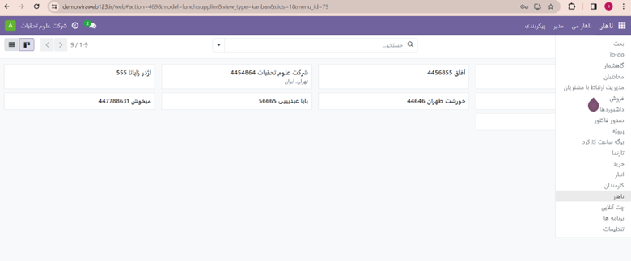

پس از نصب ماژول ناهار 4 منو اصلی برای ماژول ناهار ظاهر می شود. که هر کدام دارای چندین زیر منو می باشد. 
    
در ادامه به توضیحات آن ها خواهیم پرداخت

-   **ناهار:** در این بخش می توان منو های غذا که توسط مدیر و یا ادمین سایت قرار داده شده است را مشاهده کرد.
-   **ناهار من:** این قسمت مربوط به سفارش های روز شما می باشد.
-   **مدیر:** بعد از ثبت سفارش توسط هر کارمند مدیر مجموعه قادر خواهد بود با استفاده از تنظیمات قرار داده شده داخل این بخش به منوی کارمندان و تخصیص مبلغ و تعیین فروشنده برای غذا اقدام کند.
-   **پیکربندی:** این قسمت مربوط به اضافه کردن مواردی مانند سالن غذاخوری، دسته بندی غذا و یا فروشندگان و تنظیمات  است.

در ادامه به توضیحات تک تک هر کدام از منو ها به صورت مفصل خواهیم پرداخت.

**نحوه اضافه کردن یک غذا به منوی ناهار**

پیکر بندی
------------------
قبل از اضافه کردن غذا به منو باید چند مرحله را انجام دهیم. 
یکی از آن ها مکان ها می باشد. ممکن است مجموعه ایی دارای چند سالن غذا خوری مجزا باشد . قبل از هر چیزی باید مشخص شود کارمندان در کدام سالن غذا را میل میکنند.
برای این کار از قسمت پیکر بندی >> مکان ها << جدید فشار دهید. سپس طبق عکس یک ردیف جدید باز می شود و نام مکان مورد نظر را برای صرف غذا در شرکت انتخاب میکنید.

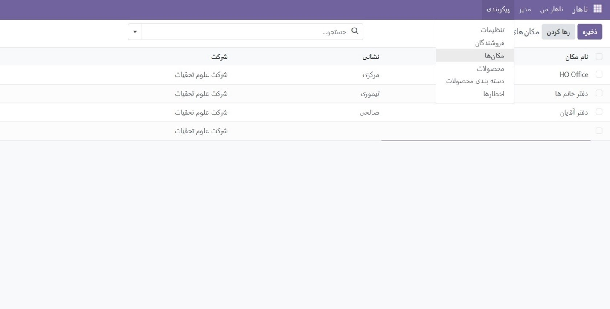

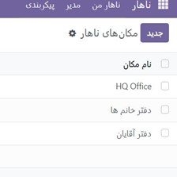

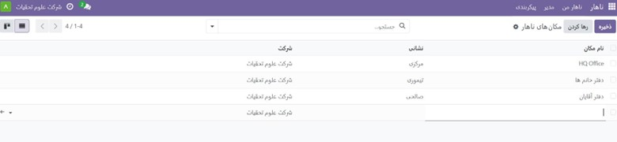

فروشندگان
---------------------

هر شرکت می تواند از فروشنده و رستوران های مختلفی سفارش غذا داشته باشد. بدین صورت که با وارد شدن از قسمت پکر بندی>> فروشندگان صفحه ایی باز می شود که باشد اطلاعات رستوران مورد نظر را به عنوان فروشنده وارد کرد.

مطابق عکس زیر ابتدا در فیلد دوم فروشنده نام فروشنده را وارد میکنیم تا به صورت اتوماتیک فیلد اول فروشنده که به صورت تیتر است پر شود.
اطلاعات الزامی فروشنده از جمله آدرس و تلفن را وارد میکنیم.
-   **دسترسی:**
 از این بخش می توانیم روزهایی که غذای مد نظر در آن رستوران موجود و یا تمایل داریم در یک روز خاص منوی غذا از این فروشنده باشد تیک میزنیم.
از قسمت تحویل گزینه تحویل را انتخاب کرده.

در بخش مکان طبق توضیحات قبل آن مکانی که مد نظر برای تحویل غذا می باشد را انتخاب میکنیم.
بعد از ثبت تمام موارد بر روی گزینه ابری کلیک کنید تا موارد ذخیره شوند.

همانطور که در سمت چپ عکس مشاهده میکنید می توانید با ارسال پیام و درج @ نام کارمندان از طریق گفت و گو در ارتباط باشید. فعالیت ها ،سندها و یادداشت های خود را در رابطه با این فروشنده ثبت کنید.

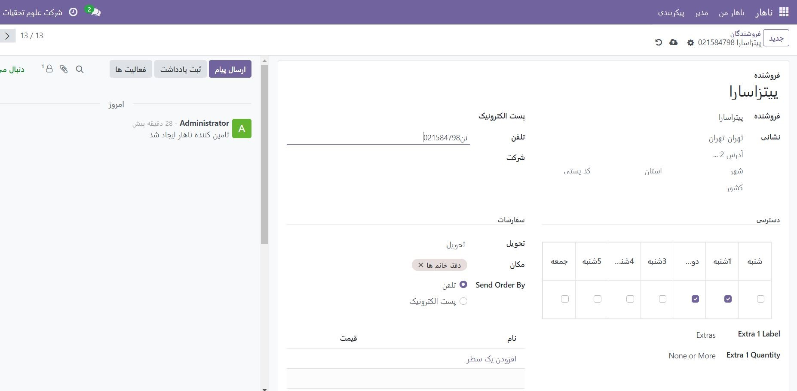

    دسته بندی محصولات
---------------------------------
از منو پیکربندی >> دسته بندی محصولات<< جدید

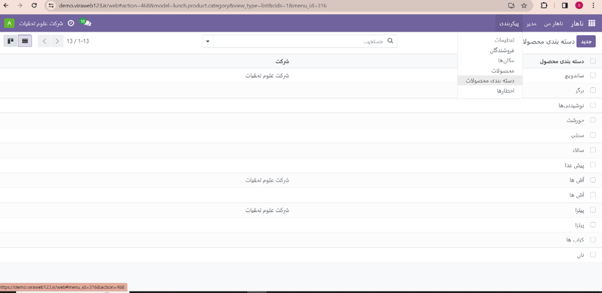

بعد از ایجاد یک دسته یک صفحه باز می شود که میتوانید دسته اصلی را بسازید تا غذاهای مربوط به آن در این دسته بندی قرار بگیرد.
(در قسمت های بعد آموزش راحت تر ایجاد دسته بندی محصولات گفته خواهد داده شد.) بعد از انتخاب نام ذخیره را بزنید.

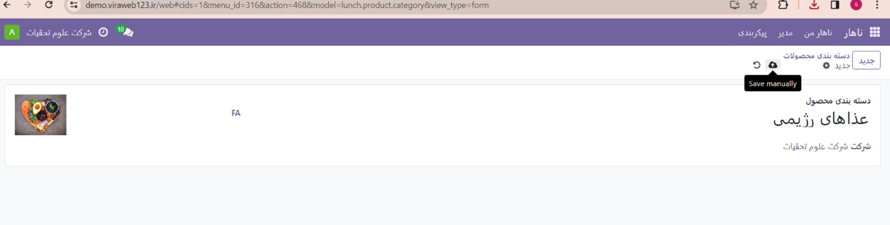

محصولات
-------------------
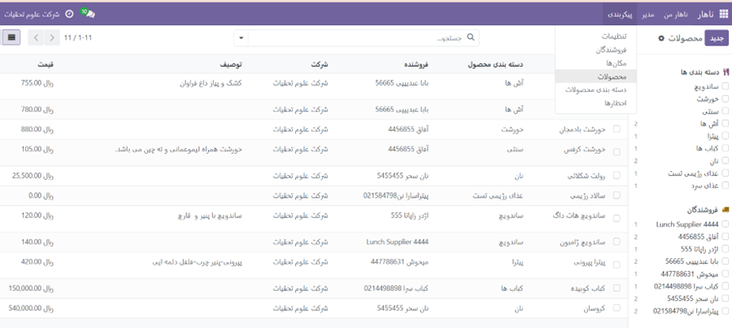

بعد از نمایش صفحه جدید محصول می توانید نام  غذا (محصول ) را اضافه کنید. توجه داشته باشید اودوو جهت سهولت کار کاربران در بسیاری از گزینه ها دسترسی های آسان و سریعی برای ایجاد تعبیه کرده است. به عنوان مثال در همین بخش در دسته بندی محصول چون از قبل دسته بندی به نام "سالاد فصل" وجود نداشت به محض نوشتن این برچسب گزینه create  در کنار دسته بندی ایجاد می شود تا همان دسته بندی درست شود. با فشردن این گزینه "سالاد فصل" به عنوان یک دسته بندی جدید شناخته می شود.

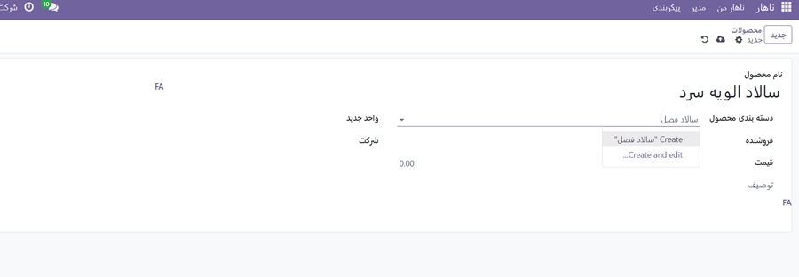

    در قسمت فروشنده هم مانند دسته بندی محصول اگر از قبل فروشنده ایی تعریف شده باشد که محصول مورد نظر را داشته باشد آن فروشنده را انتخاب میکنیم. در این غیر اینصورت میتوان در همین قسمت یک فروشنده جدید ایجاد کرد و اطلاعات آن را وارد کرد.

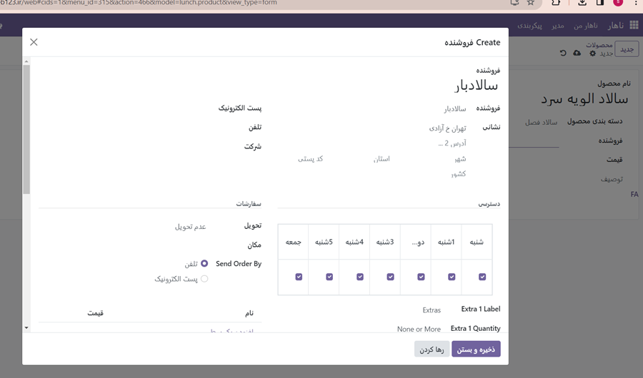

    پس از ذخیره کردن در منوی ناهار فروشنده جدید و محصول جدید قابل نمایش و انتخاب است.
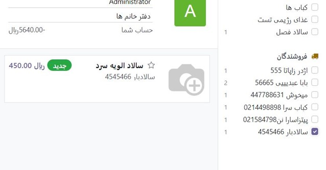

ناهار
================================

بعد از اضافه کردن محصولات و فروشندگان در قسمت ناهار هر فرد می تواند غذای مورد نظر خود را انتخاب کند و سپس بر روی گزینه order Now  (سفارش دهید)کلیک کرده تا سفارش تایید شود.
همچنین در منوی
        ناهار من  >>سفارش جدید(انتخاب غذا)
                     >> تاریخچه سفارشات( تمام غذاهای سفارش داده شده)   
                    >>  تاریخچه حساب (حساب هر کارمند می تواند توسط ادمین یا مدیر شارژ شود  قابل مشاهده هستند.

مدیر
================================

با وارد شدن در منوی مدیر می توان سفارشات امروز را بررسی کرد و در صورت ثبت اشتباه یا انصراف آن را لغو کرد.

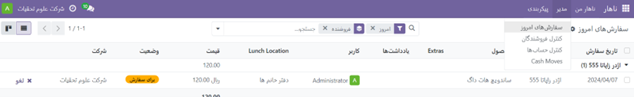

همچنین در گزینه کنترل فروشندگان میتوان مشاهده کر که از یک فروشنده در چه تاریخ های و به چه تعدادی غذا سفارش ثبت شده است.

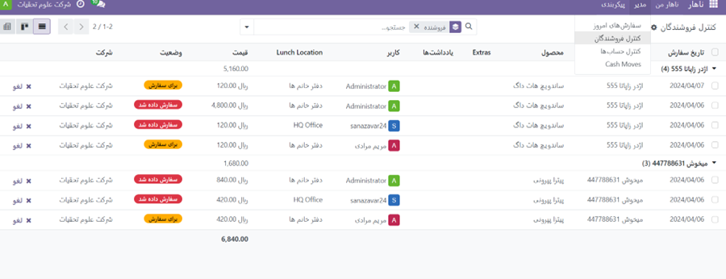

کنترل حساب ها
---------------------------
برای درک بهتر این بخش بهتر است ابتدا گزینه *<<cash Moves>>*  و بودجه تمام کارکنان را مطالعه کنید.

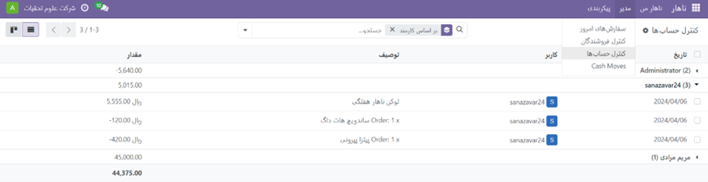

   در این قسمت مدیر می تواند مبالغی که هر کارمند برای سفارش ناهار به صورت کلی و تکی مشاهده کند در صورت منفی بودن حساب فرد نسبت به شارژ پروفایل کارمند یا قوانین مجموعه اقدام کند.( علامت منفی به منظور بدهکار بودن فرد و یا به اتمام رسیدن اعتبار در اودوو می باشد.)

   انتقال پول Cash Moves
---------------------------
قبل از وارد شدن به این گزینه  مدیر: در منوی پیکربندی<<  تنظیمات >> ناهار 
lunch Overdraft(مبلغ شارژ ناهار) مبلغی را معین می کند. سپس این مبلغ بین اعضا کارمندان تقسیم شده و افراد 
می توانند  بعد از این از شارژ حساب کاربری  خود سفارش غذا داشته باشند.

حتما بعد از تخصیص مبلغ گزینه ذخیره را فشار دهید**  

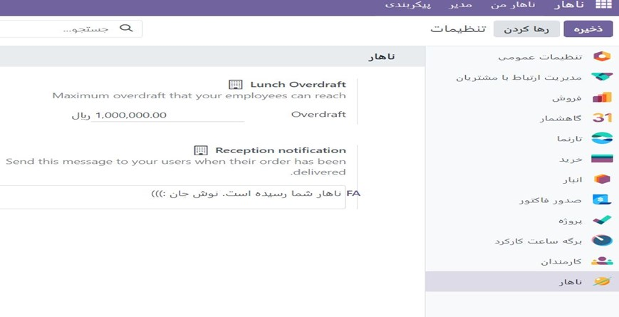

بعد از طی مراحل فوق در منوی مدیر و وارد شدن انتقال مبالغ صفحه ی زیر باز خواهد شد. در این صفحه می توان کلیک بر روی گزینه ایجاد و باز شدن صفحه ایی جدید به کارمند مورد نظر مبلغی رو جهت شارژ ناهار اختصاص داد.

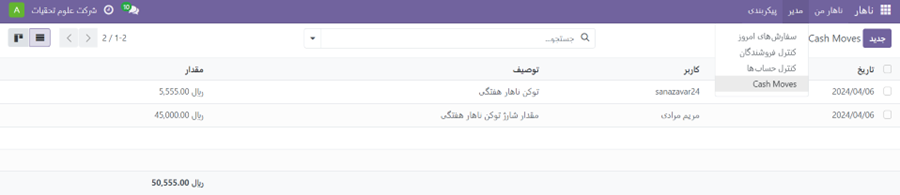

.. toctree::
        lunch/config

تگ ها:

1. :guilabel:`#ناها_ شرکتی`
2. :guilabel:`#خدمات_ناهار_شرکتی`
3. :guilabel:`#غذاهای _ناهار_شرکتی`
4. :guilabel:`#رستوران_ناهار_ شرکتی#`
5. :guilabel:`منوی_ناهار_شرکت#`
6. :guilabel:`سفارش_ناهار_شرکت#`
7. :guilabel:`تحویل_ناهار_شرکت#`
8. :guilabel:`غذاهای_مجموعه_ناهار#`
9. :guilabel:`منوی هفتگی_ناهار_شرکت#`
10. :guilabel:`#خدمات_کیتینگ_ناها_ شرکت`
11. :guilabel:`#غذاهای سالم ناهار_شرکتی`
12. :guilabel:`#منوی_گیاهی_ناهار_شرکت`
13. :guilabel:`#ناهار _شرکتی_با_کیفیت`