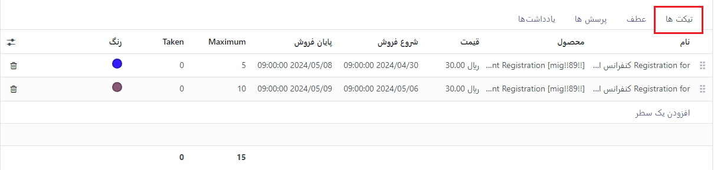
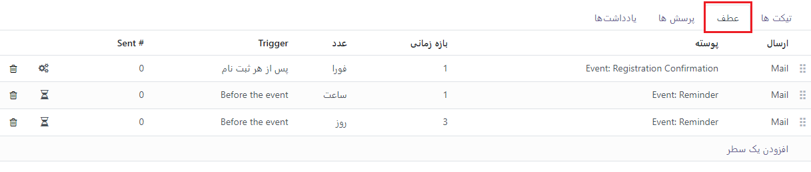
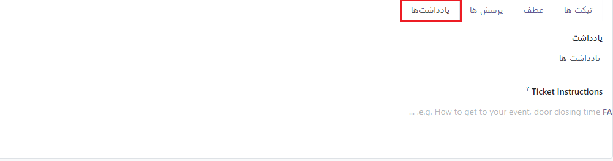

:nosearch:
:show-content:
:hide-page-toc:
:show-toc:

================
ملزومات رویداد
================
 
Odoo Events ابزارهای متعددی را برای مدیریت رویدادها فراهم می‌کند. این ابزارها از ایجاد و منتشر رویدادها در وب‌سایت گرفته تا فروش آنلاین بلیت‌ها، اسکن بلیت‌ها با بارکد Odoo، ارسال ایمیل‌های خودکار و تولید داده‌های گزارشی قوی پس از پذیرش ثبت‌نام، پشتیبانی می‌کند. این امکان به هماهنگ‌کنندگان رویداد کمک می‌کند تا تجربه‌ای جذاب و جامع برای شرکت‌کنندگان خود ایجاد کنند.

مفاهیم و سازماندهی کانبان
------------------------------

برای شروع به استفاده از کانبان، ابتدا بر روی برنامه رویدادها در داشبورد خانه کلیک کنید. این کلیک شما را به نمای kanban هدایت می‌کند که پر از مراحل مختلف خط لوله رویداد شما است. در هر کارت رویداد، اطلاعات کلیدی مانند تاریخ و زمان رویداد به همراه تعداد شرکت کنندگان مورد انتظار و تایید شده ذکر شده است. این سازماندهی کانبان به شما کمک می‌کند تا به طور مؤثر‌تر و به‌طور واضح‌تر برنامه‌ریزی و مدیریت رویدادهای خود را انجام دهید.

برای ایجاد یک مرحله جدید، روی "Add a Column" کلیک کنید و یک عنوان مناسب برای نمایش هدف آن مرحله را وارد کنید. برای سازماندهی مجدد مراحل، می‌توانید آنها را بکشید و رها کنید تا در ترتیب مناسب قرار بگیرند. همچنین، می‌توانید مراحل را در کانبان تنظیم کنید تا یک نمایش تمیزتر داشته باشید، این کار از طریق منوی تنظیمات در سمت راست عنوان هر مرحله، که با نماد چرخ دنده نشان داده می‌شود، قابل انجام است.

.. Note::
    نماد چرخ دنده، به طور پیش فرض، مخفی است و هنگامی که ماوس را روی آن قرار دهید، در کنار نماد +  ظاهر می شود .

پس از کلیک کردن، یک منوی کشویی از تنظیمات ظاهر می شود.

ایجاد یک رویداد جدید 
------------------------
برای ایجاد یک رویداد، روی ایجاد از داشبورد رویدادها کلیک کنید. سپس Odoo صفحه را به یک فرم قالب رویداد خالی هدایت می کند.
از فرم رویداد، با انتخاب از داده‌های موجود در پایگاه داده Odoo یا با ایجاد و ویرایش داده‌های فیلد جدید، فیلدهای لازم را پر کنید. اطلاعات کلیدی برای ورود به رویداد شامل:

- نام رویداد : به رویداد یک عنوان بدهید.
- تاریخ : شامل تاریخ/زمان‌های شروع و پایان رویداد است.
- منطقه زمانی : منطقه زمانی را برای زمانی که رویداد در حال برگزاری است را پوشش می دهد.
- الگو : از یک الگوی رویداد از پیش ساخته شده انتخاب کنید یا یک قالب سفارشی بسازید و آن را به اینجا متصل کنید.
- برچسب ها : برچسب هایی را اضافه کنید تا به طور خلاصه نشان دهید که رویداد برای چه چیزی است (مثلا tradeshow). برچسب ها به سازماندهی بهتر کارت های رویداد در کانبان کمک می کنند و هنگام استفاده از فیلترهای جستجو در طول دوره های گزارش مفید هستند.
- سازمان دهنده : جزئیات سازمان دهنده (های) رویداد. این فیلد معمولاً شرکتی است که پایگاه داده Odoo یا یک فروشنده را در اختیار دارد.
- مسئول : فردی که مسئول سازماندهی رویداد است را نام ببرید.
- وب‌سایت : نشان دهید که رویداد رویداد در کدام وب‌سایت Odoo باید منتشر شود.
- مکان : اگر رکورد جدیدی است، جزئیات مکان را در اینجا فهرست کنید، یا از یک مکان موجود انتخاب کنید.
- محدود کردن ثبت نام ها : وقتی این تنظیم فعال باشد، ثبت نام شرکت کنندگان را به مقدار مشخصی محدود می کند.
- تأیید خودکار : وقتی فعال باشد، این تنظیم از درخواست تأییدی که از طریق ایمیل برای ثبت‌کنندگان رویداد ارسال می‌شود، صرفنظر می‌کند و به‌طور خودکار ثبت نام آنها را تأیید می‌کند.
پس از تنظیم فیلدهای فرم رویداد، به برگه‌های بلیط و ارتباطات و در صورت نیاز به اطلاعات اضافی، به برگه سؤالات بروید.

اضافه کردن و فروش بلیط رویداد
---------------------------------

در زیر برگه بلیط، موارد خطی را برای هر نوع بلیطی که رویداد قصد ارائه آن را دارد، اضافه کنید. می‌توانید قیمت بلیط، تاریخ شروع/پایان ثبت‌نام و همچنین حداکثر تعداد بلیت‌های قابل فروش را تعیین کنید. اگر فروش بلیط برای رویداد ضروری نیست، یک دکمه ثبت‌نام ساده به طور پیش‌فرض در صفحه رویداد نمایش داده می‌شود.

در برگه ارتباطات، متن ایمیل، پیامک یا پست‌های اجتماعی را برای شرکت‌کنندگان در رویداد ارسال کنید. برای هر نوع ارتباط، روی "افزودن یک خط" در فرم برگه ارتباطات کلیک کنید و سپس از منوی کشویی زیر ستون "الگو"، یک الگوی ارتباطات را انتخاب یا ایجاد کنید.

در مرحله بعد، فاصله و واحد زمان را برای تعداد دفعات ارسال ارتباط مشخص کنید. از این فیلدهای زمانی برای تعیین فرکانس ساعت‌ها، روزها، هفته‌ها یا ماه‌ها استفاده کنید. همچنین، می‌توانید گزینه ارسال ارتباطات پس از فعال شدن را فعال کنید.

در ستون آخر، Trigger را تعیین کنید که نحوه و زمان ارسال ارتباط را کنترل می‌کند. بین موارد زیر می‌توانید انتخاب کنید: قبل از رویداد، بعد از هر ثبت‌نام، یا بعد از رویداد.

ضمیمه پرسشنامه به ثبت نام رویداد
-------------------------

برای پیاده‌سازی پرسشنامه در هنگام ثبت‌نام رویداد، می‌توانید از روشی مؤثر برای سنجش خواسته‌ها، نیازها و علایق شرکت‌کنندگان استفاده کنید. پرسشنامه‌ها همچنین به عنوان ابزار تجزیه و تحلیل اطلاعاتی برای دوره‌های گزارش قبل یا بعد از رویدادها عمل می‌کنند.
برای ایجاد یک پرسشنامه، از برنامه رویدادها، به تنظیمات ‣ تنظیمات بروید و سپس تنظیمات سؤالات را فعال کنید. با فعال بودن این تنظیمات، اکنون می‌توانید سؤالات و پاسخ‌ها را در برگه سؤالات در فرم رویداد اضافه کنید و ذخیره کنید. برای هر سؤال، مشخص کنید که آیا فقط یک بار باید با کادر چک یک بار در هر سفارش پرسیده شود، یا اینکه سؤال به یک پاسخ اجباری نیاز دارد که سؤال را برای ثبت‌نام ضروری می‌کند.

در پیاده‌سازی پرسشنامه، دو نوع سوال برای انتخاب وجود دارد: انتخاب و ورودی متن.

1.	سوال‌های انتخابی: این نوع سوال به شرکت‌کنندگان اجازه می‌دهد تا از بین گزینه‌هایی که از پیش پیکربندی شده‌اند و در تب پاسخ‌ها در زیر وارد می‌شوند، یک پاسخ را انتخاب کنند.
2.	سوال‌های ورودی متن: در این نوع سوال، شرکت‌کنندگان اجازه می‌دهد تا پاسخ خود را به سؤال در یک جعبه متن بنویسند و ارسال کنند.

از این دو نوع سوال می‌توانید برای جمع‌آوری اطلاعات مورد نیاز از شرکت‌کنندگان استفاده کنید و با توجه به نوع رویداد و هدف‌های خود، متناسب با نیازهای خود سوالات را طراحی کنید.

در برگه یادداشت‌ها، شما می‌توانید یادداشت‌های داخلی یا دستورالعمل‌های بلیط را اضافه کنید.

- یادداشت‌های داخلی: در زیر یادداشت، می‌توانید اطلاعات داخلی مانند لیست کارها، اطلاعات تماس و غیره را برای ارجاع کارکنان رویداد قرار دهید.
- دستورالعمل‌های بلیط: در قسمت دستورالعمل‌های بلیت، اطلاعات مفید برای کارکنان و شرکت‌کنندگان را می‌توان به اشتراک گذاشت، مانند مسیرهای رسیدن به محل، زمان افتتاح/بسته شدن و غیره.
برای افزودن متن به هر یک از این فیلدها، تایپ کنید تا یک منوی فرعی از گزینه‌های ساختار ظاهر شود. این گزینه‌ها گزینه‌های قالب‌بندی مختلفی را برای اطمینان از سازماندهی اطلاعات داخلی حیاتی برای بررسی کارکنان رویداد ارائه می‌کنند.

دعوت شرکت کنندگان به رویداد 
---------------------------

برای دعوت افراد به یک رویداد، روی دکمه دعوت واقع در گوشه سمت چپ بالای فرم رویداد کلیک کنید.
در داخل فرم قالب دعوت، گزینه هایی برای ارسال ایمیل یا دعوت نامه پیامکی وجود دارد. هر پیام را می توان به طور کامل سفارشی کرد و گیرندگان را می توان اضافه کرد.
افزودن یک خط موضوع برای پیام دعوت الزامی است، اما قسمت پیش نمایش متن اختیاری است. متن پیش نمایش یک جمله پیش نمایش جذاب است که هدف آن تشویق گیرندگان برای باز کردن ایمیل است.

.. Note::
    در بیشتر موارد، متن پیش نمایش در کنار موضوع نمایش داده می شود. برای اطمینان از ظاهر شدن اولین کاراکترهای محتوای ایمیل، این قسمت را خالی نگه دارید.

انتخاب دعوت شدگان و پیکربندی فیلترهای گیرنده 
---------------------------------

در وسط فرم دعوت، فیلد گیرندگان را پیدا کرده و روی آن کلیک کنید تا منوی کشویی گزینه‌های گیرنده نمایش داده شود. این انتخاب‌ها نشان دهنده جایی است که Odoo اطلاعات گیرندگان مورد نظر را پیدا می‌کند.
هنگامی که یک گزینه از این منو انتخاب شد (مثلاً متقاضی، مخاطب، ثبت رویداد، سرنخ/فرصت، و غیره)، Odoo دعوت‌نامه را برای همه گیرندگانی که با قانون اولیه مطابقت دارند، ارسال می‌کند. با کلیک روی "افزودن فیلتر"، می‌توانید قوانین بیشتری برای محدود کردن گیرندگان هدف اضافه کنید.

با کلیک بر روی "افزودن فیلتر"، سه فیلد ظاهر می‌شود که مانند یک معادله فرمت شده‌اند. برای نشان دادن گزینه‌های زیرمنو، روی هر فیلد کلیک کنید و انتخاب‌های دلخواه را انجام دهید تا پیکربندی دلخواه به دست آید. تعداد رکوردهایی که با قانون(های) مطابقت دارند، در سمت راست فیلد گیرندگان به رنگ سبز نشان داده می‌شود.

.. Note::
    برخی از گزینه‌های زیر منو در فیلد قانون اول امکان انتخاب دوم را فراهم می‌کنند تا ویژگی‌های بیشتری را ارائه دهند.

در سمت راست هر قانون، نمادهای x، + و … قرار دارند. 

-	نماد x یک گره (خط) خاص از قانون را حذف می‌کند.
-	نماد + یک گره (خط) به قانون اضافه می‌کند.
-	و نماد … یک شاخه به گره اضافه می‌کند.

یک شاخه به این معنی است که دو گره فرعی اضافی با تورفتگی به این قانون اضافه می‌شوند که ویژگی‌های بیشتری را برای خط بالای آن فراهم می‌کنند.

سفارشی سازی یک دعوت رویداد 
--------------------------

در برگه Mail Body ، تعدادی الگوی پیام از پیش پیکربندی شده برای انتخاب وجود دارد. الگوی مورد نظر را انتخاب کنید و هر عنصر از جزئیات طراحی آن را با سازنده وب کشیدن و رها کردن Odoo که در نوار کناری سمت راست قرار دارد، تغییر دهید.

.. image:: ./img/event-email-builder-block.gif
    :alt: ماژول استخدام
    :align: center

 نکته
برای ایجاد یک دعوت‌نامه برای رویداد ایمیل از ابتدا، الگوی متن ساده را انتخاب کنید. Odoo یک بوم ایمیل خالی را ارائه می‌دهد که می‌تواند با استفاده از ویرایشگر متن غنی از frontend که دستورات اسلش (/) را می‌پذیرد، یا ویرایشگر کد XML در هنگام توسعه سفارشی شود. حالت فعال است و نماد </>  فشار داده می‌شود.

.. Note::
    برگه Mail Body (و گزینه‌های الگو) تنها در صورتی در دسترس هستند که نوع پستی دعوت رویداد به‌عنوان ایمیل تعیین شده باشد . اگر پیامک نوع ارسال باشد ، به جای آن یک برگه محتوای پیامک (شامل یک فضای متنی خالی) موجود است.

تغییر تنظیمات دعوت رویداد 
-----------------------------

بسته به نوع ایمیل مشخص شده، گزینه‌های زیر برگه تنظیمات متفاوت است.

1. اگر گزینه ایمیل به عنوان نوع پستی انتخاب شود، می‌توان یک کارمند را به عنوان مسئول تعیین کرد. به این معنی که آن شخص مسئول این پیام دعوت خاص است. همچنین، نام مستعار ایمیل ارسال از و پاسخ به ایمیل را نیز می‌توان در اینجا تعیین کرد. همچنین، می‌توان اسناد خاصی را برای دعوت این رویداد همراه با این ایمیل، با کلیک کردن بر پیوست کردن یک فایل و افزودن سند(های) مناسب ارسال کرد.
2.	اگر گزینه پیامک به‌عنوان نوع پست انتخاب شود، می‌توان یک مسئول را تعیین کرد و گزینه گنجاندن پیوند انصراف در دسترس است.

ارسال دعوت نامه های رویداد برای گیرندگان 
---------------------------

اگر نوع ایمیل انتخاب شده ایمیل باشد، سه گزینه برای ارسال دعوت وجود دارد: Send، Schedule، و Test..

1.	Send این گزینه دعوت‌نامه را بلافاصله ارسال می‌کند.
2.	Schedule این گزینه یک پاپ‌آپ را نشان می‌دهد که در آن می‌توان تاریخ/زمان برنامه‌ریزی شده را برای ارسال ایمیل انتخاب کرد.
3.	Test این گزینه یک پاپ‌آپ "Test Mailing" را نشان می‌دهد، که در آن آدرس‌های ایمیل گیرنده خاصی را می‌توان برای Odoo وارد کرد تا قبل از ارسال رسمی آن برای شرکت‌کنندگان احتمالی، نسخه فعلی نامه را برای بررسی ارسال کند.

اگر نوع ایمیل انتخاب شده پیامک باشد، چهار گزینه برای ارسال دعوت وجود دارد: Queue، Send Now، Schedule، و Test.

1.	Queue این گزینه یک پیام اس‌ام‌اس را برای همه گیرندگان (که با قوانین تعیین شده مطابقت دارد، در صورت وجود) در آینده نزدیک برنامه‌ریزی می‌کند.
2.	Send Now این گزینه دعوت‌نامه را فوراً ارسال می‌کند.
3.	Schedule این گزینه مشابه گزینه ایمیل است و امکان برنامه‌ریزی ارسال پیامک را فراهم می‌کند.
4.	Test این گزینه مشابه گزینه ایمیل است و امکان ارسال آزمایشی پیامک را فراهم می‌کند.

.. Note::
    گزینه های Send Now ، Schedule و Test همگی برای هر دو گزینه Mailing Type یکسان عمل می کنند .

انتشار رویدادها 
----------------------------

تا زمانی که رویدادی منتشر نشود، از دید عموم در وب‌سایت پنهان می‌ماند و ثبت‌نام در آن امکان پذیر نخواهد بود. برای انتشار یک رویداد، می‌توانید از قسمت پشتی Odoo از طریق برنامه رویدادها به آن پیمایش کنید یا به عنوان یک کاربر یا مدیر ممتاز به صفحه رویداد مخفی از طریق frontend دسترسی داشته باشید.
اگر از باطن پیمایش می‌کنید، به فرم رویداد بروید و روی دکمه هوشمند "برو به وب‌سایت" کلیک کنید تا به صفحه رویداد در وب‌سایت (در قسمت جلویی) برسید. اگر از قسمت جلو شروع کنید، به سادگی به صفحه رویدادی که باید منتشر شود بروید.
بدون توجه به مسیر، یک صفحه رویداد فقط از قسمت جلویی قابل انتشار است. در گوشه سمت راست بالای صفحه رویداد در وب‌سایت، سوئیچ را از وضعیت قرمز "Unpublished" به وضعیت سبز "Published" تغییر دهید. انجام این کار بلافاصله صفحه رویداد را در وب‌سایت در دسترس عموم قرار می‌دهد.

