:nosearch:
:show-content:
:hide-page-toc:
:show-toc:

================
ملزومات بازیابی پیامکی
================
 

برای استفاده از این امکان بازاریابی کافیست ماژول **بازاریابی_پیامکی** را فعال کنید تا از تمام امکانات آن استفاده کنید.
پس از نصب ماژول وارد محیط زیر می شوید.

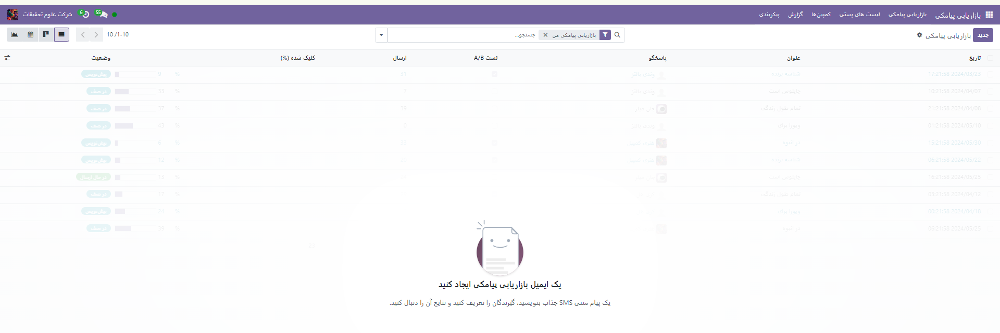

شما می توانید لیست جداگانه ای از مخاطبین در مورد فروش فلش یا پیشنهادات برای یک زمان خاص داشته باشید تا بتوانید برای آنها پیامک ارسال کنید.

می توانید پیامک را برای ارسال در یک روز مشخص در این ماژول برنامه ریزی کنید و Odoo 17 به طور خودکار پیامک را در آن تاریخ برای مشتری تعیین شده ارسال می کند. شما می توانید هر لیست پیامکی را که می خواهید حذف کنیم به لیست سیاهی که این ماژول ارائه می دهد اضافه کنید.

همانطور که در عکس زیر مشاهده می کنید حالت های مختلفی برای نمایش پیامک ها وجود دارد: **لیستی** ، **کانبان** ، **تقویم** و **نمودار**. عکس زیر حالت *کانبان* را نمایش می دهد.

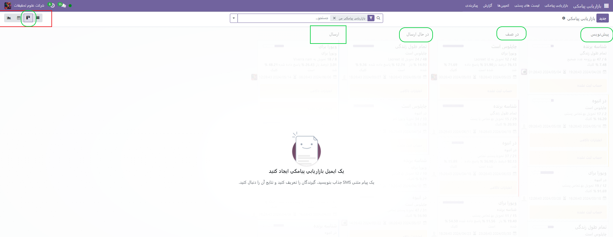

ایجاد پیامک
------------------------------

مانند عکس زیر قسمت **محتوای پیامک** می توانید متن پیامک خود را وارد کنید. در  حال حاضر این متن به 160 کاراتر محدود میشود.

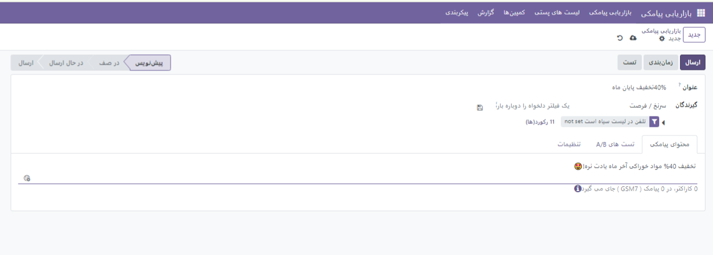

صفحه A/B Tests صفحه بعدی است که با فعال بودن این تیک در آن می توانید ایمیل های مختلفی را برای مشتریانی که انتخاب شده اند به طور همزمان ارسال کنید تا ببینید چقدر در از بین بردن ارتباطات جعلی موثر هستند. این یک گزینه برای اطمینان از نتایج است. با فعال کردن این گزینه، از شما خواسته می شود که درصد گیرندگانی که می توانند پیامک دریافت کنند را وارد کنید.

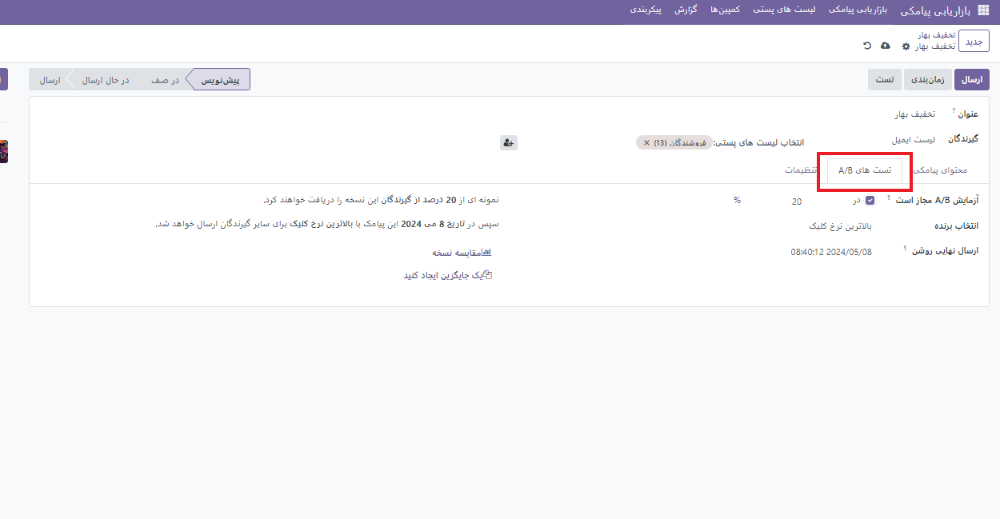
لیست پستی مخاطبین
------------------------------

گاهی ممکن است شما بخواهید تعداد انبوهی از اطلاعات تماس اشخاص را یک جا در سیستم وارد کنید و آنها را در یک خبرنامه مخصوص به خودشان قرار دهید. برای این کار مطابق عکس های زیر عمل می کنیم.

از منو **لیست های پستی** ،**لیست پستی مخاطبین**  

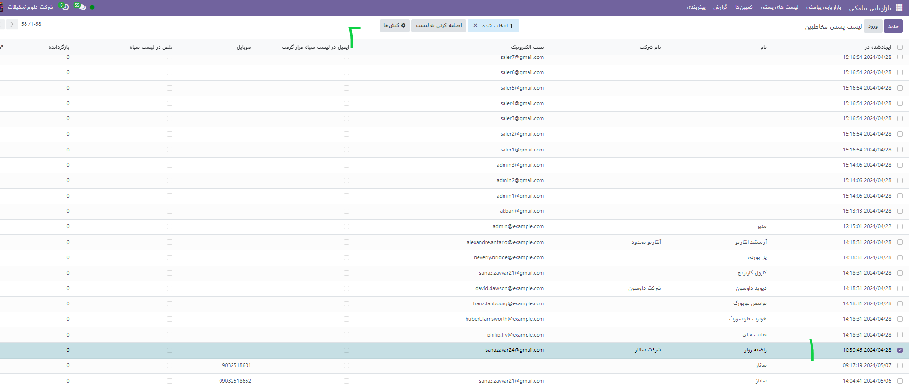

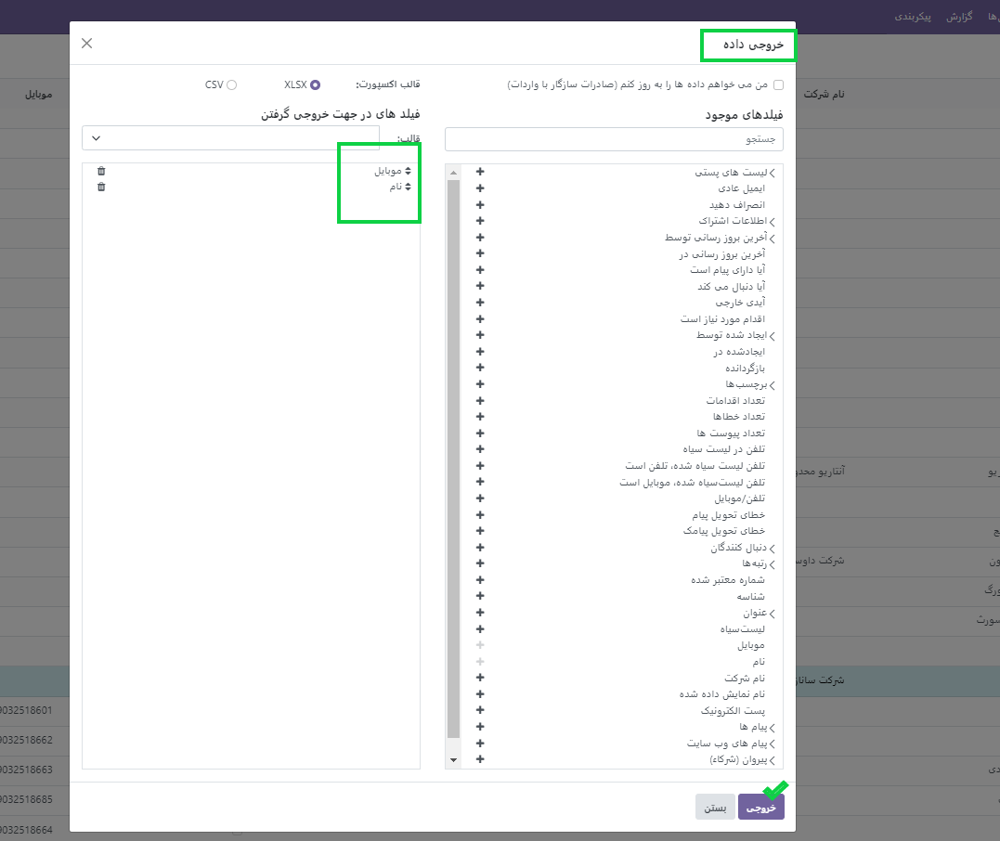

خروجی حاصل که با دو فیلد گرفته شده به صورت اکسل خواهد بود. سپس دو ستون ها را پر کرده و بهد از ذخیره همین فایل اکسل را در سایت با گزینه **آپلود فایل** بارگذاری می کنیم.

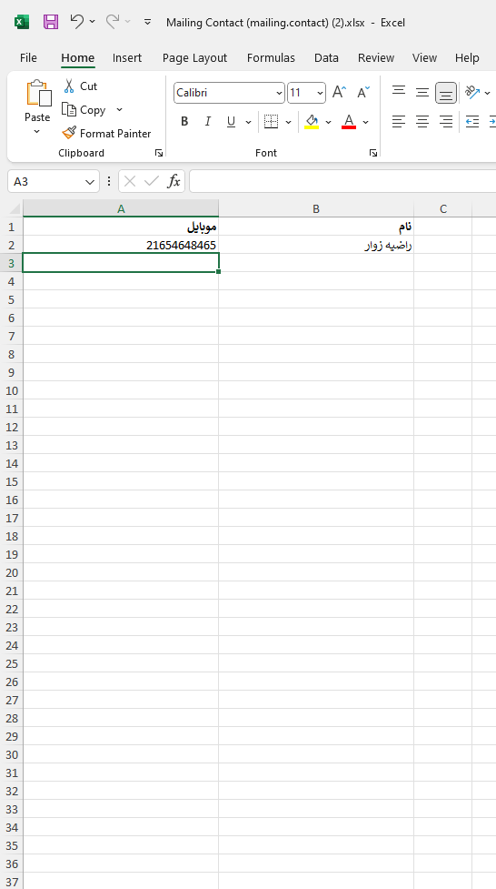

.. image:: ./img/sms8.png
    :alt: بازاریابی پیامکی
    :align: center

بعد از وارد کردن فایل اکسل مورد نظر. مطابق عکس های زیر صفحات باز شده که اول به صورت تست فیلدها را چک میکنیم سپس **ورود** را میزنیم تا تمام مخاطبان به لیست وارد شوند.

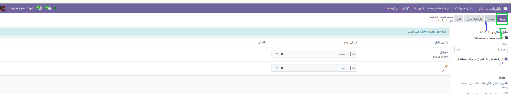

حال می خواهیم این مخاطبین را به لیست مخصوصی از پست ها وارد کنیم. برای این کار ابتدا وارد **لیست پستی** می شویم.
یک لیست پستی می سازیم. به نام دلخواه **گروه شرکت** می خواهیم همان مخاطبین قبلی را در این گروه اضافه کنیم. مانند مراحل قبل عمل میکنیم.

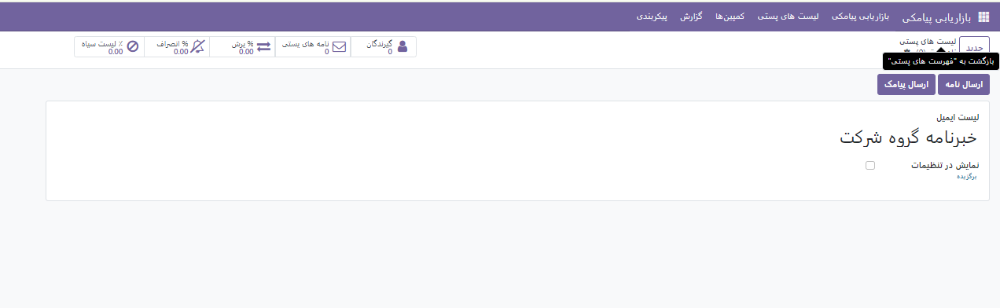

وارد منوی **لیست های پستی** ◄**لیست های پستی** می شویم.
از چرخ دنده ◄ورود رکوردها فایل مورد نطر را انتخاب میکنیم.(اینجا همان فایل قبلی اضافه شده است.)

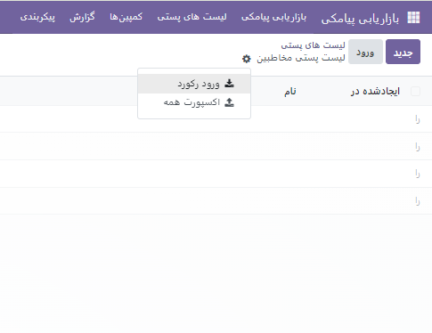

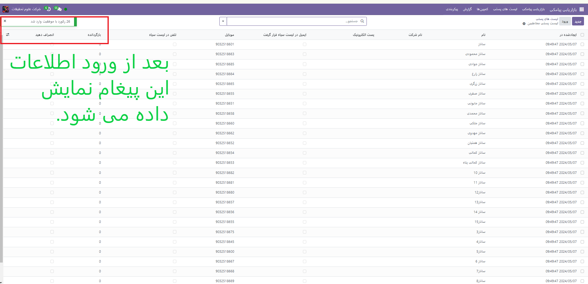

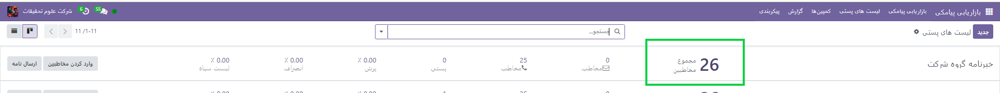

بعد از این هر زمان برای گروه شرکت پیامی ارسال شود این پیام به 26 مخاطب ارسال خواهد شد.

.. example::
    مثال:   

    می خواهیم برای گروه شرکت پیامکی ارسال کنیم. 

    برای این منظور از گزینه **ارسال پیامک**  استفاده می شود. و در صورت تمایل سایر تب ها را تنظیم میکنیم.

    .. image:: ./img/sms15.png
        :alt: بازاریابی پیامکی
        :align: center    

    بعد از زدن گزینه **ارسال** پیامک از حالت پیش نویس به در **صف** یا در **حال ارسال** تغییر می کند.

    .. image:: ./img/sms16.png
        :alt: بازاریابی پیامکی
        :align: center 
    بعد از ارسال پیامک از تب های بالا می توانیم ببینیم که این پیام به دست چند نفر رسیده و پیام را باز کرده اند و یا از تب سرنخ دمی توانیم پیامک هایی که امکان سرنخ شدن را دارند و به ماژول crm  وصل شوند را ببینیم.

تنظیمات کمپین پیامکی
------------

همانطور که در بازاریابی ایملی می توانیم کمپینی درست کرده و برای افراد این اطلاعیه را ارسال کنیم در بازاریابی پیامکی هم این قابلیت وجود دارد و می توانید افراد را به صورت پیامکی از این کمپین باخبر کنید.

دقت داشته باشید باید در تنظیمات عمومی گزینه مطابق عکس فعال باشد.

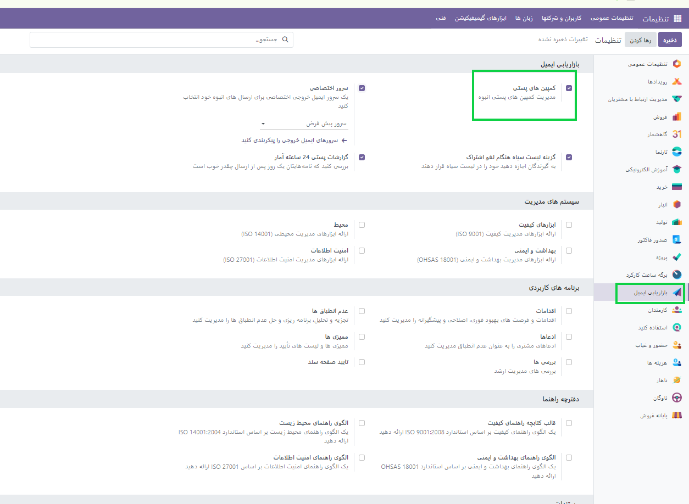

برای اطلاعات بیشتر ماژول بازایابی ایمیلی را بخوانید `<https://viraweb123.github.io/documentation/applications/emailmarketing/emailmarketing.html>`_.

گزارش ها
----------------------
از این بخش می توانید تبلیغات پیماکی خود را در نمودارهای متفاوت و با حالت مختلف تحلیلی و بررسی کنید.

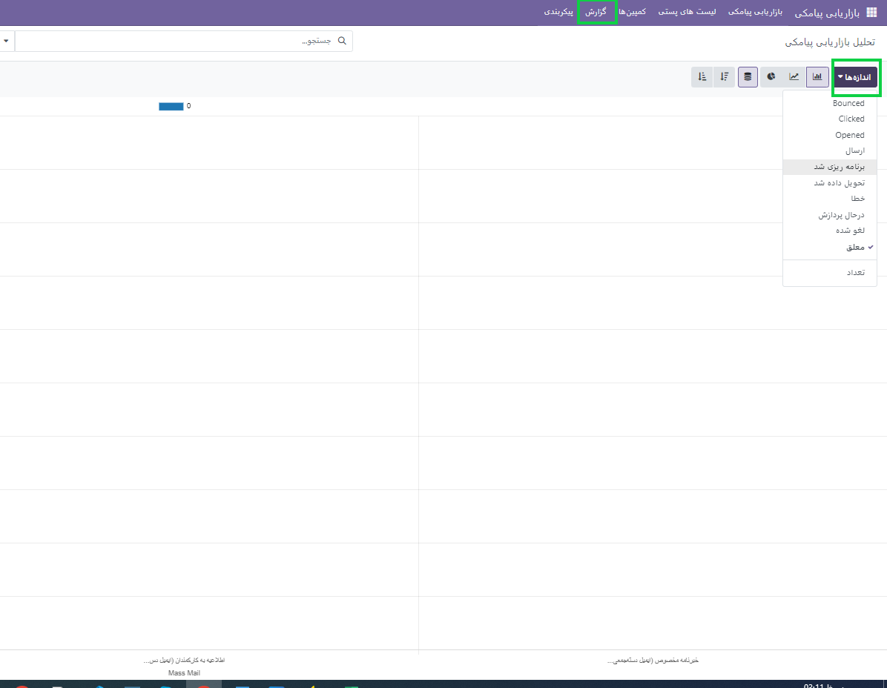

پیگیری لینک ها
--------------------
بر اساس شکل زیر شما می توانید لینک هایی که ممکن است از آن ها سرنخ ها و فرصت هایی برای ارسال پیامک و یا حتی فروش بدست آورید و کمپین های خاصی را روی آنها اعمال کنید تعریف نمایید. و از گزینه ای بالا به همان صفحه رفته و یا تعداد کلیلک هایی که روی آنها اجام شده را مشاهده کنید.

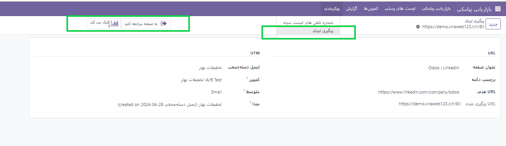

برای حذف یک لینک، کافیست از چرخ دنده گزینه **حذف** را بزنیم.

لینک ها:

1. https://www.odoo.com/documentation/17.0/applications/marketing/sms_marketing.html

2. https://www.cybrosys.com/odoo/odoo-books/v17-ce/sms-marketing/

تگ ها: 

1.  :guilabel:`#بازاریابی_پیامکی`
   
2.  :guilabel:`#محتوا_بازاریابی`
   
3.  :guilabel:`#تبلیغات_پیامکی`
   
4.  :guilabel:`#طراحی_پیامک`
   
5.  :guilabel:`#سیستم_مدیریتت_پیامک`
    
6.  :guilabel:`#فروش_پیامکی`
    
7.  :guilabel:`#SmsMarketing`
    
8. :guilabel:`#ContentMarketing`
    
9. :guilabel:`#SmsStrategy`
    
10. :guilabel:`#SmsDesign`
    
11. :guilabel:`#A/BTesting`
 
12. :guilabel:`#oldsms`

13. :guilabel:`#blockedsms`

14. :guilabel:`#reporting`