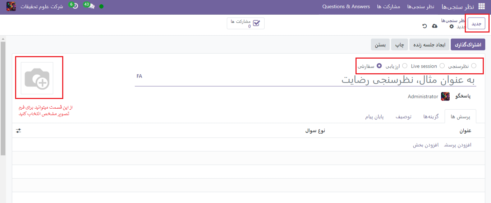

:nosearch:
:show-content:
:hide-page-toc:
:show-toc:

============
ماژول نظرسنجی
============

برای ایجاد نظر سنجی به برنامه نظرسنجی ها > **جدید** می رویم و فرم خالی نظرسنجی را به ما میدهد.

.. Note::
    اگر view در حالت activity  باشد کلید جدید را در بالای صفحه نشان نمیدهد و باید نحوه نمایش را تغییر دهید.
 
- در بالای فرم نظرسنجی 4 مورد انتخابی(نظرسنجی،live session، ارزیابی، سفارشی) وجود دارد که میتوان نوع نظر سنجی را در آن انتخاب کرد.گزینه سفارشی نمیتواند هر نوع نظرسنجی را ارائه دهد.
- در بخش عنوان، نامی برای فرم نظرسنجی انتخاب میکنیم. در بخش پایین آن میتوان فرد پاسخگو را از بین کاربران انتخاب کرد.
- از نماد دوربین که در بالا سمت چپ قرار دارد میتوان برای انتخاب عکس پس زمینه فرم نظرسنجی استفاده کرد. 

4 تب در پایین قرار دارد
----------------------

- تب پرسش
- تب گزینه ها
- توصیف
- تب پایان پیام

تب پرسش
---------------

در این تب به امور مشاهده،دسترسی، افزودن و یا حذف سوالات و بخش ها می پردازیم.
دو ستون به صورت پیش فرض وجود دارد. در سمت بالا چپ میتوان برای انتخاب پاسخ اجباری استفاده کرد. حال می توان پرسش و یا بخش را با کلیک بر روی افزودن بخش ، افزودن پرسش ، اضافه کرد.
با کلیک بر روی افزودن پرسش ،صفحه ای برای سفارشی کردن سوالات نظرسنجی باز می شود.(اگر عنوانی برای نظرسنجی انتخاب نکرده باشید این گزینه برای شما غیر فعال خواهد بود.)
سه تب پاسخ ها، توصیف ، گزینه ها در این صفحه وجود دارد. در تب پاسخ میتوان پاسخ متنی و یا حتی فایلی را آپلود کرد.در تب توصیف ، به صورت اختیاری میتوان توضیحی برای پرسش قرار داد و در تب گزینه ها میتوان گزینه پاسخ اجباری ، محدودیت زمانی سوال ، نمایش فیلد نظرات(به شرکت کننده امکان درج نظرات خود را میدهد.) و موارد دیگر را مشخص کرد.(با توجه به نوع سوال که انتخاب میکنیم تفاوت ها جزئی ممکن است در این گزینه ها ایجاد شود.) 
 

با انتخاب نوع ماتریسی میتوان ردیف و ستون پاسخ های آن را مشخص کرد.
 

افزودن بخش
-------------

با کلیک بر روی افزودن بخش و انتخاب عنوان سوالاتی که در زیر آن قرار میگیرد در این بخش هستند.

تب گزینه ها
----------------------

در تب گزینه های فرم نظرسنجی، گزینه های زیادی برای انتخاب وجود دارد که در چهار بخش مختلف از هم تفکیک شده اند: پرسش ها، PARTICIPANTS، TIME & SCORING و جلسه زنده.
 
بخش پرسش ها
---------------------

در این بخش ابتدا میتوان نحوه صفحه بندی را مشخص کرد که میتواند به حالات(
یک صفحه با تمام سوالات ،یک بخش در هر صفحه ، هر سؤال در یک صفحه) باشد.
اگر یکی از گزینه‌های یک صفحه با تمام سوالاتیا یک بخش در هر صفحه  انتخاب شود، گزینه Allow Roamingظاهر می‌شود. با فعال بودن این گزینه شرکت‌کننده اجازه دارد در طول نظرسنجی به سؤالاتی که می‌خواهد برگردد.
 

حال به تنظیمات نحوه نمایش پیشرفت شرکت کننده میپردازیم که دو حالت نمایش با شماره و Percentage left( درصد باقیمانده) دارد.
برای تنظیم کردن نمایش سوالات برای شرکت کننده میتوانیم از حالت تمام سوالات و یا به صورت اتفاقی برای هر کاربر(تعدادی را به صورت رندوم برای هر کاربر نمایش میدهد.) استفاده کرد.

بخش TIME & SCORING 
---------------------

در این بخش ابتدا میتوان محدودیت زمانی را به دلخواه و برحسب دقیقه مشخص کرد.
سپس  به تنظیمات  امتیاز دهی و انتخاب نوع حالت آن میپردازیم که 4 حالت دارد:

بدون امتیاز
----------------

 Scoring with answers after each page
 امتیاز دهی با پاسخ در پایان
 Scoring without answers
با انتخاب هر کدام از سه مورد آخر گزینه جدیدی اعمال میشود که درصد لازم برای گرفتن گواهی و مشخص کردن گواهینامه بودن یا نظرسنجی را تعیین میکند. در صورت گواهینامه بودن فرم ، گزینه های جدیدی نشان داده میشوند که رنگ و قالب گواهینامه و قالب ایمیل ارسالی را مشخص میکند.(با گرفتن درصد لازم برای گرفتن گواهینامه توسط شرکن کننده ،این ایمیل به صورت خودکار ارسال میشود.) 

.. image:: ./img/survey6.png
    :alt: وبسایت
    :align: center

اگر ویژگی اهدای نشان و نشان گواهی نیز تنظیم شده باشد، شرکت‌کننده نظرسنجی پس از دریافت گواهینامه همچنین یک نشان دریافت می‌کند.
نشان‌ها در بخش آموزش الکترونیکی پورتال کاربر نمایش داده می‌شوند و راهی برای تعیین دستاوردها و پاداش به شرکت‌کنندگان در برابر قبولی در نظرسنجی یا کسب امتیاز هستند. علاوه بر برنده جایزه، بازدیدکنندگان وب‌سایت نیز در صفحه دوره‌ها می‌توانند نشان‌های اعطا شده را ببینند.

بخش PARTICIPANTS
----------------------

دو گزینه برای حالت دسترسی به نظرسنجی وجود دارد: هر کسی که لینک دارد و فقط افراد دعوت شده.
همچنین گزینه نیاز به ورود دارد مشخص می‌کند که کاربر برای شرکت در نظرسنجی باید به سیستم ورود کند. با فعال بودن این گزینه فیلد محدود کردن تعداد تلاش‌‌ها نیز دیده می‌شود که در آن تعداد تلاش‌های نظرسنجی برای شرکت‌کننده تعریف می‌شود.
 

بخش جلسه زنده
----------------------

 این بخش امکان شرکت در نظرسنجی به صورت زنده را به شزکت کننده ها میدهد. به این صورت کاربران می‌توانند به صورت مستقیم با شرکت‌کننده‌ها تعامل داشته و پاسخ آن‌ها را جمع‌آوری کنند.
کد جلسه قابلیت سفارشی سازی شدن را دارد. این کد برای دسترسی شرکت‌کنندگان به نظرسنجی زنده لازم است. با فعال کردن گزینه پاداش برای پاسخدهی سریع، شرکت‌کنندگان بابت ارائه پاسخ سریع پاداش دریافت می‌کنند.
 

توصیف
-------------

این تب برای اضافه کردن توضیحی برای نظرسنجی میباشد. این توضیح زیرِ عنوان صفحه اصلی نظرسنجی در فرانت‌اند وب‌سایت ، نمایش داده می‌شود.

تب پایان پیام
-----------------

در این برگه اختیاری ، کاربران می توانند یک پیام سفارشی را وارد کنند که شرکت کنندگان پس از تکمیل نظرسنجی می بینند.

پس از پایان تنظیمات و ذخیره آن میتوان فرم را از طریق کلید اشتراک گذاری در بالای صفحه ،در اختیار شرکت کنندگان قرار داد. همچنین میتوان با فعال کردن ارسال از طریق ایمیل این امکان را بوجود آورد. 
 

حال باید گیرندگان را مشخص کرد.
 
.. image:: ./img/survey10.png
    :alt: وبسایت
    :align: center

- مشاهده نتایج: این دکمه فقط در صورتی ظاهر می‌شود که حداقل یک شرکت‌کننده نظرسنجی را تکمیل کرده باشد. با کلیک روی مشاهده نتایج، یک برگه جداگانه حاوی تجزیه و تحلیل بصری سؤالات و پاسخ‌های نظرسنجی نشان داده می‌شود. برای اطلاعات بیشتر، اسناد نظرسنجی امتیازدهی را بررسی کنید.
- ایجاد جلسه زنده: با کلیک بر روی این دکمه، Session Manager در یک تب جداگانه باز می شود. همچنین به شرکت کنندگان اجازه می دهد تا به جلسه زنده دسترسی داشته باشند، اما نظرسنجی واقعی تا زمانی که کاربر میزبان نظرسنجی جلسه زنده روی دکمه Start در پنجره مدیر جلسه کلیک نکند شروع نمی شود.
- test: با کلیک بر روی این دکمه، یک برگه جدید به نسخه آزمایشی نظرسنجی باز می‌شود تا کاربر خطاها یا ناهماهنگی‌ها را از نظر یک شرکت‌کننده بررسی کند. 

با کلیک بر وی نوار ابی بالای صفحه  به فرم نظرسنجی میرویم.

در زیر آن، عنوان نظرسنجی و توضیحات آن، در صورتی که در فرم نظرسنجی برای آن پیکربندی شده باشد، وجود دارد.
چاپ: با کلیک بر روی این دکمه، یک برگه جدید به نسخه قابل چاپ نظرسنجی باز می شود که کاربر می تواند برای سوابق خود اقدام به چاپ آن کند.

بستن: با کلیک بر روی این دکمه نظرسنجی بسته می شود (یعنی بایگانی می شود)، که با یک بنر قرمز رنگ بایگانی شده در گوشه سمت راست بالای فرم نظرسنجی نشان داده می شود.

وقتی روی این دکمه کلیک می‌شود و نظرسنجی بسته می‌شود، یک دکمه در گوشه سمت راست بالای فرم نظرسنجی ظاهر می‌شود، با عنوان: بازگشایی. با کلیک روی باز کردن مجدد، نظرسنجی دوباره باز می شود (یعنی از حالت بایگانی خارج می شود)، و بنر بایگانی شده از فرم نظرسنجی حذف می شود.

Create questions
---------------------

در برنامه نظرسنجی به تب Questions & Answers> پرسش ها کلیک میکنیم و در این بخش میتوانیم هر سوالی از هر فرم نظرسنجی را تنظیم کنیم.البته برای ایجاد سوال تنها از گزینه جدید در برنامه نظرسنجی میتوان استفاده کرد. که در مطالب ذکرشده ،توضیح داده شده است.

