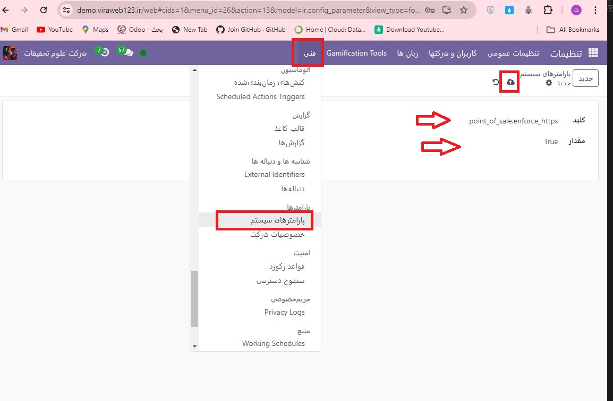

:nosearch:
:show-content:
:hide-page-toc:
:show-toc:

===========================================
اتصال ایمن (HTTPS)
===========================================

اگر Direct Devices در تنظیمات پایانه فروش فعال باشد (به عنوان مثال، اگر از چاپگر ePos استفاده می کنید)، HTTP به پروتکل پیش فرض تبدیل می شود.

پایانه فروش فروش خود را مجبور به استفاده از اتصال ایمن (HTTPS) کنید
یک کلید جدید در پارامترهای سیستم اضافه کنید تا پایانه فروش خود را مجبور کنید از یک اتصال امن با پروتکل HTTPS استفاده کند.

برای انجام این کار، **حالت توسعه دهنده** را فعال کنید، به :menuselection:`تنظیمات --> فنی --> پارامترها --> پارامترهای سیستم` بروید، سپس یک پارامتر جدید ایجاد کنید، مقادیر زیر را اضافه کنید و بر روی **ذخیره** کلیک کنید.

  - Key: point_of_sale.enforce_https

  - Value: True

.. seealso::
   - :doc:`self-signed certificate for ePOS printers`