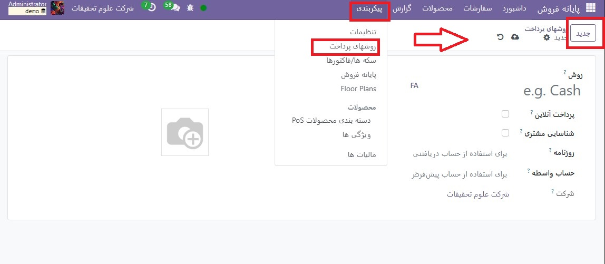

:nosearch:
:show-content:
:hide-page-toc:
:show-toc:

===========================================
روش های پرداخت
===========================================

برای افزودن روش پرداخت، ابتدا باید آن را ایجاد کنید. به **پایانه فروش ‣ پیکربندی ‣ روش های پرداخت ‣ جدید** بروید و یک نام تعیین کنید. شناسایی مشتری را علامت بزنید تا این روش پرداخت منحصراً برای مشتریان ثبت نام شده مجاز باشد.

سپس، مجله را انتخاب کنید. برای استفاده از این روش پرداخت برای پرداخت های نقدی، نقدی یا بانک را برای استفاده از آن برای پرداخت های کارتی انتخاب کنید.

.. note::
   انتخاب یک  روزنامه بانکی به طور خودکار فیلد استفاده از پایانه پرداخت را اضافه می کند که در آن می توانید اطلاعات پایانه پرداخت خود را اضافه کنید.

پس از ایجاد روش پرداخت، می توانید آن را در تنظیمات POS خود انتخاب کنید. برای انجام این کار، به تنظیمات POS بروید، روی ویرایش کلیک کنید و روش پرداخت را در قسمت پرداخت ها اضافه کنید.

.. toctree::
   :titlesonly:

   ./payment methods/adyen
   ./payment methods/stripe
   ./payment methods/sIX