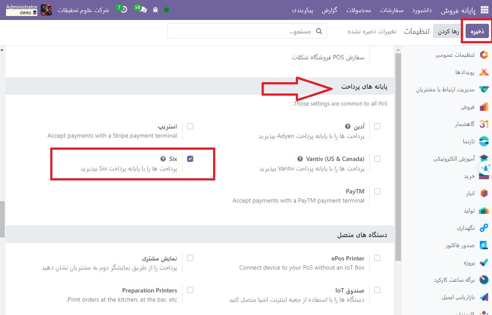
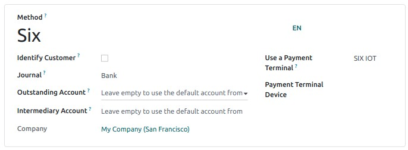
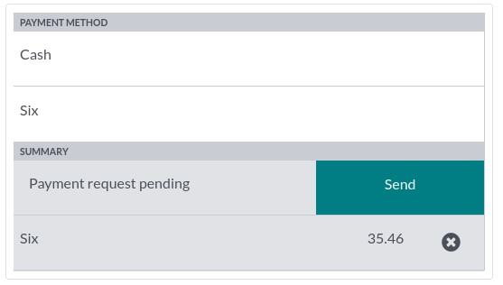

:nosearch:
:show-content:
:hide-page-toc:
:show-toc:

=============================
sIX
=============================

اتصال یک پایانه پرداخت SIX به شما این امکان را می دهد که یک جریان پرداخت سیال را به مشتریان خود ارائه دهید و کار صندوقداران خود را آسان کنید.

پیکربندی
--------------------------------------
ماژول POS IoT Six را نصب کنید
برای فعال کردن ماژول POS IoT Six، به برنامه ها بروید، فیلتر برنامه ها را بردارید و POS IoT Six را جستجو کنید. این ماژول درایور و رابط لازم را به پایگاه داده شما برای شناسایی شش پایانه اضافه می کند.

یک جعبه اینترنت اشیا را وصل کنید
-----------------------------------------------------------
اتصال یک پایانه پرداخت Six به Odoo نیاز به استفاده از Raspberry Pi یا جعبه اینترنت اشیا مجازی (فقط برای سیستم عامل ویندوز) دارد.

شناسه ترمینال را پیکربندی کنید
-------------------------------------------------------------
به صفحه اصلی IoT Box خود بروید، جایی که پس از اتصال سرور پایگاه داده شما به جعبه اینترنت اشیا، می توانید فیلد پایانه پرداخت Six را پیدا کنید. روی پیکربندی کلیک کنید، قسمت Terminal ID را با شناسه دریافتی از Six پر کنید و روی اتصال کلیک کنید. Six terminal ID شما باید در بخش Current Terminal ID ظاهر شود.

وقتی شناسه ترمینال **Six** پیکربندی شد، Odoo به طور خودکار **جعبه اینترنت اشیا** را مجددا راه اندازی می کند. اگر ترمینال Six شما آنلاین باشد، به طور خودکار شناسایی و به پایگاه داده متصل می شود. برای تأیید اتصال، صفحه اصلی جعبه اینترنت اشیا را در بخش پرداخت‌ها علامت بزنید.

روش پرداخت را پیکربندی کنید
--------------------------------------------------------
پایانه پرداخت را در تنظیمات برنامه فعال کنید و روش پرداخت مربوطه را ایجاد کنید. نوع روزنامه را به عنوان بانک تنظیم کنید و در قسمت Use a Payment Terminal SIX IOT را انتخاب کنید. سپس، دستگاه پایانه خود را در قسمت Payment Terminal Device انتخاب کنید

پس از ایجاد روش پرداخت، می توانید آن را در تنظیمات POS خود انتخاب کنید. برای انجام این کار، به تنظیمات POS بروید، روی ویرایش کلیک کنید و روش پرداخت را در قسمت پرداخت ها اضافه کنید.

با پایانه پرداخت پرداخت کنید
------------------------------------------------
هنگام پردازش پرداخت، شش روش پرداخت خود را در قسمت روش پرداخت انتخاب کنید و روی ارسال کلیک کنید. برای لغو درخواست پرداخت، روی لغو کلیک کنید. پس از پرداخت موفقیت آمیز، وضعیت به پرداخت موفق تغییر می کند.

.. tip::
    اگر مشکلات اتصال بین پایانه پرداخت و Odoo وجود دارد، همچنان می‌توانید با استفاده از دکمه Force Done اعتبار پرداخت را در Odoo اجباری کنید.