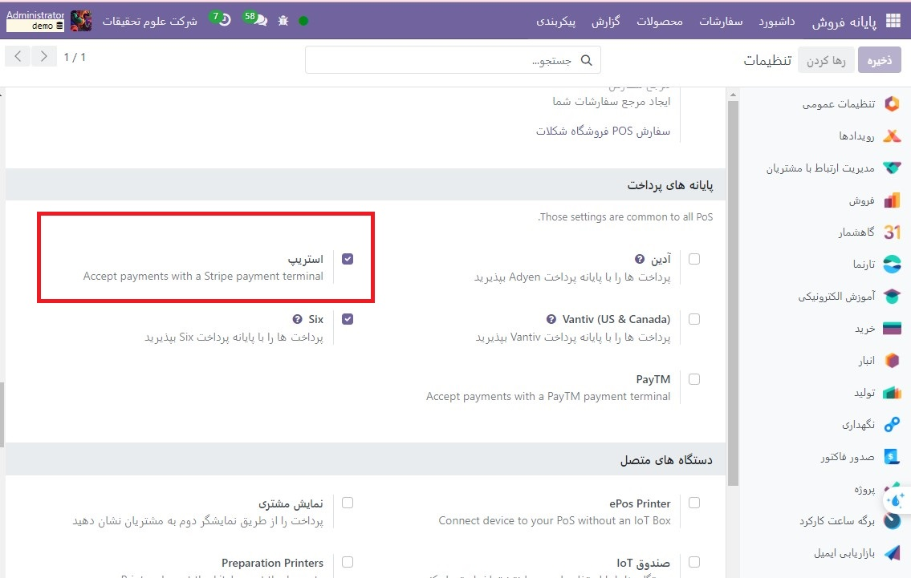
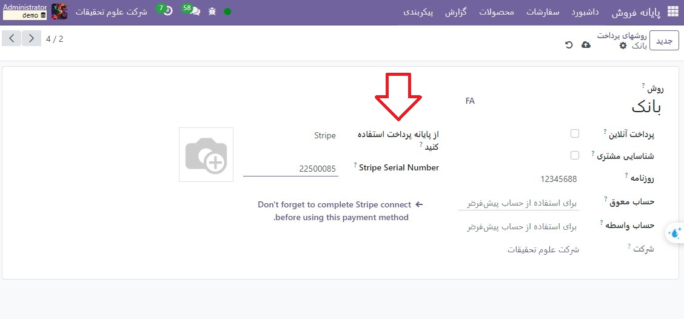
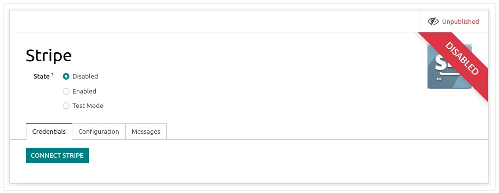

:nosearch:
:show-content:
:hide-page-toc:
:show-toc:

=============================
stripe
=============================

اتصال پایانه پرداخت به شما این امکان را می دهد که یک جریان پرداخت سیال را به مشتریان خود ارائه دهید و کار صندوقداران خود را آسان کنید.

.. important::

    پایانه های پرداخت Stripe نیازی به IoT Box ندارند

    پایانه های Stripe را می توان در بسیاری از کشورها استفاده کرد، اما نه در سراسر جهان. در دسترس بودن جهانی برای Stripe Terminal را بررسی کنید.

پیکربندی
-----------------------------------

روش پرداخت را پیکربندی کنید
   - Stripe را در تنظیمات با رفتن به  :menuselection:`پایانه فروش --> پیکربندی --> تنظیمات -->Payment Terminals`  و فعال کردن Stripe فعال کنید.

   - سپس، **روش پرداخت** را ایجاد کنید:

   - به  :menuselection:`پایانه فروش --> پیکربندی --> روشهای پرداخت` بروید، روی ایجاد کلیک کنید و قسمت روش را با نام روش پرداخت خود تکمیل کنید.

   - قسمت روزنامه را به عنوان بانک و قسمت استفاده از پایانه های پرداخت را به عنوان Stripe تنظیم کنید.

   - شماره سریال پایانه پرداخت خود را در قسمت Stripe Serial Number وارد کنید.

   - قبل از استفاده از این روش پرداخت، فراموش نکنید که اتصال Stripe را کامل کنید.

.. note::
    - روی شناسایی مشتری کلیک کنید تا این روش پرداخت منحصراً برای مشتریان شناسایی شده مجاز باشد. برای اینکه مشتریان ناشناس بتوانند با Stripe پرداخت کنند، قسمت Identify Customer را علامت نزنید.

    - حساب معوق و حساب واسطه می توانند برای استفاده از حساب های پیش فرض خالی بمانند.

    - شماره سریال پایانه پرداخت خود را در زیر دستگاه یا در داشبورد Stripe پیدا کنید.

Stripe را به Odoo وصل کنید
-------------------------------------------------------
روی Connect Stripe کلیک کنید. انجام این کار شما را به طور خودکار به یک صفحه پیکربندی هدایت می کند. تمام اطلاعات را برای ایجاد حساب Stripe خود پر کنید و آن را با Odoo پیوند دهید. پس از تکمیل فرم ها، کلیدهای API (کلید قابل انتشار و کلید مخفی) را می توان در وب سایت Stripe بازیابی کرد. برای انجام این کار، روی Get your Secret and Publishable keys کلیک کنید، روی کلیدها کلیک کنید تا آنها را کپی کنید و آنها را در فیلدهای مربوطه در Odoo قرار دهید. ترمینال شما آماده پیکربندی در POS است.

ترمینال پرداخت را پیکربندی کنید
----------------------------------------------------------
روی پایانه پرداخت خود به سمت راست بکشید، روی تنظیمات کلیک کنید، کد پین مدیریت را وارد کنید، اعتبارسنجی کنید و شبکه خود را انتخاب کنید.

.. note::
    - دستگاه باید به یک شبکه WI-FI ایمن متصل باشد.

    - پایگاه داده Odoo و پایانه پرداخت شما باید از یک شبکه مشترک استفاده کنند.

    - برای دسترسی به تنظیمات پایانه پرداخت خود باید کد پین مدیریت را وارد کنید.

روش پرداخت را به POS پیوند دهید
----------------------------------------------------
برای افزودن روش پرداخت به محل فروش خود، به **پایانه فروش ‣ پیکربندی ‣ تنظیمات** بروید. POS را انتخاب کنید، به قسمت پرداخت ها  بروید و روش پرداخت خود را برای Stripe در قسمت روش‌های پرداخت اضافه کنید.

با پایانه پرداخت پرداخت کنید
--------------------------------------------------
هنگام پردازش پرداخت، Stripe را به عنوان روش پرداخت انتخاب کنید. مقدار را بررسی کنید و روی ارسال کلیک کنید. پس از پرداخت موفقیت آمیز، وضعیت به پرداخت موفق تغییر می کند. برای لغو درخواست پرداخت، روی لغو کلیک کنید.

