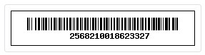
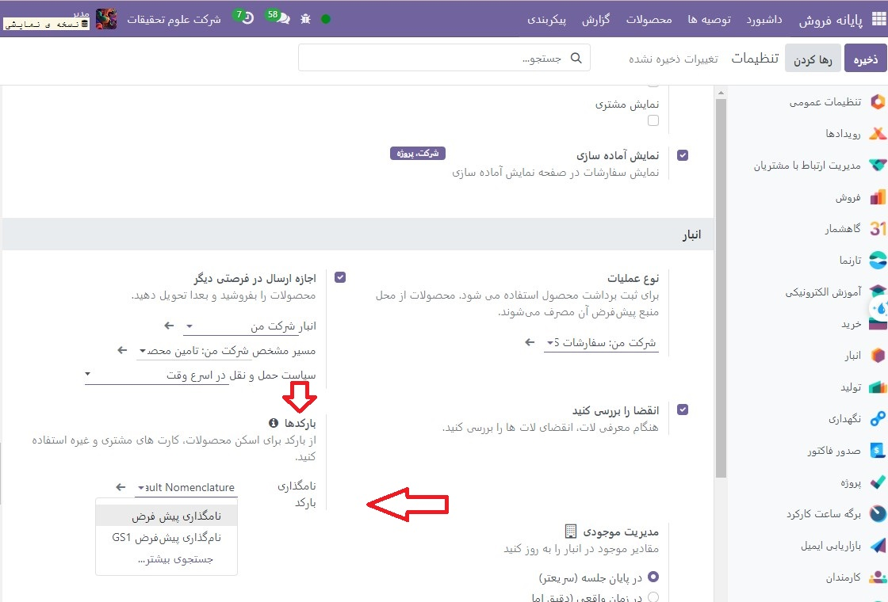
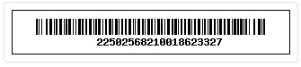
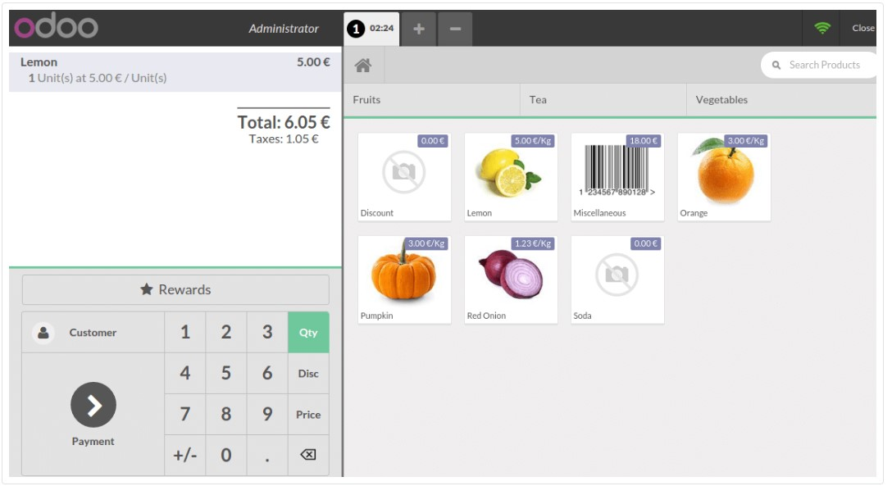
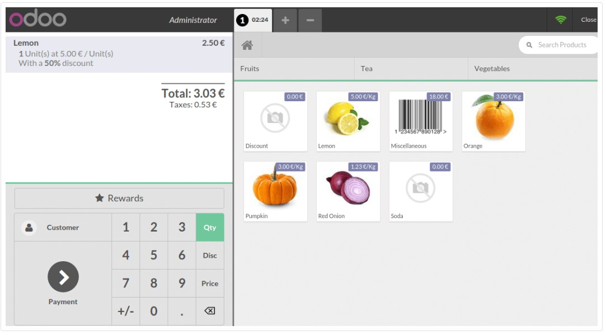

:nosearch:
:show-content:
:hide-page-toc:
:show-toc:

================================
برچسب های تخفیف (بارکد خوان)
================================

اگر می خواهید محصولات خود را با تخفیف بفروشید، برای مثال برای نزدیک شدن به تاریخ انقضای محصول، می توانید از برچسب های تخفیف استفاده کنید. آنها به شما امکان می دهند بارکدهای تخفیف را اسکن کنید.

.. note::
    برای استفاده از تگ های تخفیف باید از بارکد اسکنر استفاده کنید.

نامگذاری بارکد
-----------------------------------------
برای استفاده از تگ های تخفیف، باید با نام گذاری بارکد آشنا شویم.

فرض کنید می خواهید برای محصول با بارکد زیر تخفیف بگیرید:

می‌توانید نام‌گذاری پیش‌فرض را در تنظیمات رابط PoS خود پیدا کنید.

فرض کنید برای محصولی 50 درصد تخفیف می‌خواهید، باید بارکد خود را با 22 (برای نام‌گذاری بارکد تخفیف) و سپس 50 (برای درصد) قبل از اضافه کردن بارکد محصول شروع کنید. در مثال ما، بارکد به صورت زیر خواهد بود:

محصولات و برچسب ها را اسکن کنید
ابتدا باید محصول مورد نظر را اسکن کنید.

و سپس برچسب تخفیف را اسکن کنید. تخفیف اعمال می شود و می توانید معامله را تمام کنید.

