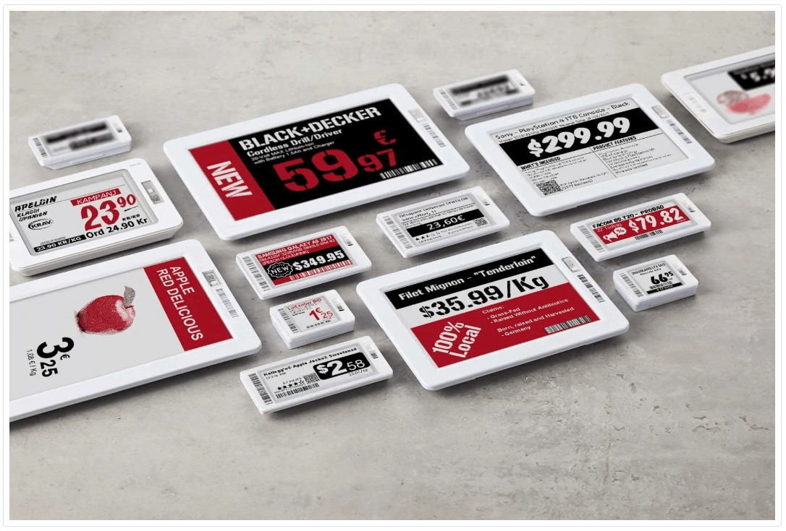
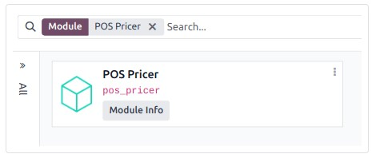
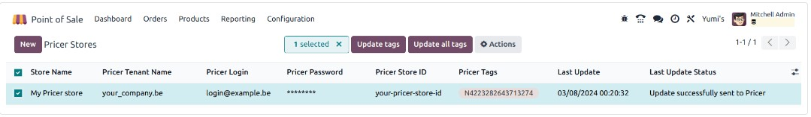

:nosearch:
:show-content:
:hide-page-toc:
:show-toc:

================================
برچسب قفسه های الکترونیکی
================================
برچسب‌های قفسه الکترونیکی به شما این امکان را می‌دهند که اطلاعات محصول مانند قیمت‌ها و بارکدها را در قفسه‌های فروشگاه نمایش دهید و آنها را از راه دور از پشتیبان همگام‌سازی کنید. این کار نیاز به چاپ برچسب های جدید را هنگام تغییر اطلاعات محصول از بین می برد.

.. note::
    Odoo از برچسب های الکترونیکی قیمت گذاری استفاده می کند.

پیکربندی
------------------------------------------------------
#. فروشگاه های خود را ایجاد کنید: یک فروشگاه قیمت گذار برابر با یک فروشگاه فیزیکی است.

#. هر تعداد فرستنده گیرنده را که نیاز است به فروشگاه(های) قیمت گذار پیوند دهید.

#. متغیرهای زیر را ایجاد کنید تا اطلاعات محصول را بین سیستم پایگاه داده Odoo و Pricer به اشتراک بگذارید. این متغیرها مانند متغیرهایی در قالب برچسب عمل می کنند.

   - itemId: این شناسه داخلی منحصر به فرد اختصاص داده شده به هر محصول را نگه می دارد

   - itemName: نام واقعی محصول

   - قیمت: قیمت فروش محصول، شامل هرگونه مالیات قابل اعمال

   - ارائه: نام الگوی مورد استفاده در Pricer برای نمایش اطلاعات محصول بر روی برچسب

   - ارز: واحد پول شرکت شما (به عنوان مثال USD، EUR)

   - بارکد: شماره بارکد مربوط به هر محصول

.. impotrant::
    نام این متغیرها باید در پایگاه داده قیمت گذاری شما یکسان باشد.

#. یک قالب به نام NORMAL ایجاد کنید. این الگو برای نمایش اطلاعات روی برچسب های دیجیتالی شما استفاده می شود.

هنگامی که حساب، فروشگاه‌ها، متغیرها و الگوی شما در Pricer پیکربندی شدند، می‌توانید به راه‌اندازی پایگاه داده Odoo خود ادامه دهید.

.. important::
    حساب مرتبط با فروشگاه **Pricer** شما باید به ارسال درخواست‌های API به **Pricer** دسترسی داشته باشد.

راه اندازی Odoo
----------------------------------------
به عنوان یک پیش نیاز، ماژول POS Pricer (نام فنی: pos_pricer) را فعال کنید تا تمام ویژگی های مورد نیاز برای استفاده از برچسب های الکترونیکی Pricer را داشته باشید.

هنگامی که ماژول فعال شد، فروشگاه های قیمتی خود را پیکربندی کنید و برچسب های Pricer را با محصولات خود مرتبط کنید.

فروشگاه های قیمت
--------------------------------------------
مشابه پیکربندی در Pricer، باید یک فروشگاه قیمت‌گذار در هر مکان فیزیکی ایجاد کنید. برای انجام این کار، به  :menuselection:`پایانه فروش --> پیکربندی --> Pricer Stores`  بروید، روی New کلیک کنید و اطلاعات مورد نیاز را پر کنید:

  - نام فروشگاه: شما می توانید هر نامی را که دوست دارید قرار دهید.

  - Pricer Tenant Name: نام حساب شرکت شما در Pricer که معمولاً به دنبال آن -country_code است. این مقدار توسط Pricer ارائه شده است.

  - Pricer Login: ورود به حساب پرایسر شما.

  - رمز عبور Pricer: رمز عبور حساب پرایسر شما.

  - شناسه فروشگاه Pricer: شناسه فروشگاه Pricer مربوطه همانطور که در پایگاه داده Pricer شما تعریف شده است.

.. note::
    - هنگامی که یک برچسب به یک محصول پیوند داده می شود، ستون برچسب های قیمت به طور خودکار به روز می شود.

    - ستون های Last Update و Last Update Status به طور خودکار با به روز رسانی برچسب ها به روز می شوند.

برچسب های قیمت گذار
-----------------------------------------------------
برای اینکه یک برچسب اطلاعات خاص محصول را نمایش دهد، برچسب باید با محصول مرتبط باشد. برای انجام این کار:

   #. با رفتن به **پایانه فروش ‣ محصولات ‣ محصولات** و کلیک بر روی **جدید** یا انتخاب یک محصول موجود، فرم محصول را باز کنید.

   #. به تب فروش بروید، به بخش Pricer بروید و فروشگاه Pricer مربوطه را انتخاب کنید.

   #. با کپی کردن شناسه برچسب از خود برچسب یا اسکن بارکد آن، قسمت شناسه برچسب های Pricer را پر کنید.

.. note::
    شناسه‌های برچسب قیمت‌گذار از یک حرف به همراه 16 رقم تشکیل شده‌اند.

.. tip::
    - توصیه می کنیم از یک اسکنر بارکد برای سرعت بخشیدن به فرآیند رمزگذاری استفاده کنید.

    - هنگام تنظیم Pricer با Odoo برای اولین بار، توصیه می شود ابتدا فقط یک محصول را پیکربندی کنید. قبل از پیکربندی محصولات بیشتر، اطمینان حاصل کنید که می‌توانید اطلاعات آنها را روی برچسب Pricer نمایش دهید.

اکنون که محصولی مرتبط با برچسب pricer دارید، می‌توانیم اطلاعات آن را برای pricer ارسال کنیم.

کاربرد عملی
-------------------------------------------
Odoo به‌طور خودکار درخواست‌هایی را به Pricer ارسال می‌کند تا اگر تغییراتی در موارد زیر ایجاد کنید، هر 12 ساعت یکبار برچسب‌ها را همگام‌سازی کند:

    - نام محصول، قیمت، بارکد، یا مالیات مشتری

    - واحد پول

    - فروشگاه pricer مرتبط یا برچسب های پرایسر

برای اجبار به روز رسانی، حالت توسعه دهنده را فعال کنید. سپس:

  #. به پایانه فروش ‣ پیکربندی ‣ فروشگاه قیمت گذار بروید.

  #. فروشگاه(های) مورد نظر را انتخاب کنید.

روی به‌روزرسانی برچسب‌ها کلیک کنید تا همه برچسب‌های تحت تأثیر تغییرات به‌روزرسانی شوند:

    - نام محصول، قیمت، بارکد، یا مالیات مشتری

    - واحد پول

    - فروشگاه Associated Pricer یا برچسب های Pricer

از طرف دیگر، بر روی Update all tags کلیک کنید تا به اجبار به روز رسانی هر برچسب، صرف نظر از اینکه آیا تغییرات ایجاد شده است یا خیر.

اگر Pricer درخواست را پردازش کرده و پذیرفته باشد، فیلد وضعیت نشان می دهد که به روز رسانی با موفقیت به Pricer ارسال شد. اگر مشکلی وجود داشته باشد، سیستم یک پیغام خطا نشان می دهد.

.. warning::
    اگر درخواست ارسال شده به Pricer با شکست مواجه شود، Odoo همچنان معتقد است که محصول به روز شده است. در این صورت، توصیه می‌کنیم به‌روزرسانی همه برچسب‌ها را اجباری کنید.