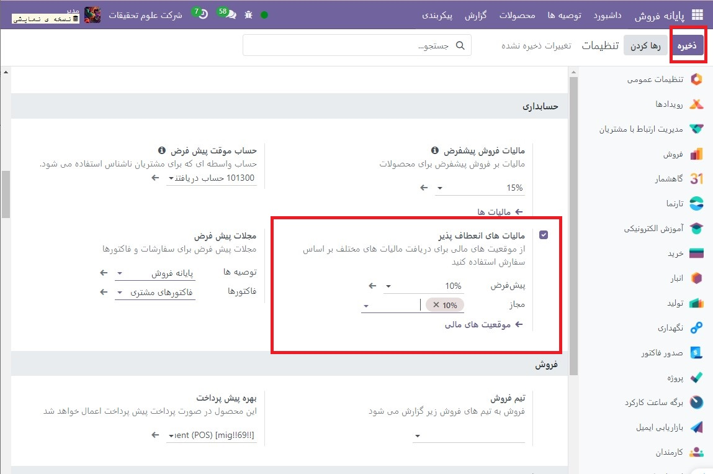
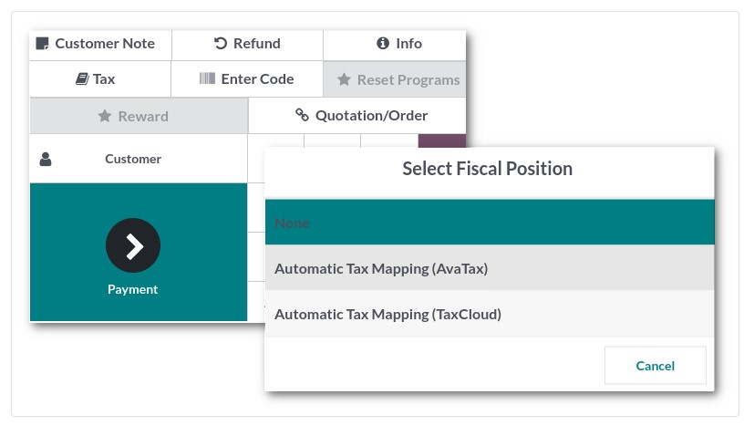

:nosearch:
:show-content:
:hide-page-toc:
:show-toc:

==============================================
مالیات های انعطاف پذیر (موقعیت های مالی)
==============================================

هنگام راه اندازی یک کسب و کار، ممکن است نیاز به اعمال مالیات های مختلف و ثبت تراکنش ها در حساب های مختلف بر اساس مکان و نوع کسب و کار مشتریان و ارائه دهندگان خود داشته باشید.

ویژگی موقعیت های مالی به شما امکان می دهد قوانینی را ایجاد کنید که به طور خودکار مالیات ها و حساب های مناسب مورد استفاده برای هر تراکنش را انتخاب می کند.

پیکربندی
--------------------------------------------------
برای فعال کردن این ویژگی، به  :menuselection:`پایانه فروش --> پیکربندی --> تنظیمات` بروید، به قسمت **حسابداری** پایین بروید و مالیات های انعطاف پذیر را فعال کنید.

سپس، یک موقعیت مالی پیش‌ فرض را تنظیم کنید که باید برای همه فروش‌های موجود در POS انتخابی در قسمت پیش‌فرض اعمال شود. همچنین می توانید موقعیت های مالی بیشتری را برای انتخاب در قسمت مجاز اضافه کنید.

با توجه به بسته محلی‌سازی مالی فعال شده، چندین موقعیت مالی از پیش پیکربندی شده‌اند و می‌توانند در POS تنظیم و استفاده شوند. با این حال، شما همچنین می توانید موقعیت های مالی جدید ایجاد کنید.

.. note::
    اگر موقعیت مالی تعیین نکنید، مالیات همانطور که در قسمت مالیات مشتری در فرم محصول تعریف شده باقی می ماند.

.. note::
    اگر یک موقعیت مالی پیش فرض تنظیم شده باشد، دکمه مالیات نام موقعیت مالی را نشان می دهد.