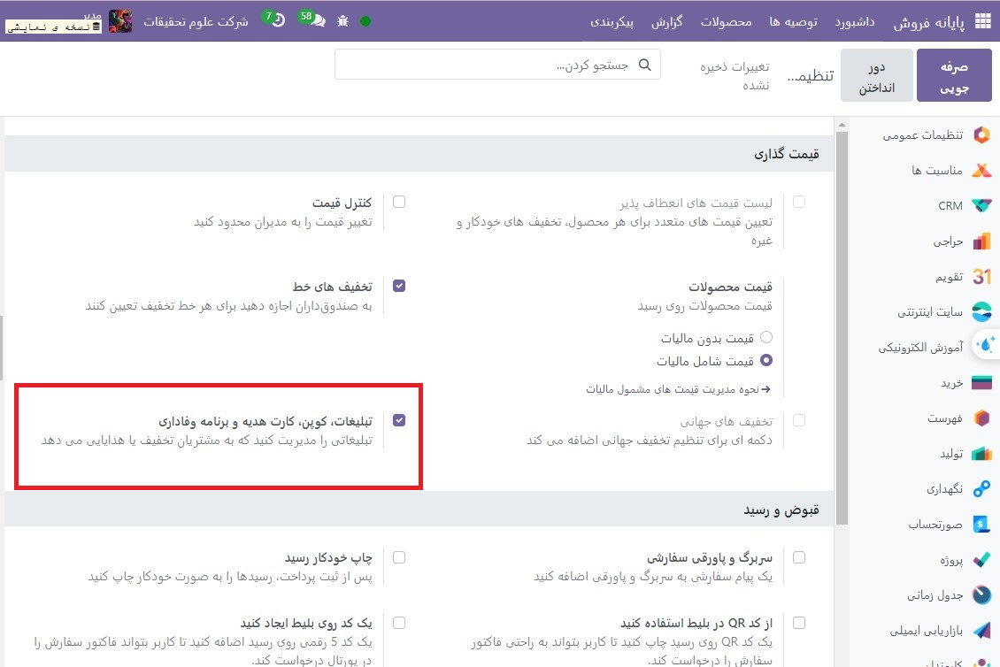
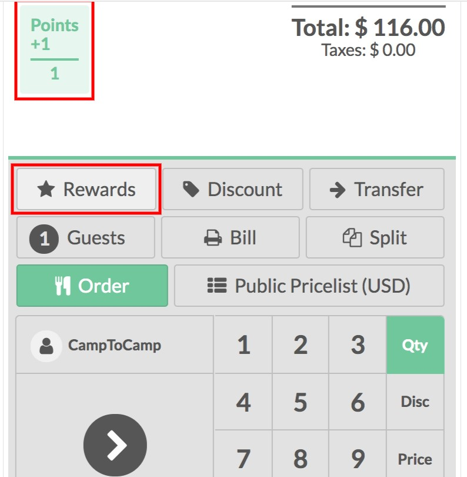

:nosearch:
:show-content:
:hide-page-toc:
:show-toc:

==============================================
برنامه های وفاداری
==============================================

با یک برنامه وفاداری، مشتریان خود را تشویق کنید که به خرید در محل فروش شما ادامه دهند.

پیکربندی
---------------------------------------
برای فعال کردن ویژگی برنامه وفاداری، به  :menuselection:`پایانه فروش -->پیکربندی --> پایانه فروش` رفته و رابط PoS خود را انتخاب کنید. در زیر ویژگی های قیمت گذاری، برنامه وفاداری را انتخاب کنید

شما می‌توانید تصمیم بگیرید که چه نوع برنامه‌ای را می‌خواهید استفاده کنید، اگر پاداش تخفیف یا هدیه است، آن را مختص برخی از محصولات کنید یا کل محدوده خود را پوشش دهید. قوانین را به گونه ای اعمال کنید که فقط در شرایط خاص و همه چیز در بین آن ها معتبر باشد.

از برنامه وفاداری در رابط PoS خود استفاده کنید
------------------------------------------------------------------------
هنگامی که مشتری تنظیم می شود، اکنون امتیازاتی را می بینید که برای معامله به دست می آورند و تا زمانی که خرج شوند جمع می شوند. زمانی که طبق قوانین تعریف شده در برنامه وفاداری امتیاز کافی داشته باشند با استفاده از دکمه پاداش ها خرج می شوند.

می توانید ببینید که قیمت فوراً به روز می شود تا لیست قیمت را منعکس کند. شما می توانید سفارش را به روش معمول خود نهایی کنید.

.. note::
    اگر مشتری را با لیست قیمت پیش فرض انتخاب کنید، اعمال می شود. البته می توانید آن را تغییر دهید.