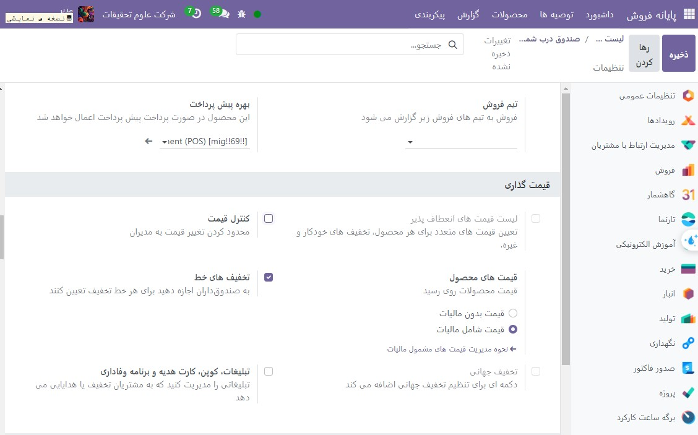
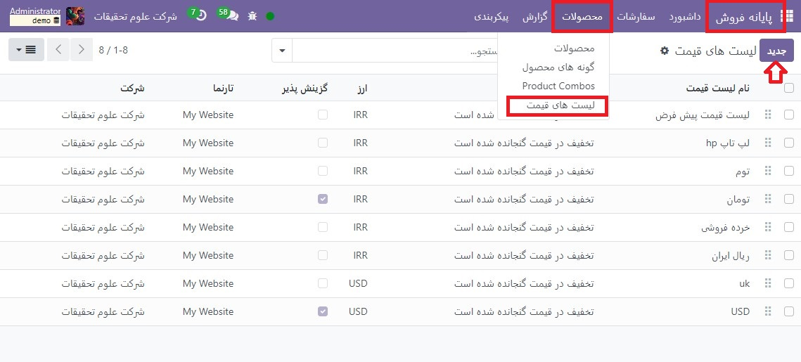
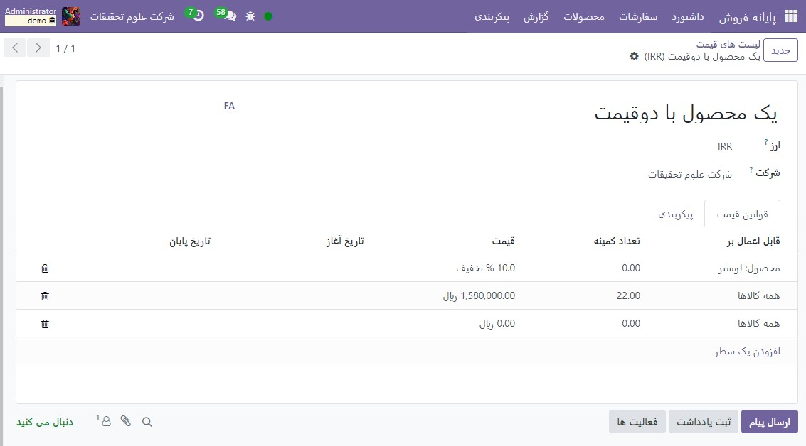

:nosearch:
:show-content:
:hide-page-toc:
:show-toc:

==============================================
لیست قیمت ها
==============================================

لیست قیمت به شما این امکان را می دهد که قیمت محصولات را بسته به معیارهای مختلف به طور خودکار تنظیم کنید. به عنوان مثال، می‌توانید قیمت‌های اختصاصی POS را تعیین کنید، دوره‌های تخفیف موقت ایجاد کنید، به مشتریان خاص پاداش دهید، یا در صورت سفارش مقادیر تعیین‌شده، تخفیف ارائه دهید.

پیکربندی
--------------------------------------------------
به تنظیمات عمومی برنامه POS بروید و مطمئن شوید که لیست قیمت های انعطاف پذیر در بخش قیمت گذاری فعال هستند.

قیمت های چندگانه برای هر محصول گزینه پیش فرض لیست قیمت برای تنظیم قوانین قیمت ثابت ساده برای هر محصول است. قوانین قیمت پیشرفته (تخفیف ها، فرمول ها) را انتخاب کنید تا قوانین قیمت را برای چندین محصول به طور همزمان اعمال کنید و علاوه بر تعیین قیمت های ثابت، قیمت ها را به صورت پویا با استفاده از درصد تخفیف یا فرمول های پیچیده تر محاسبه کنید.

.. note::
    نوع لیست قیمت انتخاب شده برای کل پایگاه داده، از جمله برنامه های فروش و تجارت الکترونیک اعمال می شود.

لیست قیمت ایجاد کنید
-----------------------------------
به **پایانه فروش ‣ محصولات ‣ لیست قیمت** بروید و روی **جدید**کلیک کنید یا یک لیست قیمت موجود را انتخاب کنید. تنظیم لیست قیمت بسته به گزینه لیست قیمت انتخاب شده متفاوت است.

چند قیمت برای هر محصول
-----------------------------------------------------
هنگامی که فهرست‌های قیمت برای استفاده از گزینه قیمت‌های چندگانه برای هر محصول پیکربندی می‌شوند، بسته به یک یا چند شرط، می‌توان از چندین قیمت ثابت برای محصولات مختلف یا انواع آنها استفاده کرد. برای افزودن یک قانون قیمت جدید به لیست قیمت:

  #. روی افزودن خط کلیک کنید و در صورت نیاز یک محصول و نوع آن را انتخاب کنید.

    - شرط(های) را اضافه کنید:

    - مقدار محصولی که با استفاده از حداقل به دست می آید. ستون کمیت؛

  #. یک دوره تعیین شده که طی آن لیست قیمت با استفاده از ستون های تاریخ شروع و تاریخ پایان اعمال می شود.

  #. قیمتی را که باید در صورت برآورده شدن شرایط اعمال شود (در صورت وجود) اضافه کنید.

قوانین قیمت پیشرفته

--------------------------------------------------
هنگامی که لیست‌های قیمت برای استفاده از گزینه قوانین قیمت پیشرفته (تخفیف‌ها، فرمول‌ها) پیکربندی می‌شوند، می‌توان علاوه بر استفاده از قیمت‌های ثابت، از درصد تخفیف/مارک‌آپ و فرمول‌ها نیز استفاده کرد. برای افزودن یک قانون قیمت جدید به لیست قیمت، روی افزودن یک خط کلیک کنید. در پنجره های پاپ آپ:

   #. انتخاب یک روش محاسباتی:

  - قیمت ثابت برای تعیین یک قیمت ثابت جدید (مثل گزینه قیمت های چندگانه برای هر محصول).

  - تخفیف برای محاسبه درصد تخفیف (به عنوان مثال، 10.00٪) یا افزایش (به عنوان مثال، -10.00٪).

  - فرمولی برای محاسبه قیمت طبق یک فرمول. لازم است مشخص شود که محاسبه بر اساس چه چیزی است (قیمت فروش، بهای تمام شده یا سایر لیست قیمت). سپس می توانید:

     - درصد تخفیف یا نشانه گذاری را اعمال کنید.

     - یک کارمزد اضافی اضافه کنید (به عنوان مثال، 5.00 دلار) یا مقدار ثابتی را کم کنید (به عنوان مثال، 5.00- دلار).

     - با مجبور کردن قیمت پس از تخفیف به مضرب مجموعه ارزش، یک روش گرد تعریف کنید. هزینه اضافی پس از آن اعمال می شود.

.. example::
    برای اینکه قیمت نهایی با 0.99 به پایان برسد، **روش های گرد کردن** را روی 1.00 و **هزینه های اضافی** را روی -0.01 تنظیم کنید.

  #. انتخاب کنید که در کدام محصول قانون قیمت باید اعمال شود:

  - همه محصولات

  - یک دسته محصول

  - یک محصول

  - یک نوع محصول

  #. شرایط را اضافه کنید، مانند یک مقدار خاص برای رسیدن به تغییر قیمت با استفاده از حداقل. فیلد مقدار یا دوره خاصی که طی آن لیست قیمت باید با استفاده از فیلدهای اعتبار اعمال شود.

.. image:: ./img/pricingfeatures/a13.jpg
    :align: center
    :alt: پایانه فروش 

لیست قیمت ها را انتخاب کنید
---------------------------------------------------------------
به تنظیمات خاص POS بروید و تمام لیست قیمت های موجود را در قسمت در دسترس اضافه کنید. سپس، لیست قیمت پیش فرض آن را در قسمت پیش فرض تنظیم کنید.

هنگامی که یک جلسه POS را باز می کنید، روی دکمه **لیست قیمت ها** کلیک کنید و لیست قیمت مورد نظر را از لیست انتخاب کنید.

.. note::
    برای نمایش دکمه لیست قیمت باید چندین لیست قیمت انتخاب شود.
    اگر لیست قیمتی در سفارش POS انتخاب شود در حالی که شرایط آن برآورده نشده باشد، قیمت تعدیل نخواهد شد.

.. tip::
    شما همچنین می توانید لیست قیمتی را تنظیم کنید تا پس از تنظیم یک مشتری خاص، به طور خودکار انتخاب شود. برای انجام این کار، به فرم مشتری بروید و در قسمت لیست قیمت در تب خرید و فروش، به لیست قیمت ترجیحی بروید.

.. seealso::
   - :doc:`pricelists`
   - :doc:`discounts`